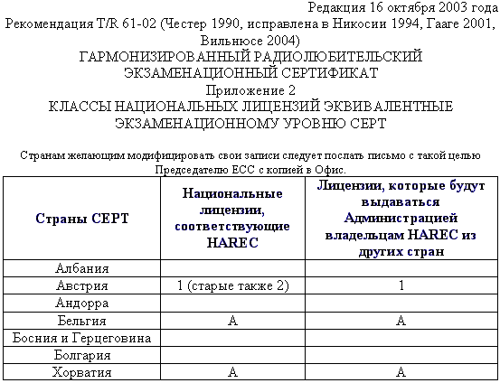
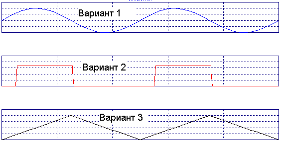
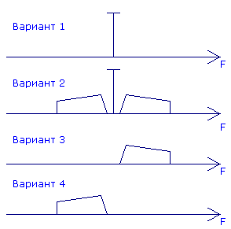
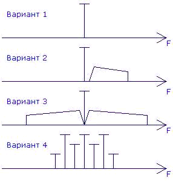
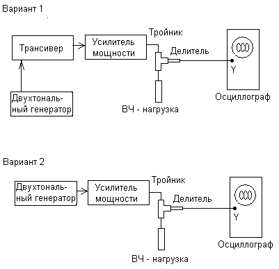
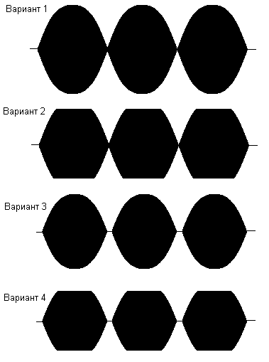

## Вопросы для второй категории

### Вопрос №1  *(1/405)*

С какими радиостанциями может проводить радиосвязи любительская станция, если она НЕ участвует в проведении аварийно-спасательных работ?

- a) С любительскими радиостанциями и радиостанциями гражданского «Си - Би» диапазона (`27 МГц`)
- b) С любительскими радиостанциями и радиостанциями стандартов `LPD` (`433 МГц`, 10мВт) и `PMR` (`446 МГц`, `0,5 Вт`)
- c) С любительскими радиостанциями, радиостанциями гражданского «Си - Би» диапазона (`27 МГц`), а также с радиостанциями стандартов `LPD` (`433 МГц`, `10 мВт`) и `PMR` (`446 МГц`, `0,5 Вт`)
- d) Только с любительскими радиостанциями

*[Ответ:](# "d")* **$${\color{white}d}$$**

### Вопрос №2  *(2/405)*

В каких случаях любительская радиостанция может передавать кодированные сообщения?

- a) Только при работе вне любительских диапазонов
- b) Не регламентируется
- c) При участии в аварийно-спасательной связи
- d) Ни в каких, при этом передача контрольного номера в соревнованиях по радиоспорту, а также управляющих команд и телеметрии любительских радиостанций наземного и космического базирования не относится к передачам с использованием кодировки сигнала

*[Ответ:](# "d")* **$${\color{white}d}$$**

### Вопрос №3  *(3/405)*

Разрешено ли радиостанции любительской службы создание преднамеренных помех другим радиостанциям?

- a) Разрешено, если станция другой службы работает на более низкой основе
- b) Не разрешено в диапазонах совместного использования с другими службами связи
- c) Не разрешено
- d) Разрешено, если это «радиохулиган», который не реагирует на требования прекратить передачу

*[Ответ:](# "c")* **$${\color{white}c}$$**

### Вопрос №4  *(4/405)*

Разрешено ли радиостанции любительской службы передавать какие-либо сообщения за плату?

- a) Разрешено, если это реклама
- b) Не разрешено
- c) Не разрешено на частотах ниже `30 МГц`
- d) Разрешено, если это телеграммы в труднодоступные районы страны

*[Ответ:](# "b")* **$${\color{white}b}$$**

### Вопрос №5  *(5/405)*

Как называется станция любительской службы, производящая односторонние передачи в целях изучения условий распространения радиоволн?

- a) Цифровая станция
- b) Радиомаяк
- c) Станция радиоуправления
- d) Ретранслятор

*[Ответ:](# "b")* **$${\color{white}b}$$**

### Вопрос №6  *(6/405)*

Может ли станция любительской службы проводить радиосвязи с радиостанциями, не имеющими отношения к любительской службе?

- a) Не может
- b) Может, если эти станции имеют Свидетельства о регистрации РЭС
- c) Может для выяснения, на какой основе (первичной или вторичной) работают эти радиостанции
- d) Может в случае стихийных бедствий, при проведении аварийно-спасательных работ

*[Ответ:](# "d")* **$${\color{white}d}$$**

### Вопрос №7  *(7/405)*

Если радиооператор любительской радиостанции слышит сигнал бедствия на частоте, на которой он не имеете права осуществлять передачу, что ему разрешено сделать для помощи станции, терпящей бедствие?

- a) Ему разрешено помогать станции, терпящей бедствие, на любых частотах любым доступным способом
- b) Ему разрешено помогать, только если сигналы его радиостанции будут на ближайшей частоте в разрешенных границах
- c) Ему разрешено помогать вне разрешённых частот передачи, если только он использует международный код Морзе
- d) Ему не разрешено помогать, потому что сигнал лежит вне границ разрешенных ему частот

*[Ответ:](# "a")* **$${\color{white}a}$$**

### Вопрос №8  *(8/405)*

На сколько условных районов разделён земной шар по схеме деления на районы `IARU` (`ITU`)?

- a) На три
- b) На пять
- c) На два
- d) На четыре

*[Ответ:](# "a")* **$${\color{white}a}$$**

### Вопрос №9  *(9/405)*

Какие территории входят в первый район `IARU` (`ITU`)?

- a) Южная Америка
- b) Австралия и Океания
- c) Северная Америка
- d) Африка, Европа, страны бывшего СССР

*[Ответ:](# "d")* **$${\color{white}d}$$**

### Вопрос №10  *(10/405)*

На основании рекомендаций какой организации в различных странах Европы и ряде неевропейских стран устанавливаются единые требования к квалификации радиолюбителей?

- a) `СРР` (Союз радиолюбителей России)
- b) `СЕРТ` (Европейская конференция администраций почт и электросвязи)
- c) `WRL` (Всемирная радиолюбительская лига)
- d) `ITU` (МСЭ, Международный союз электросвязи)

*[Ответ:](# "b")* **$${\color{white}b}$$**

### Вопрос №11  *(11/405)*

Какой из перечисленных позывных сигналов образован для любительской службы?

- a) `RA3A`
- b) `БЕРЁЗА`
- c) `АТ-321`
- d) `RIT`

*[Ответ:](# "a")* **$${\color{white}a}$$**

### Вопрос №12  *(12/405)*

Какой из перечисленных позывных сигналов образован для любительской службы?

- a) `RA9EM`
- b) `RMT`
- c) `MO13`
- d) `ФОНАРЬ`

*[Ответ:](# "a")* **$${\color{white}a}$$**

### Вопрос №13  *(13/405)*

Какой позывной сигнал не относится к любительской службе?

- a) `RIT`
- b) `R4IT`
- c) `R44ITU`
- d) `R8SRR`

*[Ответ:](# "a")* **$${\color{white}a}$$**

### Вопрос №14  *(14/405)*

Как называется международная организация радиолюбителей?

- a) `СЕРТ` (Европейская конференция администраций почт и электросвязи)
- b) `IARU` (Международный радиолюбительский союз)
- c) `WRL` (Всемирная радиолюбительская лига)
- d) `ITU` (МСЭ, Международный союз электросвязи)

*[Ответ:](# "b")* **$${\color{white}b}$$**

### Вопрос №15  *(15/405)*

Что обозначает сокращение «DX»?

- a) Дальнюю или редкую радиостанцию
- b) Радиостанцию, работающую в соревнованиях
- c) Радиостанцию, работающую с плохим сигналом
- d) Радиостанцию, работающую малой мощностью

*[Ответ:](# "a")* **$${\color{white}a}$$**

### Вопрос №16  *(16/405)*

При каких условиях любительская радиостанция может использоваться на борту морского или воздушного судна

- a) С согласия командира судна и при условии соблюдения всех правил по обеспечению безопасности полетов или мореплавания
- b) С согласия владельца судна
- c) При наличии разрешений Морского или Воздушного Регистров
- d) При любых условиях

*[Ответ:](# "a")* **$${\color{white}a}$$**

### Вопрос №17  *(17/405)*

Разрешается ли допуск на любительскую радиостанцию лица, не имеющего квалификацию или имеющего квалификацию более низкой категории?

- a) Не допускается
- b) Допускаются только лица не старше `19 лет`
- c) Допускается исключительно в целях обучения и при условии обеспечения непрерывного контроля за его работой
- d) Допускается только при участии в соревнованиях

*[Ответ:](# "c")* **$${\color{white}c}$$**

### Вопрос №18  *(18/405)*

Какой российский документ имеет силу полной лицензии СЕРТ?

- a) Свидетельство об образовании позывного сигнала опознавания радиолюбителя третьей квалификационной категории
- b) Свидетельство об образовании позывного сигнала опознавания радиолюбителя первой категории
- c) Свидетельство о регистрации РЭС первой категории
- d) Свидетельство об образовании позывного сигнала опознавания радиолюбителя первой или второй квалификационной категории

*[Ответ:](# "d")* **$${\color{white}d}$$**

### Вопрос №19  *(19/405)*

Какой российский документ имеет силу лицензии СЕРТ новичка (Novice)?

- a) Свидетельство об образовании позывного сигнала опознавания радиолюбителя третьей квалификационной категории
- b) Свидетельство о регистрации РЭС третьей квалификационной категории
- c) Свидетельство об образовании позывного сигнала опознавания радиолюбителя первой или второй квалификационной категории
- d) Свидетельство о регистрации РЭС четвёртой квалификационной категории

*[Ответ:](# "a")* **$${\color{white}a}$$**

### Вопрос №20  *(20/405)*

В течение какого времени радиооператор любительской радиостанции, нерезидент, - обладатель полной или Novice - лицензии СЕРТ может осуществлять передачи с территории России без получения разрешительных документов?

- a) Не имеет права
- b) `90 дней`
- c) Ограничений нет
- d) `1 год`

*[Ответ:](# "b")* **$${\color{white}b}$$**

### Вопрос №21  *(21/405)*

Какой позывной сигнал должен передавать радиолюбитель, осуществляющий передачи при посещении страны, присоединившейся к рекомендациям `СЕРТ T/R 61-01` и `ЕСС(05)06` ?

- a) Передаётся свой позывной сигнал, после которого через дробь следует буква `"Р"`
- b) После своего позывного сигнала через дробь передаётся префикс страны пребывания
- c) Перед своим позывным сигналом через дробь передаётся префикс страны пребывания
- d) Передаётся только свой позывной сигнал

*[Ответ:](# "c")* **$${\color{white}c}$$**

### Вопрос №22  *(22/405)*

Какой позывной сигнал должен использовать российский радиолюбитель с позывным сигналом `RL3DX`, не имеющий бельгийской национальной радиолюбительской лицензии, для осуществления передач с территории Бельгии в течение первых `90` дней пребывания? Смотри подсказку.

- a) `ON33DX`
- b) `ON/RL3DX`
- c) `RL3DX/ON`
- d) `RL3DX`

*[Ответ:](# "b")* **$${\color{white}b}$$**

### Вопрос №23  *(23/405)*

Какой позывной сигнал должен использовать российский радиолюбитель с позывным сигналом `RL3DX`, не имеющий австрийской национальной радиолюбительской лицензии, для осуществления передач с территории Австрии в течение первых `90` дней пребывания? Смотри подсказку.

- a) `RL3DX/OE`
- b) `OE83DX`
- c) `OE/RL3DX`
- d) `RL3DX`

*[Ответ:](# "c")* **$${\color{white}c}$$**

### Вопрос №24  *(24/405)*

В каком документе содержатся сведения о том, в соответствии с какой национальной радиолюбительской лицензией может осуществлять передачи владелец полной или Novice - лицензии СЕРТ в стране пребывания? Как найти этот документ?

- a) В соответствии с решением Роскомнадзора. Находится в интернете на сайте Роскомнадзора по адресу [http://www.rsoc.ru](http://www.rsoc.ru)
- b) В соответствии с приложением № 2 рекомендации `СЕРТ T/R 61-01`. Находится в интернете на сайте Европейского комитета по радиосвязи по адресу [http://www.ero.dk](http://www.ero.dk)
- c) В соответствии с решением Союза радиолюбителей России. Находится в интернете на сайте СРР по адресу [http://www.srr.ru](http://www.srr.ru)
- d) В соответствии с последним Решением ГКРЧ по радиолюбителям. Находится в интернете на сайте ГРЧЦ по адресу [http://www.grfc.ru](http://www.grfc.ru)

*[Ответ:](# "b")* **$${\color{white}b}$$**

### Вопрос №25  *(25/405)*

Может ли обладатель Свидетельства об образовании позывного сигнала опознавания четвёртой квалификационной категории осуществлять передачи из стран пребывания, присоединившихся к рекомендациям `СЕРТ T/R 61-01` и `ЕСС(05)06`?

- a) Может в соответствии с полной лицензией СЕРТ
- b) Может в соответствии с лицензией СЕРТ новичка (Novice)
- c) Нет, не может
- d) Может в соответствии с международной лицензией СЕРТ

*[Ответ:](# "c")* **$${\color{white}c}$$**

### Вопрос №26  *(26/405)*

Даёт ли полная или Novice - лицензия СЕРТ, право беспрепятственно осуществлять ввоз и вывоз любительской аппаратуры в страны - члены СЕРТ?

- a) Даёт, но только в страны - члены СЕРТ
- b) Даёт, но только в страны, присоединившейся к рекомендациям `СЕРТ T/R 61-01` и `ЕСС(05)06`
- c) Не даёт. Рекомендации СЕРТ не заменяют таможенные правила и не имеют отношения к ввозу и вывозу радиолюбительской аппаратуры
- d) Даёт, но только радиолюбителю первой квалификационной категории

*[Ответ:](# "c")* **$${\color{white}c}$$**

### Вопрос №27  *(27/405)*

Какую функцию выполняет гармонизированный радиолюбительский экзаменационный сертификат `HAREC`?

- a) Это справка о сдаче экзамена по программе полной лицензии СЕРТ, на основании которой Администрация связи страны пребывания выдаёт национальную радиолюбительскую лицензию без экзамена
- b) Это лицензия, на основании которой радиолюбитель может осуществлять передачи из стран - членов СЕРТ в течение `90` дней
- c) Это справка о сдаче экзамена по программе лицензии СЕРТ новичка (Novice), на основании которой Администрация связи страны пребывания выдаёт национальную радиолюбительскую лицензию без экзамена
- d) Это свидетельство о членстве радиолюбителя в национальной радиолюбительской организации

*[Ответ:](# "a")* **$${\color{white}a}$$**

### Вопрос №28  *(28/405)*

Какую функцию выполняет радиолюбительский экзаменационный сертификат новичка `ARNEC`?

- a) Это свидетельство о членстве радиолюбителя в национальной радиолюбительской организации
- b) Это лицензия, на основании которой радиолюбитель может осуществлять передачи из стран - членов СЕРТ в течение `90` дней
- c) Это справка о сдаче экзамена по программе полной лицензии СЕРТ, на основании которой Администрация связи страны пребывания выдаёт национальную радиолюбительскую лицензию без экзамена
- d) Это справка о сдаче экзамена по программе лицензии СЕРТ новичка (Novice), на основании которой Администрация связи страны пребывания выдаёт национальную радиолюбительскую лицензию без экзамена

*[Ответ:](# "d")* **$${\color{white}d}$$**

### Вопрос №29  *(29/405)*

Какой позывной сигнал должен использовать для опознавания своей радиостанции владелец лицензии СЕПТ при временном (до `90` дней) посещении России?

- a) Свой позывной и далее после дроби условный номер федерального округа
- b) `R/` и далее свой позывной
- c) `RB/` и далее свой позывной
- d) `RA/` и далее свой позывной

*[Ответ:](# "d")* **$${\color{white}d}$$**

### Вопрос №30  *(30/405)*

Какой позывной сигнал должен использовать для опознавания своей радиостанции владелец лицензии СЕПТ "новичка" (`CEPT NOVICE`) при временном (до `90 дней`) посещении России?

- a) `RU/` и далее свой позывной
- b) Свой позывной и далее после дроби условный номер федерального округа
- c) `RC/` и далее свой позывной
- d) `RA/` и далее свой позывной

*[Ответ:](# "c")* **$${\color{white}c}$$**

### Вопрос №31  *(31/405)*

Какую возможность даёт российскому радиолюбителю наличие лицензии `CEPT В` стране, присоединившейся к рекомендации СЕРТ T/R 61-02` и сообщению `ERC 32` по получению документов?

- a) Получить национальную радиолюбительскую лицензию страны, присоединившейся к рекомендации `CEPT T/R 61-02` и сообщению `ERC 32` и международный экзаменационный сертификат (`HAREC` или `ARNE`) - без экзамена на основании лицензии `CEPT`
- b) Никакой дополнительной возможности для получения документов
- c) Получить только национальную радиолюбительскую лицензию страны, присоединившейся к рекомендации `CEPT T/R 61-02` и сообщению `ERC 32` без экзамена на основании лицензии `CEPT`
- d) Получить только международный экзаменационный сертификат (`HAREC` или `ARNE`) - без экзамена на основании лицензии `CEPT`

*[Ответ:](# "b")* **$${\color{white}b}$$**

### Вопрос №32  *(32/405)*

Какую национальную радиолюбительскую лицензию в Бельгии может без экзаменов получить российский радиолюбитель, имеющий Гармонизированный экзаменационный сертификат `HAREC`? (Смотри подсказку)

- a) Лицензию СЕРТ
- b) Лицензию класса "А"
- c) Лицензию второй категории
- d) Лицензию `HAREC`

*[Ответ:](# "b")* **$${\color{white}b}$$**

### Вопрос №33  *(33/405)*

Где можно сдать международный экзамен на получение гармонизированного радиолюбительского экзаменационного сертификата `HAREC`?

- a) Международных экзаменов на получение гармонизированного экзаменационного сертификата `HAREC` не существует. Каждая страна СЕРТ организует национальные экзамены в соответствии с темами, перечисленными в приложении № 6 рекомендаций `T/R61-02`
- b) В штаб - квартире `ITU В` Вене
- c) Заочно в интернете на сайте Европейского комитета по радиосвязи по адресу [http://www.ero.dk](http://www.ero.dk)
- d) В штаб - квартире СЕРТ в Женеве

*[Ответ:](# "a")* **$${\color{white}a}$$**

### Вопрос №34  *(34/405)*

Может ли гражданин России сдать экзамен на получение гармонизированного радиолюбительского экзаменационного сертификата `HAREC` за пределами России?

- a) Нет, не может
- b) Может, если он является членом национальной радиолюбительской организации
- c) Да, может. Для этого гражданин России должен сдать национальный радиолюбительский экзамен в любой стране СЕРТ, на квалификационную категорию (класс), соответствующую полной лицензии `CEPT`
- d) Может - только в штаб - квартире `ITU`

*[Ответ:](# "c")* **$${\color{white}c}$$**

### Вопрос №35  *(35/405)*

Как Регламентом радиосвязи Международного союза электросвязи определены цели любительской службы?

- a) Самообучение, переговорная связь и технические исследования
- b) Взаимная радиосвязь на территориях со слабым развитием сетей связи общего пользования
- c) Такого определения нет
- d) Бесплатная переговорная радиосвязь

*[Ответ:](# "a")* **$${\color{white}a}$$**

### Вопрос №36  *(36/405)*

Как Регламентом радиосвязи Международного союза электросвязи определены лица, допущенные к любительской службе?

- a) Такого определения нет
- b) Лица, имеющие стационарную, либо мобильную радиостанцию
- c) Лица, имеющие должное разрешение и занимающимися радиотехникой исключительно из личного интереса и без извлечения материальной выгоды
- d) Лица, имеющие мобильную радиостанцию

*[Ответ:](# "c")* **$${\color{white}c}$$**

### Вопрос №37  *(37/405)*

Как Регламентом радиосвязи Международного союза электросвязи определена Администрация связи?

- a) Любое правительственное учреждение или служба, ответственное за развитие сетей связи в стране
- b) Любая организация, осуществляющая надзор за использованием в стране радиочастотного спектра
- c) Любое правительственное учреждение или служба, ответственное за выполнение обязательств по Уставу Международного союза электросвязи, по Конвенции Международного союза электросвязи и по Административным регламентам
- d) Любая организация страны – участника, заявившая о том, что она администрирует сети связи в своей стране

*[Ответ:](# "c")* **$${\color{white}c}$$**

### Вопрос №38  *(38/405)*

Какая из перечисленных любительских радиостанций вправе претендовать на то, что какая-либо из частот будет закреплена за ней постоянно или будет освобождена для ней в какой-то момент времени: радиостанция, участвующая в соревнованиях, радиостанция, участвующая в тренировке аварийной радиолюбительской службы, радиостанция, ведущая «круглый стол»?

- a) Радиостанция, участвующая в тренировке аварийной радиолюбительской службы
- b) Радиостанция, ведущая «круглый стол»?
- c) Радиостанция, участвующая в соревнованиях
- d) Ни одна из радиостанций

*[Ответ:](# "d")* **$${\color{white}d}$$**

### Вопрос №47  *(39/405)*

Какой из перечисленных диапазонов выделен любительской службе на первичной основе?

- a) `2 м`
- b) `23 см`
- c) `70 см`
- d) `90 см`

*[Ответ:](# "a")* **$${\color{white}a}$$**

### Вопрос №48  *(40/405)*

Что должен делать радиооператор любительской радиостанции, ведущий передачу в диапазоне частот, выделенном любительской службе на вторичной основе, при требовании прекратить передачу со стороны радиостанции, работающей на первичной основе?

- a) Продолжать передачу
- b) Выяснить позывной радиостанции, работающей на первичной основе
- c) Выяснить местоположение радиостанции, работающей на первичной основе
- d) Прекратить передачу

*[Ответ:](# "d")* **$${\color{white}d}$$**

### Вопрос №49  *(41/405)*

Для каких целей предназначена любительская и любительская спутниковая службы в Российской Федерации?

- a) Для оказания помощи зарубежным странам в улучшении технического состояния сетей радиосвязи и технического мастерства обслуживающего персонала, а также для поощрения визитов зарубежных радиолюбителей
- b) Для самореализации граждан в сфере любительской радиосвязи и радиоспорта, изучения, исследования и экспериментального использования новых технологий и видов радиосвязи, развития технического творчества детей и молодежи, социальной реабилитации граждан с ограниченными возможностями
- c) Для разработки радиосхем, увеличения числа разработчиков радиосхем
- d) Для обеспечения граждан Российской Федерации везде и всегда, где это возможно, бесплатными средствами связи, в том числе мобильными.

*[Ответ:](# "b")* **$${\color{white}b}$$**

### Вопрос №50  *(42/405)*

Какие темы запрещены для радиообмена в эфире?

- a) Только угрозы применения насилия, оскорбления и клевета
- b) Только политика
- c) Политика, религия коммерческая реклама, высказывания экстремистского характера, угрозы применения насилия, оскорбления и клевета
- d) Для радиообмена в эфире нет запрещённых тем

*[Ответ:](# "c")* **$${\color{white}c}$$**

### Вопрос №51  *(43/405)*

Какие сведения запрещены к передаче радиооператорам радиостанций любительской службы?

- a) Сведения, составляющие государственную тайну
- b) Сведения, полученные при прослушивании работы любительских радиостанций
- c) Не регламентируется
- d) Сведения, полученные от корреспондентов

*[Ответ:](# "a")* **$${\color{white}a}$$**

### Вопрос №52  *(44/405)*

Какая организация контролирует выполнение правил и требований любительской службы в России?

- a) Союз радиолюбителей России (СРР)
- b) Государственная комиссия по радиочастотам (ГКРЧ)
- c) Роскомнадзор
- d) Главный радиочастотный центр (ФГУП ГРЧЦ)

*[Ответ:](# "c")* **$${\color{white}c}$$**

### Вопрос №53  *(45/405)*

Сколько категорий радиолюбителей установлено в России?

- a) Пять
- b) Четыре
- c) Шесть
- d) Три

*[Ответ:](# "b")* **$${\color{white}b}$$**

### Вопрос №54  *(46/405)*

Сколько постоянных позывных сигналов может быть образовано любительской радиостанции?

- a) Только один
- b) Два, при этом второй — только для обучения
- c) Нет ограничений
- d) Три

*[Ответ:](# "b")* **$${\color{white}b}$$**

### Вопрос №55  *(47/405)*

Какая категория предоставляет радиолюбителю в России наибольшие возможности работы в эфире?

- a) Четвёртая
- b) «Супер»
- c) Первая
- d) «Экстра»

*[Ответ:](# "c")* **$${\color{white}c}$$**

### Вопрос №56  *(48/405)*

Какой максимальной мощностью разрешено производить передачи любительским радиостанциям четвертой категории?

- a) Один ватт
- b) Десять ватт
- c) Пять ватт
- d) Мощность не ограничена

*[Ответ:](# "c")* **$${\color{white}c}$$**

### Вопрос №57  *(49/405)*

На каких диапазонах разрешено осуществлять передачи радиооператорам любительских радиостанций четвертой категории самостоятельно с собственной радиостанции?

- a) На всех диапазонах, выделенных любительской службе в России
- b) Только на диапазоне `160` метров
- c) На диапазоне `160` метров и `УКВ`-диапазонах
- d) Только на `УКВ` - диапазонах

*[Ответ:](# "d")* **$${\color{white}d}$$**

### Вопрос №58  *(50/405)*

С каких радиостанций разрешено осуществлять передачи начинающим радиолюбителям, не имеющим категории?

- a) С любых радиостанций только под непосредственным контролем управляющего оператора
- b) С радиостанций 1 и 2 категории только под непосредственным контролем управляющего оператора
- c) С радиостанций 1 категории только под непосредственным контролем управляющего оператора
- d) Начинающим радиолюбителям, не имеющим категории, осуществлять передачи запрещено

*[Ответ:](# "a")* **$${\color{white}a}$$**

### Вопрос №59  *(51/405)*

С каких радиостанций разрешено осуществлять передачи в диапазоне коротких волн радиооператорам любительских радиостанций четвёртой категории?

- a) Радиооператорам любительских радиостанций четвёртой категории осуществлять передачи в диапазоне коротких волн запрещено
- b) С радиостанций физических и юридических лиц, имеющих `1 категорию`
- c) С радиостанций физических и юридических лиц, имеющих `1, 2 и 3 категорию` и только под непосредственным контролем управляющего оператора
- d) С радиостанций физических и юридических лиц, имеющих `1, и 2 категорию`

*[Ответ:](# "c")* **$${\color{white}c}$$**

### Вопрос №60  *(52/405)*

Из каких частей состоит позывной сигнал?

- a) Суффикс и астериск
- b) Суффикс и приставка
- c) Префикс и астериск
- d) Префикс и суффикс

*[Ответ:](# "d")* **$${\color{white}d}$$**

### Вопрос №61  *(53/405)*

Как правильно записывается позывной, произнесенный в эфире как `"Роман-Жук-ТриДмитрий-Анна-Василий"`?

- a) `RW3DAV`
- b) `RV3DAW`
- c) `RQ3DAW`
- d) `RG3DAV`

*[Ответ:](# "b")* **$${\color{white}b}$$**

### Вопрос №62  *(54/405)*

Как правильно записывается позывной, произнесенный в эфире как `"Роман-Знак-ТриДмитрий-Галина-Зинаида"`?

- a) `RZ3DHZ`
- b) `RZ3DGX`
- c) `RZ3DGZ`
- d) `RX3DGZ`

*[Ответ:](# "d")* **$${\color{white}d}$$**

### Вопрос №63  *(55/405)*

Как правильно записывается позывной, произнесенный в эфире как `"Ульяна-Анна-ТриЩука-Жук-Иван-Краткий"`?

- a) `UA3QVI`
- b) `UA3QVJ`
- c) `UA3VQJ`
- d) `UA3VQIK`

*[Ответ:](# "b")* **$${\color{white}b}$$**

### Вопрос №64  *(56/405)*

Укажите позывной радиооператора любительской радиостанции из России

- a) `UA9AAA`
- b) `UK8AAA`
- c) `US5AAA`
- d) `UN8AAA`

*[Ответ:](# "a")* **$${\color{white}a}$$**

### Вопрос №65  *(57/405)*

Какой из перечисленных ниже позывных используется для опознавания любительской радиостанции, установленной на автомобиле или речном судне?

- a) `UA3AA/s`
- b) `UA3AA/m`
- c) `UA3AA/mm`
- d) `UA3AA/z`

*[Ответ:](# "b")* **$${\color{white}b}$$**

### Вопрос №66  *(58/405)*

Какой позывной сигнал использовал Э. Т. Кренкель?

- a) `UW3DI`
- b) `R1FL`
- c) `UA1FA`
- d) `RAEM`

*[Ответ:](# "d")* **$${\color{white}d}$$**

### Вопрос №67  *(59/405)*

Кому принадлежал позывной сигнал `RAEM`?

- a) Кудрявцев Ю. Н.
- b) Кренкель Э. Т.
- c) Лаповок Я. С.
- d) Лбов Ф. А.

*[Ответ:](# "b")* **$${\color{white}b}$$**

### Вопрос №68  *(60/405)*

Укажите позывной сигнал любительской радиостанции, принадлежащей ветерану Великой Отечественной войны?

- a) `RR3DH`
- b) `R73SRR`
- c) `U3DI`
- d) `R3DAAD/B`

*[Ответ:](# "c")* **$${\color{white}c}$$**

### Вопрос №69  *(61/405)*

Укажите позывной сигнал любительской радиостанции четвёртой категории

- a) `R73SRR`
- b) `U3DI`
- c) `R3DAAD`
- d) `RR3DH`

*[Ответ:](# "c")* **$${\color{white}c}$$**

### Вопрос №70  *(62/405)*

Какие префиксы позывных сигналов выделены для радиолюбителей России?

- a) `R0 - R9`, `RA0 - RZ9`, `UA0-UI9`
- b) `RA0 - RZ9`
- c) `UA0-UZ9`
- d) `RA0 - RZ9`, `UA0-UZ9`

*[Ответ:](# "a")* **$${\color{white}a}$$**

### Вопрос №71  *(63/405)*

Какой мощностью работает радиостанция любительской службы с позывным сигналом `UA3AA/QRP`?

- a) Более `200 Ватт`
- b) Нельзя определить
- c) `5 Ватт`, или менее
- d) Более `1000 Ватт`

*[Ответ:](# "c")* **$${\color{white}c}$$**

### Вопрос №72  *(64/405)*

Когда радиооператор любительской радиостанции может использовать свою любительскую радиостанцию для передачи `"SOS"` или `"MAYDAY"` на радиочастотах, выделенных другим службам радиосвязи?

- a) Когда передано штормовое предупреждение
- b) Только в определённое время (через `15` или `30` минут после начала часа)
- c) Никогда
- d) В исключительных случаях и только при непосредственной угрозе жизни и здоровью граждан

*[Ответ:](# "d")* **$${\color{white}d}$$**

### Вопрос №73  *(65/405)*

Разрешено ли радиолюбительской станции передавать музыку?

- a) Разрешено только в вечернее время
- b) Не разрешено, кроме передачи музыкальных позывных
- c) Не разрешено
- d) Разрешено на частотах выше `433 МГц`

*[Ответ:](# "c")* **$${\color{white}c}$$**

### Вопрос №74  *(66/405)*

При каких условиях радиооператор любительской радиостанции может самостоятельно осуществлять передачи с принадлежащей ему радиостанции?

- a) При наличии у радиооператора членского билета Союза радиолюбителей России
- b) При наличии у радиооператора Разрешения на эксплуатацию радиостанции
- c) При наличии у радиооператора Сертификата соответствия на радиостанцию
- d) При наличии у радиооператора эксплуатационной и технической квалификации, позывного сигнала, регистрации РЭС, а также выполнении Решения ГКРЧ по любительской службе

*[Ответ:](# "d")* **$${\color{white}d}$$**

### Вопрос №75  *(67/405)*

Какая организация образует позывной сигнал радиостанции любительской службы?

- a) Государственная комиссия по радиочастотам
- b) Радиочастотная служба, состоящая из Главного радиочастотного центра, а также радиочастотных центров Федеральных округов и их филиалов в Республиках, краях и областях
- c) Союз радиолюбителей России
- d) Территориальное управление Роскомнадзора

*[Ответ:](# "b")* **$${\color{white}b}$$**

### Вопрос №76  *(68/405)*

Сколько Свидетельств о регистрации радиоэлектронного средства (РЭС), должен получить радиооператор любительской радиостанции?

- a) По одному на каждое радиоэлектронное средство (трансивер)
- b) Только одно
- c) Одно на позывной и по одному на каждый трансивер
- d) Максимум два: одно на основное место жительства и одно на дачу

*[Ответ:](# "a")* **$${\color{white}a}$$**

### Вопрос №77  *(69/405)*

Может ли радиолюбитель допустить другого радиолюбителя, не имеющего позывного, для работы со своей радиостанции?

- a) Может только под личным контролем
- b) Может только под контролем Роскомнадзора
- c) Может только под контролем Радиочастотной службы
- d) Не может

*[Ответ:](# "a")* **$${\color{white}a}$$**

### Вопрос №78  *(70/405)*

Эксплуатация радиоэлектронных средств без специального разрешения (лицензии), если такое разрешение (лицензия) обязательно (обязательна) влечёт административное наказание физического лица в виде: ?

- a) Предупреждение в письменной форме
- b) Административный арест физического лица на срок до пятнадцати суток
- c) Лишение специального права, предоставленного физическому лицу на три года
- d) Наложение административного штрафа на физическое лицо с конфискацией радиоэлектронных средств или без таковой

*[Ответ:](# "d")* **$${\color{white}d}$$**

### Вопрос №79  *(71/405)*

Каким документом российским радиолюбителям выделяются полосы радиочастот для проведения радиосвязей?

- a) Постановлением Правительства РФ (ППРФ)
- b) Решением Госинспекции электросвязи РФ (ГИЭ)
- c) Решением Государственной комиссии по радиочастотам (ГКРЧ)
- d) Решением Министерства внутренних дел (МВД)

*[Ответ:](# "c")* **$${\color{white}c}$$**

### Вопрос №80  *(72/405)*

Имеет ли право лицо, не имеющее квалификации радиолюбителя (категории), осуществлять самостоятельно передачи на зарегистрированной любительской радиостанции, переданной ему по доверенности?

- a) Да, только в случае, если доверенность заверена нотариально
- b) Да, при наличии разрешения полиции
- c) Да
- d) Нет. Лицо, не имеющее квалификации радиолюбителя, может осуществлять передачи только под контролем управляющего оператора, указанного в Свидетельстве о регистрации РЭС

*[Ответ:](# "d")* **$${\color{white}d}$$**

### Вопрос №81  *(73/405)*

Что определяется Свидетельством об образовании позывного сигнала опознавания?

- a) Только позывной сигнал любительской радиостанции
- b) Квалификационная категория радиооператора любительской радиостанции и позывной сигнал опознавания радиостанций
- c) Свидетельство об образовании позывного сигнала опознавания является разрешением на осуществление радиолюбителем передач с любых радиостанций
- d) Только квалификационная категория радиооператора любительской радиостанции

*[Ответ:](# "b")* **$${\color{white}b}$$**

### Вопрос №82  *(74/405)*

В каком случае радиооператор любительской радиостанции может не вести аппаратный журнал?

- a) При использовании стационарной радиостанции в полосах радиочастот выше `30 МГц`
- b) При проведении радиосвязей цифровыми видами связи
- c) При использовании мобильной радиостанции в полосах радиочастот выше `30 МГц`
- d) При проведении радиосвязей с местными корреспондентами

*[Ответ:](# "c")* **$${\color{white}c}$$**

### Вопрос №83  *(75/405)*

Какой минимальный объём информации фиксируется в аппаратном журнале любительской радиостанции?

- a) Позывной корреспондента и оба рапорта
- b) Позывной корреспондента, его имя и местонахождение, используемая аппаратура и антенны, краткая характеристика погодных условий
- c) Дата и время проведения радиосвязи
- d) Дата и время проведения радиосвязи, диапазон и вид работы, позывной корреспондента

*[Ответ:](# "d")* **$${\color{white}d}$$**

### Вопрос №84  *(76/405)*

Какой минимальный объём информации фиксируется в аппаратном журнале любительского ретранслятора или радиомаяка?

- a) При работе любительских ретрансляторов и радиомаяков аппаратный журнал не ведётся
- b) Выходная мощность и потребляемый ток
- c) Список позывных сигналов допущенных корреспондентов
- d) Время включения и выключения

*[Ответ:](# "d")* **$${\color{white}d}$$**

### Вопрос №85  *(77/405)*

Сколько времени должен храниться аппаратный журнал любительской радиостанции?

- a) Не менее шести месяцев после того, как он начат
- b) Не менее одного года после внесения в него последних сведений
- c) Вечно
- d) Не менее трёх лет после внесения в него последних сведений

*[Ответ:](# "b")* **$${\color{white}b}$$**

### Вопрос №86  *(78/405)*

Обязательно ли переносить сведения в аппаратный журнал любительской радиостанции из отдельного журнала учёта радиосвязей, проведённых в соревнованиях?

- a) Обязательно, если учёт связей в соревнованиях вёлся с использованием компьютера
- b) Нет
- c) Обязательно, если учёт связей в соревнованиях вёлся на бумажном носителе
- d) Да

*[Ответ:](# "b")* **$${\color{white}b}$$**

### Вопрос №87  *(79/405)*

Можно ли вносить в аппаратный журнал любительской радиостанции какую-либо информацию помимо обязательной

- a) Можно вносить дополнительную информацию только об используемой аппаратуре и погодных условиях
- b) Можно вносить дополнительную информацию, только переданную корреспондентом
- c) Нельзя
- d) Можно вносить любую дополнительную информацию

*[Ответ:](# "d")* **$${\color{white}d}$$**

### Вопрос №88  *(80/405)*

Какая полоса частот двухметрового диапазона предназначена для работы частотной модуляцией (`FM`) без использования наземных ретрансляторов и радиолюбительских спутников?

- a) `145`,`206-145`,`594 МГц`
- b) `145 - 146 МГц`
- c) `144.0 - 144.5 МГц`
- d) `144 - 146 МГц`

*[Ответ:](# "a")* **$${\color{white}a}$$**

### Вопрос №89  *(81/405)*

Каков разнос частот приёма и передачи любительского ретранслятора на диапазоне `70 см`?

- a) `6 МГц`
- b) `600 кГц`
- c) `1,6 МГц`
- d) `100 кГц`

*[Ответ:](# "c")* **$${\color{white}c}$$**

### Вопрос №90  *(82/405)*

Каков разнос частот приёма и передачи любительского ретранслятора на диапазоне `2 м`?

- a) `100 кГц`
- b) `1,6 МГц`
- c) `6 МГц`
- d) `600 кГц`

*[Ответ:](# "d")* **$${\color{white}d}$$**

### Вопрос №91  *(83/405)*

Каков разнос частот приёма и передачи любительского ретранслятора на диапазоне `23 см`?

- a) `100 кГц`
- b) `600 кГц`
- c) `6 МГц`
- d) `1,6 МГц`

*[Ответ:](# "c")* **$${\color{white}c}$$**

### Вопрос №92  *(84/405)*

Какое сообщение может регулярно передавать любительский ретранслятор азбукой Морзе?

- a) Новости для радиолюбителей
- b) Значение температуры ретранслятора и напряжение питания
- c) Телеметрию
- d) Позывной сигнал ретранслятора

*[Ответ:](# "d")* **$${\color{white}d}$$**

### Вопрос №93  *(85/405)*

Какие станции пользуются преимуществом при проведении радиосвязей через любительский ретранслятор?

- a) Стационарные
- b) Местные
- c) Иностранные
- d) Носимые и возимые

*[Ответ:](# "d")* **$${\color{white}d}$$**

### Вопрос №94  *(86/405)*

Что может потребоваться передавать вашей радиостанции одновременно с речевым сигналом для проведения `QSO` через любительский ретранслятор?

- a) Позывной сигнал владельца ретранслятора
- b) Субтон
- c) Звук высокого тона, указывающий на окончание передачи
- d) Позывной сигнал ретранслятора

*[Ответ:](# "b")* **$${\color{white}b}$$**

### Вопрос №95  *(87/405)*

Какой экзаменационной программе `CEPT` соответствуют вопросы на четвёртую категорию?

- a) Сообщению `ECC 89` (`ENTRY LEVEL`)
- b) Сообщению `CEPT ERC32` (`ARNEC`)
- c) Рекомендации `CEPT T/R 61-02` (`HAREC`). Дополнительно требуется продемонстрировать умение принимать на слух текст азбукой Морзе со скоростью 60 знаков в минуту
- d) Рекомендации `CEPT T/R 61-02` (`HAREC`)

*[Ответ:](# "a")* **$${\color{white}a}$$**

### Вопрос №96  *(88/405)*

Какой экзаменационной программе `CEPT` соответствуют вопросы на третью категорию?

- a) Рекомендации `CEPT T/R 61-02` (`HAREC`). Дополнительно требуется продемонстрировать умение принимать на слух текст азбукой Морзе со скоростью 60 знаков в минуту
- b) Сообщению `CEPT ERC32` (`ARNEC`)
- c) Рекомендации `CEPT T/R 61-02` (`HAREC`)
- d) Сообщению `ECC 89` (`ENTRY LEVEL`)

*[Ответ:](# "b")* **$${\color{white}b}$$**

### Вопрос №97  *(89/405)*

Какой экзаменационной программе `CEPT` соответствуют вопросы на вторую категорию?

- a) Рекомендации `CEPT T/R 61-02` (`HAREC`). Дополнительно требуется продемонстрировать умение принимать на слух текст азбукой Морзе со скоростью 60 знаков в минуту
- b) Сообщению `ECC 89` (`ENTRY LEVEL`)
- c) Рекомендации `CEPT T/R 61-02` (`HAREC`)
- d) Сообщению `CEPT ERC32` (`ARNEC`)

*[Ответ:](# "c")* **$${\color{white}c}$$**

### Вопрос №98  *(90/405)*

Какой экзаменационной программе `CEPT` соответствуют вопросы на первую категорию?

- a) Рекомендации `CEPT T/R 61-02` (`HAREC`). Дополнительно требуется продемонстрировать умение принимать на слух текст азбукой Морзе со скоростью 60 знаков в минуту
- b) Сообщению `CEPT ERC32` (`ARNEC`)
- c) Сообщению `ECC 89` (`ENTRY LEVEL`)
- d) Рекомендации `CEPT T/R 61-02` (`HAREC`)

*[Ответ:](# "a")* **$${\color{white}a}$$**

### Вопрос №100  *(91/405)*

Как осуществляется общий вызов (`CQ`) при голосовой передаче?

- a) Сначала «Всем», затем несколько раз позывной, затем «приём»
- b) Сначала «Всем», затем несколько раз имя
- c) Несколько раз называется свой самостоятельно придуманный «ник»
- d) Несколько раз называется свой позывной

*[Ответ:](# "a")* **$${\color{white}a}$$**

### Вопрос №101  *(92/405)*

Что необходимо сделать перед передачей общего вызова (`CQ`)?

- a) Убедиться, что операторам других станций не будет создано помех
- b) Несколько раз перевести радиостанцию в режим передачи
- c) Несколько раз передать свой позывной
- d) Дать короткий общий вызов

*[Ответ:](# "a")* **$${\color{white}a}$$**

### Вопрос №102  *(93/405)*

Как следует отвечать на голосовой общий вызов (`CQ`)?

- a) Назвать позывной вызывающей станции, по крайней мере, `пять раз` по буквам, затем слово "здесь", затем Ваш позывной, по крайней мере, `один раз`
- b) Назвать позывной вызывающей станции, по крайней мере, `три раза`, затем слово "здесь", затем Ваш позывной, по крайней мере, `пять раз по буквам`
- c) Назвать позывной вызывающей станции, по крайней мере, `один раз`, затем слово "здесь", затем Ваш позывной `по буквам`
- d) Назвать позывной вызывающей станции, по крайней мере, `10` раз, затем слово "здесь", затем Ваш позывной по крайней мере `дважды`

*[Ответ:](# "c")* **$${\color{white}c}$$**

### Вопрос №103  *(94/405)*

Каковы права радиооператоров любительских радиостанций, желающих использовать одну и ту же свободную частоту?

- a) Радиооператор станции, мощность которой меньше, должен уступить частоту оператору станции, мощность которой больше
- b) Радиооператоры станций второго и третьего районов `ITU` должны уступить частоту радиооператорам станций первого района `ITU`
- c) Радиооператор станции низшей категории должен уступить частоту оператору станции высшей категории
- d) Радиооператоры обеих станций имеют равные права для работы на частоте

*[Ответ:](# "d")* **$${\color{white}d}$$**

### Вопрос №104  *(95/405)*

Как следует выбирать мощность радиостанции при проведении радиосвязи?

- a) Мощность радиостанции не имеет значения
- b) Всегда необходимо устанавливать максимально возможную мощность
- c) Всегда необходимо устанавливать минимально возможную мощность
- d) Необходимо устанавливать минимальную мощность, достаточную для обеспечения уверенного приема вашего сигнала корреспондентом

*[Ответ:](# "d")* **$${\color{white}d}$$**

### Вопрос №105  *(96/405)*

Разрешается ли изменять частоту радиостанции, находящейся в режиме передачи?

- a) Да, только за границами любительских диапазонов
- b) Да, только для компенсации допплеровского сдвига радиочастоты при проведении радиосвязи с использованием любительских ретрансляторов, установленных на борту космических аппаратов
- c) Да
- d) Нет

*[Ответ:](# "b")* **$${\color{white}b}$$**

### Вопрос №106  *(97/405)*

Что следует сделать любительским станциям сразу после обмена позывными и рапортами на вызывной частоте?

- a) Назвать свои позывные сигналы и продолжить радиообмен
- b) Ограничений на радиообмен на вызывной частоте не существует
- c) Немедленно закончить радиообмен
- d) Либо закончить радиообмен, либо перейти на другую частоту для продолжения радиообмена

*[Ответ:](# "d")* **$${\color{white}d}$$**

### Вопрос №107  *(98/405)*

В каком порядке при проведении `QSO` голосовыми видами связи называются позывные?

- a) Свой позывной, затем - позывной корреспондента
- b) Не имеет значения
- c) Позывной корреспондента, затем свой
- d) Всегда только свой позывной

*[Ответ:](# "c")* **$${\color{white}c}$$**

### Вопрос №108  *(99/405)*

В каком порядке даются оценки сигнала корреспондента при передаче рапорта по системе `RST`?

- a) Разбираемость, слышимость (сила сигнала), тон
- b) Слышимость (сила сигнала), разбираемость, тон
- c) Тон, слышимость (сила сигнала), разбираемость
- d) Тон, разбираемость, слышимость (сила сигнала)

*[Ответ:](# "a")* **$${\color{white}a}$$**

### Вопрос №109  *(100/405)*

Что означает "Ваш сигнал - пять девять плюс `20 дб`..."?

- a) Полоса Вашего сигнала на `20` децибел выше линейности
- b) Измеритель относительной силы сигнала вашего корреспондента показывает значение, на `20 дб` превышающее отметку в 9 баллов по шкале «S»
- c) Повторите Вашу передачу на частоте на `20 кГц` Выше
- d) Сила Вашего сигнала увеличилась в `100` раз

*[Ответ:](# "b")* **$${\color{white}b}$$**

### Вопрос №110  *(101/405)*

Какой рапорт (`RS`) при голосовой связи нужно дать радиостанции, которую слышно очень громко и при этом вся передаваемая ей информация разбирается полностью?

- a) `57`
- b) `59`
- c) `599`
- d) `39`

*[Ответ:](# "b")* **$${\color{white}b}$$**

### Вопрос №111  *(102/405)*

Какой рапорт (`RS`) при голосовой связи нужно дать радиостанции, которую слышно очень громко, но из-за плохого качества модуляции отдельные слова принять невозможно?

- a) `599`
- b) `59`
- c) `49`
- d) `73`

*[Ответ:](# "c")* **$${\color{white}c}$$**

### Вопрос №112  *(103/405)*

Каков высший балл оценки разбираемости сигналов корреспондента по системе `RS` или `RST`?

- a) `5` баллов
- b) `1` балл
- c) `9` баллов
- d) `59` баллов

*[Ответ:](# "a")* **$${\color{white}a}$$**

### Вопрос №113  *(104/405)*

Каков высший балл оценки слышимости (силы сигнала) корреспондента по системе `RS` или `RST`?

- a) `5` баллов
- b) `9` баллов
- c) `59` баллов
- d) `1` балл

*[Ответ:](# "b")* **$${\color{white}b}$$**

### Вопрос №114  *(105/405)*

С какой целью используются кодовые слова фонетического алфавита?

- a) Для повышения разборчивости при передаче позывных сигналов и слов сообщений в условиях помех
- b) Для оценки разбираемости сигналов корреспондента
- c) Для передачи общего вызова
- d) Для оценки слышимости (силы сигнала) корреспондента

*[Ответ:](# "a")* **$${\color{white}a}$$**

### Вопрос №115  *(106/405)*

Какие радиолюбительские диапазоны относятся к ультракоротковолновым?

- a) `10 м`, `2 м`, `70 см`
- b) `10 м`, `2 м`
- c) Все диапазоны выше `30 МГц`
- d) `433 МГц` и выше

*[Ответ:](# "c")* **$${\color{white}c}$$**

### Вопрос №116  *(107/405)*

Как радиооператор должен вызывать корреспондента в любительском ретрансляторе, если он знает позывной корреспондента?

- a) Назвать позывной вызываемой станции, затем назвать свой позывной
- b) Сказать `"Брэк, брэк - 73"`, затем назвать позывной вызываемой станции
- c) Сказать три раза `"CQ"`, затем назвать позывной вызываемой станции
- d) Подождать пока станция даст `"CQ"`, затем ответить ей

*[Ответ:](# "a")* **$${\color{white}a}$$**

### Вопрос №117  *(108/405)*

Как правильно включиться в разговор в любительском ретрансляторе?

- a) Назвать Ваш позывной во время паузы между передачами
- b) Немедленно передать: "Брэк - брэк!", чтобы показать, что Вы сильно хотите принять участие в разговоре
- c) Включить усилитель мощности и перекрыть всех, кто работает на передачу
- d) Дождаться окончания передачи и начать вызывать необходимую станцию

*[Ответ:](# "a")* **$${\color{white}a}$$**

### Вопрос №118  *(109/405)*

Почему следует делать короткие паузы между передачами при использовании любительского ретранслятора?

- a) Для проверки КСВ ретранслятора
- b) Чтобы ретранслятор не сильно нагревался
- c) Чтобы успеть сделать запись в аппаратном журнале
- d) Чтобы послушать, не просит ли кто-либо еще предоставить ему возможность воспользоваться ретранслятором

*[Ответ:](# "d")* **$${\color{white}d}$$**

### Вопрос №119  *(110/405)*

Почему передачи через любительский ретранслятор должны быть короткими?

- a) Длинные передачи могут затруднить пользование любительским ретранслятором в аварийной ситуации
- b) Чтобы дать возможность ответить слушающим операторам-нерадиолюбителям
- c) Чтобы повысить вероятность проведения связей на большие расстояния
- d) Чтобы проверить, не отключился ли оператор станции, находящейся на приеме

*[Ответ:](# "a")* **$${\color{white}a}$$**

### Вопрос №120  *(111/405)*

Зачем при работе через любительский ретранслятор, установленный на спутнике, необходимо контролировать излучаемую мощность своей радиостанции?

- a) Чтобы уменьшить допплеровский сдвиг частоты ретранслятора
- b) Чтобы ретранслятор не сильно нагревался
- c) Чтобы Вас всегда было хорошо слышно
- d) Чтобы избежать перегрузки линейного тракта ретранслятора (транспондера)

*[Ответ:](# "d")* **$${\color{white}d}$$**

### Вопрос №121  *(112/405)*

Каким `Q-`кодом обозначается слово "радиосвязь"?

- a) `QSO`
- b) `QSL`
- c) `QSY`
- d) `QRZ`

*[Ответ:](# "a")* **$${\color{white}a}$$**

### Вопрос №122  *(113/405)*

Каким `Q-`кодом обозначается выражение "изменение частоты"?

- a) `QSY`
- b) `QRG`
- c) `QRT`
- d) `QRZ`

*[Ответ:](# "a")* **$${\color{white}a}$$**

### Вопрос №123  *(114/405)*

Каким `Q-`кодом обозначается выражение "прекращение работы в эфире"?

- a) `QRM`
- b) `QRT`
- c) `QRN`
- d) `QRZ`

*[Ответ:](# "b")* **$${\color{white}b}$$**

### Вопрос №124  *(115/405)*

Каким `Q-`кодом обозначается выражение "атмосферные помехи"?

- a) `QRM`
- b) `QRT`
- c) `QRN`
- d) `QRZ`

*[Ответ:](# "c")* **$${\color{white}c}$$**

### Вопрос №125  *(116/405)*

Каким `Q-`кодом обозначается выражение "помехи от других радиостанций"?

- a) `QRT`
- b) `QRN`
- c) `QRZ`
- d) `QRM`

*[Ответ:](# "d")* **$${\color{white}d}$$**

### Вопрос №126  *(117/405)*

Каким `Q-`кодом обозначается выражение "станция малой (менее 5 Ватт) мощности"?

- a) `QRZ`
- b) `QRP`
- c) `QRM`
- d) `QRO`

*[Ответ:](# "b")* **$${\color{white}b}$$**

### Вопрос №127  *(118/405)*

Каким `Q-`кодом обозначается выражение "станция большой мощности"?

- a) `QRM`
- b) `QRO`
- c) `QRZ`
- d) `QRP`

*[Ответ:](# "b")* **$${\color{white}b}$$**

### Вопрос №128  *(119/405)*

С какой периодичностью должен передаваться собственный позывной любительской радиостанции при проведении радиосвязи?

- a) В начале и в конце радиосвязи, а во время радиосвязи - не реже одного раза за десять минут
- b) Один раз за все время радиосвязи, в её конце
- c) Один раз за все время радиосвязи, в её начале
- d) Никогда

*[Ответ:](# "a")* **$${\color{white}a}$$**

### Вопрос №129  *(120/405)*

Что представляет собой карточка - квитанция (`QSL`)?

- a) Квитанция об оплате услуг Радиочастотной службы
- b) Визитная карточка любительской радиостанции
- c) Документ, подтверждающий проведение любительской радиосвязи
- d) Почтовая карточка

*[Ответ:](# "c")* **$${\color{white}c}$$**

### Вопрос №130  *(121/405)*

Для чего предназначен любительский ретранслятор?

- a) Для соревнований по радиоспорту
- b) Для увеличения возможностей по проведению `QSO` переносных и мобильных радиостанций
- c) Для длительных бесед на интересные темы
- d) Для передачи радиолюбительских новостей

*[Ответ:](# "b")* **$${\color{white}b}$$**

### Вопрос №131  *(122/405)*

Как обозначается вид работы «телеграф»?

- a) `RTTY`
- b) `AM`
- c) `CW`
- d) `FM`

*[Ответ:](# "c")* **$${\color{white}c}$$**

### Вопрос №132  *(123/405)*

Как обозначается вид работы «частотная модуляция»?

- a) `CW`
- b) `AM`
- c) `RTTY`
- d) `FM`

*[Ответ:](# "d")* **$${\color{white}d}$$**

### Вопрос №133  *(124/405)*

Как обозначается вид работы - «амплитудная модуляция»?

- a) `CW`
- b) `AM`
- c) `FM`
- d) `RTTY`

*[Ответ:](# "b")* **$${\color{white}b}$$**

### Вопрос №134  *(125/405)*

Какие из перечисленных видов работы предназначены для передачи голоса?

- a) `FM`, `AM`, `SSB`
- b) `CW`
- c) `RTTY`
- d) `PSK`

*[Ответ:](# "a")* **$${\color{white}a}$$**

### Вопрос №135  *(126/405)*

Какой из перечисленных видов работы предназначен для передачи текста?

- a) `RTTY`
- b) `AM`
- c) `FM`
- d) `SSB`

*[Ответ:](# "a")* **$${\color{white}a}$$**

### Вопрос №136  *(127/405)*

Как графически изображается сигнал прямоугольной формы?

- a) Вариант 1
- b) Вариант 2
- c) Вариант 3
- d) На приведённом рисунке сигнала прямоугольной формы нет

*[Ответ:](# "b")* **$${\color{white}b}$$**

### Вопрос №137  *(128/405)*

Как графически изображается спектр непрерывного синусоидального сигнала?

- a) Вариант 1
- b) Вариант 2
- c) Вариант 3
- d) Вариант 4

*[Ответ:](# "a")* **$${\color{white}a}$$**

### Вопрос №138  *(129/405)*

Как графически изображается спектр сигнала при амплитудной модуляции?

- a) Вариант 3
- b) Вариант 1
- c) Вариант 2
- d) Вариант 4

*[Ответ:](# "c")* **$${\color{white}c}$$**

### Вопрос №139  *(130/405)*

Как графически изображается спектр сигнала при однополосной модуляции с верхней боковой полосой?

- a) Вариант 2
- b) Вариант 1
- c) Вариант 4
- d) Вариант 3

*[Ответ:](# "d")* **$${\color{white}d}$$**

### Вопрос №140  *(131/405)*

Как графически изображается спектр сигнала при однополосной модуляции с нижней боковой полосой?

- a) Вариант 1
- b) Вариант 2
- c) Вариант 3
- d) Вариант 4

*[Ответ:](# "d")* **$${\color{white}d}$$**

### Вопрос №141  *(132/405)*

Как графически изображается спектр сигнала при частотной (фазовой) модуляции?

- a) Вариант 1
- b) Вариант 2
- c) Вариант 3
- d) Вариант 4

*[Ответ:](# "c")* **$${\color{white}c}$$**

### Вопрос №142  *(133/405)*

Как графически изображается спектр сигнала при многопозиционной фазовой модуляции?

- a) Вариант 1
- b) Вариант 2
- c) Вариант 3
- d) Вариант 4

*[Ответ:](# "d")* **$${\color{white}d}$$**

### Вопрос №143  *(134/405)*

Что характеризует коэффициент модуляции при амплитудной модуляции?

- a) Коэффициент модуляции при амплитудной модуляции характеризует ширину амплитудной модуляции и соотношение между несущей частотой и шириной спектра
- b) Коэффициент модуляции при амплитудной модуляции характеризует способность передавать высокочастотные сигналы
- c) Коэффициент модуляции при амплитудной модуляции характеризует глубину амплитудной модуляции и соотношение между уровнями несущей и боковых полос
- d) Коэффициент модуляции при амплитудной модуляции характеризует способность передавать низкочастотные сигналы

*[Ответ:](# "c")* **$${\color{white}c}$$**

### Вопрос №144  *(135/405)*

Как связаны девиация частоты и индекс модуляции при частотной модуляции

- a) Индекс модуляции при частотной модуляции определяется как разность между максимальной девиацией частоты (за один период модулирующего сигнала) и частотой модуляции
- b) Индекс модуляции при частотной модуляции определяется как отношение частоты модуляции к максимальной девиации частоты (за один период модулирующего сигнала)
- c) Индекс модуляции при частотной модуляции определяется как произведение максимальной девиации частоты (за один период модулирующего сигнала) на частоту модуляции
- d) Индекс модуляции при частотной модуляции определяется как отношение максимальной девиации частоты (за один период модулирующего сигнала) к частоте модуляции

*[Ответ:](# "d")* **$${\color{white}d}$$**

### Вопрос №145  *(136/405)*

Как связаны скорость передачи символов в цифровых видах связи и ширина полосы сигнала?

- a) Чем выше скорость передачи символов, тем уже полоса сигнала
- b) Чем выше скорость передачи символов, тем шире полоса сигнала
- c) Полоса сигнала не зависит от скорости передачи символов
- d) Полоса сигнала зависит только от частоты, на которой ведётся передача

*[Ответ:](# "b")* **$${\color{white}b}$$**

### Вопрос №146  *(137/405)*

Какую полосу частот занимает спектр сигнала при однополосной модуляции с нижней боковой полосой, если частота подавленной несущей равна `7060 кГц`, а полоса звукового модулирующего сигнала равна `300…3000 Гц`?

- a) `7059,7 - 7060,3 кГц`
- b) `7060,3 – 7063,0 кГц`
- c) `7057,0 – 7063,0 кГц`
- d) `7057,0 – 7059,7 кГц`

*[Ответ:](# "d")* **$${\color{white}d}$$**

### Вопрос №147  *(138/405)*

Какую полосу частот занимает спектр сигнала при однополосной модуляции с верхней боковой полосой, если частота подавленной несущей равна `14350 кГц`, а полоса звукового модулирующего сигнала равна `300…3000 Гц`?

- a) `14350,3 – 14353 кГц`
- b) `14347 – 14349,7 кГц`
- c) `14650 -17350 кГц`
- d) `14347 – 14353 кГц`

*[Ответ:](# "a")* **$${\color{white}a}$$**

### Вопрос №148  *(139/405)*

Какую полосу частот занимает спектр сигнала при частотной модуляции с индексом модуляции равным 2, если частота несущей равна `29500 кГц`, а полоса звукового модулирующего сигнала равна 300…`3000` Гц?

- a) `29499,7` – `29500,3 кГц`
- b) `29494` – `29506 кГц`
- c) `29497` – `29503 кГц`
- d) `29488` – `29500 кГц`

*[Ответ:](# "b")* **$${\color{white}b}$$**

### Вопрос №149  *(140/405)*

Какую полосу частот занимает спектр сигнала при амплитудной модуляции, если частота несущей равна `144500 кГц`, а полоса звукового модулирующего сигнала равна `300…3000 Гц`?

- a) `144497 – 144499,7 кГц`
- b) `144497 – 144503 кГц`
- c) `144500,3 – 144503 кГц`
- d) `144800 – 147500 кГц`

*[Ответ:](# "b")* **$${\color{white}b}$$**

### Вопрос №150  *(141/405)*

В каком случае рекомендуется включать малошумящий предварительный усилитель (`PREAMP`), установленный на входе приёмника радиостанции?

- a) При высоком уровне внешнего шума
- b) При приёме сильных сигналов
- c) При недостаточной громкости сигнала в головных телефонах
- d) При приёме слабых сигналов

*[Ответ:](# "d")* **$${\color{white}d}$$**

### Вопрос №151  *(142/405)*

В каком случае рекомендуется включать аттенюатор (`АТТ`)?

- a) При недостаточной мощности усилителя звуковой частоты
- b) При приёме слабых сигналов
- c) При приёме сильных сигналов
- d) При недостаточной мощности выходного каскада

*[Ответ:](# "c")* **$${\color{white}c}$$**

### Вопрос №152  *(143/405)*

В каких случаях НЕ рекомендуется включать компрессор речевого сигнала (`PROC`, `COMP`)?

- a) Включать компрессор нужно всегда
- b) При работе с динамическим микрофоном
- c) Если в микрофон попадает много постороннего шума
- d) Если у оператора сильный голос

*[Ответ:](# "c")* **$${\color{white}c}$$**

### Вопрос №153  *(144/405)*

В каком режиме работы радиостанции есть высокая вероятность выхода из строя выходного каскада?

- a) При включении режима передачи при отключенном микрофоне
- b) При подключении к радиостанции компьютера с нелицензионной операционной системой Windows
- c) При включении режима передачи без подключенной антенны
- d) При включении высокоомных телефонов вместо низкоомных

*[Ответ:](# "c")* **$${\color{white}c}$$**

### Вопрос №154  *(145/405)*

Что представляет собой субтон (`TONE`, `T`, `CTCSS`)?

- a) Звук высокого тона, указывающий на окончание передачи
- b) Сигнал, используемый для работы азбукой Морзе
- c) Двухчастотный сигнал для проверки линейности выходного каскада передатчика
- d) Низкочастотный звуковой сигнал, передающийся в эфир вместе с речью оператора

*[Ответ:](# "d")* **$${\color{white}d}$$**

### Вопрос №155  *(146/405)*

С какой целью передаётся субтон (`TONE`, `T`, `CTCSS`)?

- a) Для настройки выходного каскада передатчика
- b) Для работы азбукой Морзе
- c) Для автоматического перехода радиостанции в режим передачи
- d) Для автоматического опознавания сигналов одной или нескольких радиостанций

*[Ответ:](# "d")* **$${\color{white}d}$$**

### Вопрос №156  *(147/405)*

Что произойдёт со включенной радиостанцией, если нажать кнопку РТТ (`TRANSMIT`, `SEND`)?

- a) Радиостанция перейдёт в режим приёма
- b) Радиостанция перейдёт в режим передачи
- c) Отключится микрофон
- d) Выключится питание

*[Ответ:](# "b")* **$${\color{white}b}$$**

### Вопрос №157  *(148/405)*

Какова общепринятая цветовая маркировка проводов, идущих от радиостанции (трансивера) к внешнему блоку питания?

- a) Чёрный - плюс, белый - минус
- b) Чёрный - плюс, красный - минус
- c) Красный - плюс, чёрный - минус
- d) Красный - плюс, белый - минус

*[Ответ:](# "c")* **$${\color{white}c}$$**

### Вопрос №158  *(149/405)*

Какую функцию в радиостанции выполняет ручка расстройки (`RIT`)?

- a) Изменяет усиление по промежуточной частоте
- b) Регулирует громкость приёмника
- c) Расстраивает выходной контур выходного каскада
- d) Изменяет частоту приёма при неизменной частоте передачи

*[Ответ:](# "d")* **$${\color{white}d}$$**

### Вопрос №159  *(150/405)*

Что произойдёт со включенной радиостанцией, если включить голосовое управление радиостанцией (`VOX`) и произнести перед микрофоном громкий звук?

- a) Включится шумоподавитель
- b) Радиостанция перейдёт в режим приёма
- c) Радиостанция перейдёт в режим передачи
- d) Выключится питание радиостанции

*[Ответ:](# "c")* **$${\color{white}c}$$**

### Вопрос №160  *(151/405)*

Что отображается на индикаторе радиостанции, градуированном в делениях шкалы `«S»`?

- a) Уровень собственных шумов приёмника
- b) Чувствительность микрофонного входа радиостанции
- c) Громкость сигналов на выходе усилителя звуковой частоты радиостанции
- d) Сила сигнала принимаемых радиостанций, выраженная в баллах

*[Ответ:](# "d")* **$${\color{white}d}$$**

### Вопрос №161  *(152/405)*

Что отображается на индикаторе радиостанции, имеющем обозначение `«PWR»` (`«POWER»`, `«Po»`)?

- a) Уровень мощности на выходе передатчика
- b) Ток потребления радиостанции
- c) Уровень шумов приёмника
- d) Чувствительность микрофонного входа радиостанции

*[Ответ:](# "a")* **$${\color{white}a}$$**

### Вопрос №162  *(153/405)*

При работе в двухметровом диапазоне на индикаторе частоты настройки радиостанции отображаются цифры `«145.475.00»`. Какова частота настройки радиостанции?

- a) `145 Мегагерц` и `475 килогерц`
- b) `14547500 герц`
- c) `145475 герц`
- d) `145475 Мегагерц`

*[Ответ:](# "a")* **$${\color{white}a}$$**

### Вопрос №163  *(154/405)*

Какую функцию в радиостанции выполняет схема автоматической регулировки усиления (`AGC`)?

- a) Поддерживает на постоянном уровне выходную мощность радиостанции
- b) Поддерживает принимаемые сигналы радиостанций на одном уровне громкости
- c) Обеспечивает плавность вращения ручки настройки частоты
- d) Обеспечивает постоянное усилие на рычаг телеграфного манипулятора

*[Ответ:](# "b")* **$${\color{white}b}$$**

### Вопрос №164  *(155/405)*

Что произойдёт с показаниями индикатора уровня выходной мощности (`PWR`) при передаче в режиме `FM` и увеличении усиления микрофонного усилителя?

- a) Показания увеличатся
- b) Показания уменьшатся
- c) Предсказать невозможно
- d) Изменений не произойдёт

*[Ответ:](# "d")* **$${\color{white}d}$$**

### Вопрос №165  *(156/405)*

Что произойдёт с показаниями индикатора уровня выходной мощности (`PWR`) при передаче в режиме `SSB` и сильном уменьшении усиления микрофонного усилителя?

- a) Изменения показаний предсказать невозможно
- b) Показания сильно увеличатся
- c) Показания сильно уменьшатся
- d) Изменения показаний не произойдёт

*[Ответ:](# "c")* **$${\color{white}c}$$**

### Вопрос №166  *(157/405)*

Что произойдёт при установке слишком большого коэффициента усиления микрофонного усилителя радиостанции?

- a) Упадёт выходная мощность
- b) Сигнал радиостанции будет передаваться с искажениями
- c) Сигнал радиостанции передаваться не будет
- d) Ничего не произойдёт

*[Ответ:](# "b")* **$${\color{white}b}$$**

### Вопрос №167  *(158/405)*

Для чего предназначен интерфейс `«САТ»`?

- a) Для подключения к радиостанции дополнительной антенны
- b) Для обмена данными между компьютером и радиостанцией
- c) Для подключения к радиостанции внешних динамиков
- d) Для передачи данных из радиостанции в сеть Интернет

*[Ответ:](# "b")* **$${\color{white}b}$$**

### Вопрос №168  *(159/405)*

Для чего предназначен шумоподавитель (`SQUELCH`, `SQL`)?

- a) Для подавления шума при отсутствии на частоте приёма работающих радиостанций
- b) Для подключения к радиостанции внешних динамиков
- c) Для передачи данных из радиостанции в сеть Интернет
- d) Для обмена данными между компьютером и радиостанцией

*[Ответ:](# "a")* **$${\color{white}a}$$**

### Вопрос №169  *(160/405)*

Что в радиостанции переключает кнопка `«USB - LSB»`?

- a) Верхнюю и нижнюю боковые полосы при работе `SSB`
- b) Верхнюю и нижнюю боковые полосы при работе `FM`
- c) Повышенный и пониженный уровень мощности
- d) Субтон

*[Ответ:](# "a")* **$${\color{white}a}$$**

### Вопрос №170  *(161/405)*

Что представляет собой полудуплекс (`QSK`)?

- a) Режим работы, при котором половину времени занимает передача и половину приём
- b) Режим работы, при котором приём возможен в паузах между нажатиями ключа
- c) Режим работы выходного каскада радиостанции с половинным уровнем мощности
- d) Работа на двух разнесённых частотах

*[Ответ:](# "b")* **$${\color{white}b}$$**

### Вопрос №171  *(162/405)*

Какова наиболее вероятная причина громкого, но при этом полностью неразборчивого приёма сигналов радиостанций в режиме `SSB`?

- a) Мала чувствительность радиостанции
- b) Выключен малошумящий предварительный усилитель (`PREAMP`)
- c) Включена расстройка (`RIT`)
- d) Неправильно выбрана боковая полоса

*[Ответ:](# "d")* **$${\color{white}d}$$**

### Вопрос №172  *(163/405)*

Какой фильтр в тракте промежуточной частоты радиостанции лучше всего подходит для приёма сигналов в режиме `SSB`?

- a) С шириной полосы пропускания `6 кГц`
- b) С шириной полосы пропускания `10 кГц`
- c) С шириной полосы пропускания `500 Гц`
- d) С шириной полосы пропускания `3 кГц`

*[Ответ:](# "d")* **$${\color{white}d}$$**

### Вопрос №173  *(164/405)*

На функциональной схеме изображён `FM` - передатчик. Чем является блок, обозначенный цифрой `4`?

- a) Усилителем мощности
- b) Модулятором
- c) Задающим генератором
- d) Микрофонным усилителем

*[Ответ:](# "a")* **$${\color{white}a}$$**

### Вопрос №174  *(165/405)*

На функциональной схеме изображён `FM` - передатчик. Чем является блок, обозначенный цифрой `3`?

- a) Микрофонным усилителем
- b) Задающим генератором
- c) Модулятором
- d) Усилителем мощности

*[Ответ:](# "a")* **$${\color{white}a}$$**

### Вопрос №175  *(166/405)*

На функциональной схеме изображён `FM` - передатчик. Чем является блок, обозначенный цифрой `1`?

- a) Микрофонным усилителем
- b) Задающим генератором
- c) Усилителем мощности
- d) Модулятором

*[Ответ:](# "b")* **$${\color{white}b}$$**

### Вопрос №176  *(167/405)*

На функциональной схеме изображён `FM` - передатчик. Чем является блок, обозначенный цифрой `2`?

- a) Модулятором
- b) Микрофонным усилителем
- c) Задающим генератором
- d) Усилителем мощности

*[Ответ:](# "a")* **$${\color{white}a}$$**

### Вопрос №177  *(168/405)*

На функциональной схеме изображён супергетеродинный приёмник. Чем является блок, обозначенный цифрой `1`?

- a) Гетеродином
- b) Детектором
- c) Смесителем
- d) Усилителем высокой частоты

*[Ответ:](# "d")* **$${\color{white}d}$$**

### Вопрос №178  *(169/405)*

На функциональной схеме изображён супергетеродинный приёмник. Чем является блок, обозначенный цифрой `2`?

- a) Усилителем высокой частоты
- b) Гетеродином
- c) Детектором
- d) Смесителем

*[Ответ:](# "d")* **$${\color{white}d}$$**

### Вопрос №179  *(170/405)*

На функциональной схеме изображён супергетеродинный приёмник. Чем является блок, обозначенный цифрой `3`?

- a) Усилителем высокой частоты
- b) Смесителем
- c) Гетеродином
- d) Детектором

*[Ответ:](# "c")* **$${\color{white}c}$$**

### Вопрос №180  *(171/405)*

На функциональной схеме изображён супергетеродинный приёмник. Чем является блок, обозначенный цифрой `5`?

- a) Усилителем высокой частоты
- b) Смесителем
- c) Детектором
- d) Гетеродином

*[Ответ:](# "c")* **$${\color{white}c}$$**

### Вопрос №181  *(172/405)*

Что из перечисленного пригодно для работы в качестве линии питания антенны?

- a) Пластмассовая труба
- b) Коаксиальный кабель, двухпроводная линия
- c) Резиновый шланг
- d) Стальной трос

*[Ответ:](# "b")* **$${\color{white}b}$$**

### Вопрос №182  *(173/405)*

Какую линию питания антенны можно вести под землёй и крепить непосредственно к стене дома?

- a) Четырёхпроводную линию
- b) Двухпроводную линию
- c) Коаксиальный кабель
- d) Однопроводную линию

*[Ответ:](# "c")* **$${\color{white}c}$$**

### Вопрос №183  *(174/405)*

Какая линия питания антенны излучает меньше других?

- a) Двухпроводная линия
- b) Однопроводная линия
- c) Четырёхпроводная линия
- d) Коаксиальный кабель

*[Ответ:](# "d")* **$${\color{white}d}$$**

### Вопрос №184  *(175/405)*

Какая линия питания антенны допускает работу с сильно рассогласованной антенной?

- a) Двухпроводная линия
- b) Коаксиальный кабель
- c) Резиновый шланг
- d) Пластмассовая труба

*[Ответ:](# "a")* **$${\color{white}a}$$**

### Вопрос №185  *(176/405)*

Как можно понизить резонансную частоту дипольной антенны?

- a) Использовать линию питания большей длины
- b) Укоротить антенну
- c) Использовать линию питания меньшей длины
- d) Удлинить антенну

*[Ответ:](# "d")* **$${\color{white}d}$$**

### Вопрос №186  *(177/405)*

Каково входное сопротивление высоко подвешенного полуволнового диполя на резонансной частоте?

- a) Около `50 Ом`
- b) Около `75 Ом`
- c) Зависит от резонансной частоты
- d) Около `200 Ом`

*[Ответ:](# "b")* **$${\color{white}b}$$**

### Вопрос №187  *(178/405)*

Каково входное сопротивление четвертьволновой вертикальной штыревой антенны (`«граунд-плейн»`) на резонансной частоте?

- a) Около `50 Ом`
- b) Около `30-36 Ом`
- c) Около `75 Ом`
- d) Зависит от резонансной частоты

*[Ответ:](# "b")* **$${\color{white}b}$$**

### Вопрос №188  *(179/405)*

Какой вид имеет диаграмма направленности в горизонтальной плоскости высоко подвешенного горизонтально расположенного полуволнового диполя?

- a) В виде восьмёрки вдоль полотна антенны
- b) Полуволновый диполь диаграммы направленности не имеет
- c) Круговую
- d) В виде восьмёрки перпендикулярно полотну антенны

*[Ответ:](# "d")* **$${\color{white}d}$$**

### Вопрос №189  *(180/405)*

Какой вид имеет диаграмма направленности в горизонтальной плоскости четвертьволновой вертикальной штыревой антенны («граунд-плейн»)?

- a) Вертикальная штыревая антенна диаграммы направленности не имеет
- b) В виде восьмёрки перпендикулярно полотну антенны
- c) В виде восьмёрки вдоль полотна антенны
- d) Круговую

*[Ответ:](# "d")* **$${\color{white}d}$$**

### Вопрос №190  *(181/405)*

Что является показателем широкополосности антенны?

- a) Ширина полосы частот, в пределах которой `КСВ` не превышает `20`
- b) Ширина полосы частот, в пределах которой антенна полностью перестаёт принимать радиосигналы
- c) Ширина полосы частот, в пределах которой антенна сохраняет свою
работоспособность
- d) Ширина полосы частот, в пределах которой `КСВ` не превышает `0,7`

*[Ответ:](# "c")* **$${\color{white}c}$$**

### Вопрос №191  *(182/405)*

Куда расходуется мощность передатчика, если линия питания антенны имеет потери?

- a) На нагрев линии питания и разъёмов, которыми линия питания присоединяется к антенне и передатчику, а также на излучение линии питания
- b) Возвращается назад в передатчик
- c) Только на излучение линии питания
- d) Только на нагрев линии питания

*[Ответ:](# "a")* **$${\color{white}a}$$**

### Вопрос №192  *(183/405)*

Если в линии питания антенны, имеющей очень малые потери, произойдёт короткое замыкание, каким станет значение `КСВ` в этой линии?

- a) `-1` (минус единица)
- b) `1` (единица)
- c) Бесконечно малым
- d) Бесконечно большим

*[Ответ:](# "d")* **$${\color{white}d}$$**

### Вопрос №193  *(184/405)*

Если линия питания антенны, имеющей очень малые потери, оторвётся от антенны, каким станет значение `КСВ` в этой линии?

- a) Бесконечно большим
- b) `-1` (минус единица)
- c) Бесконечно малым
- d) `1`

*[Ответ:](# "a")* **$${\color{white}a}$$**

### Вопрос №194  *(185/405)*

Справедливо ли утверждение о том, что при увеличении мощности передатчика в `10 раз` дальность связи на `УКВ` возрастает в `10 раз`?

- a) Нет
- b) Да, если антенна поднята на высоту боле десяти длин волн
- c) Да, если используется направленная антенна
- d) Да, если используется однополосная модуляция

*[Ответ:](# "a")* **$${\color{white}a}$$**

### Вопрос №195  *(186/405)*

Какие механизмы дальнего распространения присущи ультракоротким радиоволнам?

- a) Отражение от ионосферного слоя `Z`
- b) Отражение от ионосферного слоя `D`
- c) Рефракция, температурная инверсия, радиоаврора, отражение от слоя Es, отражение от Луны и следов метеоров
- d) Ультракороткие радиоволны распространяется только в пределах прямой видимости

*[Ответ:](# "c")* **$${\color{white}c}$$**

### Вопрос №196  *(187/405)*

Что представляет собой температурная инверсия?

- a) Момент перехода температуры через ноль градусов Цельсия
- b) Такое расположение воздушных масс, при котором холодный воздух оказывается вверху, а тёплый - внизу
- c) Момент перехода температуры через ноль градусов Фаренгейта
- d) Такое расположение воздушных масс, при котором тёплый воздух оказывается вверху, а холодный - внизу

*[Ответ:](# "d")* **$${\color{white}d}$$**

### Вопрос №197  *(188/405)*

Что представляет собой радиоаврора?

- a) Такое расположение воздушных масс, при котором тёплый воздух оказывается вверху, а холодный - внизу
- b) Такое расположение воздушных масс, при котором холодный воздух оказывается вверху, а тёплый - внизу
- c) Отражение радиоволн от приполярных областей ионосферы во время магнитных бурь
- d) Выпадение ледяных игл

*[Ответ:](# "c")* **$${\color{white}c}$$**

### Вопрос №198  *(189/405)*

Сколько в среднем длится солнечный цикл?

- a) `5 лет`
- b) `2 года`
- c) `11 лет`
- d) `17 лет`

*[Ответ:](# "c")* **$${\color{white}c}$$**

### Вопрос №199  *(190/405)*

Какое действие является наиболее эффективным для достижения большей дальности связи?

- a) Использование направленной антенны с коэффициентом усиления `10 дб`и вместо четвертьволновой штыревой антенны с коэффициентом усиления `1 дБи`
- b) Увеличение коэффициента усиления микрофонного усилителя `FM` - радиостанции
- c) Использование компрессора речевого сигнала в `FM` - радиостанции
- d) Увеличение мощности передатчика в два раза

*[Ответ:](# "a")* **$${\color{white}a}$$**

### Вопрос №200  *(191/405)*

В каких условиях наблюдается наиболее сильная температурная инверсия?

- a) Ночью и утром при большом суточном ходе температур, а также при высоком давлении
- b) В туман
- c) При сильном ветре
- d) При температуре, превышающей плюс `30` градусов

*[Ответ:](# "a")* **$${\color{white}a}$$**

### Вопрос №201  *(192/405)*

Каким символом обозначается электрическое напряжение?

- a) `А`
- b) `I`
- c) `U` или `Е`
- d) `W`

*[Ответ:](# "c")* **$${\color{white}c}$$**

### Вопрос №202  *(193/405)*

Каким символом обозначается электрический ток?

- a) `U` или `Е`
- b) `А`
- c) `W`
- d) `I`

*[Ответ:](# "d")* **$${\color{white}d}$$**

### Вопрос №203  *(194/405)*

Как называется электрическая цепь, потребляющая слишком большой ток?

- a) Короткозамкнутая
- b) Мертвая
- c) Закрытая
- d) Разомкнутая

*[Ответ:](# "a")* **$${\color{white}a}$$**

### Вопрос №204  *(195/405)*

Как называется электрическая цепь, не потребляющая тока?

- a) Разомкнутая
- b) Закрытая
- c) Мертвая
- d) Короткозамкнутая

*[Ответ:](# "a")* **$${\color{white}a}$$**

### Вопрос №205  *(196/405)*

Какая физическая величина описывает величину потребления электрической энергии в единицу времени?

- a) Ток
- b) Мощность
- c) Сопротивление
- d) Напряжение

*[Ответ:](# "b")* **$${\color{white}b}$$**

### Вопрос №206  *(197/405)*

Как действует сопротивление в электрической цепи?

- a) Оно хранит энергию в электрическом поле
- b) Оно препятствует движению электронов, превращая электрическую энергию в тепло
- c) Оно обеспечивает цепь электронами вследствие химической реакции
- d) Оно хранит энергию в магнитном поле

*[Ответ:](# "b")* **$${\color{white}b}$$**

### Вопрос №207  *(198/405)*

Как можно непосредственно вычислить величину напряжения в цепи постоянного тока при известных значениях тока и сопротивления?

- a) `U = I * R` (Напряжение равно току, умноженному на сопротивление)
- b) `U = I / R` (Напряжение равно току, деленному на сопротивление)
- c) `U = I / P` (Напряжение равно току, деленному на мощность)
- d) `U = R / I` (Напряжение равно сопротивлению, деленному на ток)

*[Ответ:](# "a")* **$${\color{white}a}$$**

### Вопрос №208  *(199/405)*

Как можно непосредственно вычислить величину тока в цепи постоянного тока при известных значениях напряжения и сопротивления?

- a) `I = U * R` (Ток равен напряжению, умноженному на сопротивление)
- b) `I = U / P` (Ток равен напряжению, деленному на мощность)
- c) `I = U / R` (Ток равен напряжению, деленному на сопротивление)
- d) `I = R / U` (Ток равен сопротивлению, деленному на напряжение)

*[Ответ:](# "c")* **$${\color{white}c}$$**

### Вопрос №209  *(200/405)*

Как называется электрический ток, меняющий своё направление с определённой частотой?

- a) Ток устоявшейся величины
- b) Переменный ток
- c) Изменчивый ток
- d) Постоянный ток

*[Ответ:](# "b")* **$${\color{white}b}$$**

### Вопрос №210  *(201/405)*

Как называется электрический ток, текущий только в одном направлении?

- a) Стабильный ток
- b) Переменный ток
- c) Изменчивый ток
- d) Постоянный ток

*[Ответ:](# "d")* **$${\color{white}d}$$**

### Вопрос №211  *(202/405)*

Какова длина волны диапазона `144 МГц`?

- a) `2 м`
- b) `10 м`
- c) `145 м`
- d) `20 см`

*[Ответ:](# "a")* **$${\color{white}a}$$**

### Вопрос №212  *(203/405)*

Какова длина волны диапазона `433 МГц`?

- a) `433 м`
- b) `23 см`
- c) `70 см`
- d) `7 см`

*[Ответ:](# "c")* **$${\color{white}c}$$**

### Вопрос №213  *(204/405)*

Какова длина волны диапазона `1300 МГц`?

- a) `1300 м`
- b) `2 м`
- c) `23 см`
- d) `10 м`

*[Ответ:](# "c")* **$${\color{white}c}$$**

### Вопрос №214  *(205/405)*

Какова длина волны диапазона `28 МГц`?

- a) `28 м`
- b) `2 м`
- c) `23 см`
- d) `10 м`

*[Ответ:](# "d")* **$${\color{white}d}$$**

### Вопрос №215  *(206/405)*

Что происходит с длиной радиоволны при увеличении частоты?

- a) Длина радиоволны не изменяется
- b) Длина радиоволны уменьшается
- c) Длина радиоволны увеличивается
- d) Радиоволна превращается в электромагнитную волну

*[Ответ:](# "b")* **$${\color{white}b}$$**

### Вопрос №216  *(207/405)*

Какая боковая полоса, как правило, используется при однополосной `(SSB)`- передаче в УКВ - диапазонах?

- a) Центральная
- b) Верхняя
- c) Подавленная
- d) Нижняя

*[Ответ:](# "b")* **$${\color{white}b}$$**

### Вопрос №217  *(208/405)*

При включении радиостанции в режим передачи и при отсутствии звуков перед микрофоном мощность на выходе радиостанции практически не излучается. Каким видом модуляции производится передача?

- a) `FM`
- b) Узкополосная `FM` (`NFM`)
- c) `AM`
- d) `SSB`

*[Ответ:](# "d")* **$${\color{white}d}$$**

### Вопрос №218  *(209/405)*

При включении радиостанции в режим передачи и при отсутствии звуков перед микрофоном на выходе радиостанции излучается полная мощность. Каким видом модуляции производится передача?

- a) `AM`
- b) `USB`
- c) `FM`
- d) `SSB`

*[Ответ:](# "c")* **$${\color{white}c}$$**

### Вопрос №219  *(210/405)*

Что услышит радиооператор радиостанции при приёме в режиме `FM` двух радиостанций одновременно, если сигналы одной из них значительно мощнее другой?

- a) Ничего
- b) Только радиостанцию с более слабыми сигналами
- c) Только радиостанцию с более мощными сигналами
- d) Сигналы обеих радиостанций

*[Ответ:](# "c")* **$${\color{white}c}$$**

### Вопрос №220  *(211/405)*

Что происходит при неполном согласовании антенны с линией питания?

- a) Уменьшается громкость радиостанции
- b) В эфир излучается мощность, меньшая, чем может излучаться при полном согласовании
- c) Уменьшается усиление по микрофонному входу
- d) В эфир излучается мощность, большая, чем может излучаться при полном согласовании

*[Ответ:](# "b")* **$${\color{white}b}$$**

### Вопрос №221  *(212/405)*

Каким волновым сопротивлением должен обладать коаксиальный соединитель, предназначенный для подключения к радиостанции коаксиального кабеля, соединяющего радиостанцию с антенной, имеющей входное сопротивление `50 Ом`?

- a) `75 Ом`
- b) `50 Ом`
- c) С любым волновым сопротивлением
- d) `100 Ом`

*[Ответ:](# "b")* **$${\color{white}b}$$**

### Вопрос №222  *(213/405)*

Два коаксиальных соединителя, один из которых имеет волновое сопротивление `50 Ом`, а другой - `75 Ом`, отличаются только диаметром штыря центрального проводника. Какое волновое сопротивление имеет коаксиальный соединитель с более толстым штырём?

- a) Определить невозможно
- b) `50 Ом`
- c) `75 Ом`
- d) Любое

*[Ответ:](# "b")* **$${\color{white}b}$$**

### Вопрос №223  *(214/405)*

Что означает «сопротивление `50 Ом`» применительно к коаксиальному соединителю?

- a) Усилие при стыковке соединителя к ответной части
- b) Волновое сопротивление соединителя по переменному току
- c) Сопротивление по постоянному току внутри центрального штыря
- d) Сопротивление по постоянному току между корпусом и центральным штырём

*[Ответ:](# "b")* **$${\color{white}b}$$**

### Вопрос №224  *(215/405)*

Какой способ соединения коаксиальных кабелей в линии питания является наименее надёжным?

- a) Обжим
- b) Сварка
- c) Пайка
- d) Скрутка

*[Ответ:](# "d")* **$${\color{white}d}$$**

### Вопрос №225  *(216/405)*

Какова эффективная изотропно-излучаемая мощность (`EIRP`) радиостанции мощностью `100 Ватт` с линией питания без потерь и антенной с коэффициентом усиления 3 дБи (2 раза по мощности)?

- a) `71 Ватт`
- b) `100 Ватт`
- c) `200 Ватт`
- d) `50 Ватт`

*[Ответ:](# "c")* **$${\color{white}c}$$**

### Вопрос №226  *(217/405)*

Что представляет из себя «эквивалент нагрузки» радиостанции?

- a) Кронштейн для крепления радиостанции в автомобиле
- b) Мощный резистор, рассеивающий при подключении его к источнику питания радиостанции такую же мощность, какую потребляет радиостанция
- c) Мощный безындукционный резистор, сопротивление которого равно выходному сопротивлению радиостанции. Как правило, `50` или `75 Ом`
- d) Мощный резистор, включаемый вместо динамика

*[Ответ:](# "c")* **$${\color{white}c}$$**

### Вопрос №227  *(218/405)*

Перечислите ионосферные слои, от которых отражаются короткие волны

- a) `A, B, C, D`
- b) `F, E`
- c) `C, D, E`
- d) `E, S`

*[Ответ:](# "b")* **$${\color{white}b}$$**

### Вопрос №228  *(219/405)*

При радиосвязи на каком радиолюбительском диапазоне энергетические потери на затухание в ионосфере минимальны?

- a) `28 МГц`
- b) Потери на затухание в ионосфере одинаковы на всех диапазонах
- c) `1,8 МГц`
- d) `3,5 МГц`

*[Ответ:](# "a")* **$${\color{white}a}$$**

### Вопрос №229  *(220/405)*

В каком ионосферном слое происходит сильное затухание волн низкочастотного участка кортковолнового диапазона в дневное время?

- a) F
- b) C
- c) D
- d) S

*[Ответ:](# "c")* **$${\color{white}c}$$**

### Вопрос №230  *(221/405)*

Что происходит при многоскачковом распространении коротких волн?

- a) Радиоволна отражается от ионосферы, затем от поверхности земли или водной поверхности, затем снова от ионосферы и так несколько раз
- b) Радиоволна отражается от ионосферы, затем от Солнца, затем снова от ионосферы и так несколько раз
- c) У радиоволны при отражении от ионосферы, несколько раз скачком меняется частота
- d) Радиоволна отражается от ионосферы, затем от Луны, затем снова от ионосферы и так несколько раз

*[Ответ:](# "a")* **$${\color{white}a}$$**

### Вопрос №231  *(222/405)*

От каких областей отражаются ультракороткие волны во время радиоавроры?

- a) От авроральных областей, ионосферы, находящихся на экваторе
- b) От авроральных областей ионосферы, находящихся вблизи магнитных полюсов Земли
- c) От метеоров, влетающих в атмосферу Земли во время радиоавроры
- d) От авроральных областей, тропосферы, находящихся на экваторе

*[Ответ:](# "b")* **$${\color{white}b}$$**

### Вопрос №232  *(223/405)*

Что характеризуется числом Вольфа?

- a) Степень активности Солнца
- b) Минимально возможное число скачков при многоскачковом распространении радиоволны
- c) Степень активности Луны
- d) Максимально возможное число скачков при многоскачковом распространении радиоволны

*[Ответ:](# "a")* **$${\color{white}a}$$**

### Вопрос №233  *(224/405)*

Какие из перечисленных явлений связаны с распространением радиоволн и зависят от состояния Солнца?

- a) Отражение от следов метеоров
- b) Радиооаврора, магнитная буря, изменение МПЧ
- c) Тропосферное прохождение, рефракция
- d) Отражение от Луны

*[Ответ:](# "b")* **$${\color{white}b}$$**

### Вопрос №234  *(225/405)*

Какие факторы при распространении радиоволн влияют на образование «мёртвой зоны»?

- a) Чувствительность приемника
- b) Мощность сигнала, вид модуляции
- c) Грозовая активность
- d) Частота сигнала, солнечная активность, диаграмма направленности антенны

*[Ответ:](# "d")* **$${\color{white}d}$$**

### Вопрос №235  *(226/405)*

Как связаны между собой максимально применимая частота (МПЧ) и затухание на дальних трассах?

- a) На частотах выше МПЧ всегда наблюдается минимальное затухание сигнала
- b) МПЧ и затухание сигнала на дальних трассах никак не связаны друг с другом
- c) На частотах, не совпадающих с МПЧ, радиосвязь невозможна
- d) На дальних трассах при совпадении МПЧ и частоты, применяемой для радиосвязи, часто наблюдается минимальное затухание

*[Ответ:](# "d")* **$${\color{white}d}$$**

### Вопрос №236  *(227/405)*

Как влияет многолучевое распространение радиоволн на качество сигнала при проведении дальних радиосвязей?

- a) При многолучевом распространении радиоволн происходит полное затухание радиоволн в точке приема
- b) При многолучевом распространении радиоволн часто обнаруживается эффект “эхо”, замирания и задержки сигнала
- c) При многолучевом распространении радиоволн происходит сдвиг частоты приема корреспондента
- d) При многолучевом распространении радиоволн возникают сильные помехи
телевидению

*[Ответ:](# "b")* **$${\color{white}b}$$**

### Вопрос №237  *(228/405)*

Каков механизм распространения радиоволн при метеорных радиосвязях?

- a) Радиоволны отражаются от металлических метеоритов
- b) Радиоволны преломляются в воздухе, нагретом раскаленным метеором
- c) Радиоволны отражаются от точки столкновения двух метеоров
- d) Радиоволны отражаются от ионизированных следов сгорающих метеоров

*[Ответ:](# "d")* **$${\color{white}d}$$**

### Вопрос №238  *(229/405)*

В какую из перечисленных групп материалов входят только диэлектрики?

- a) Германий, кремний, селен
- b) Медь, алюминий, ртуть
- c) Стекло, керамика, текстолит
- d) Стекло, медь, кремний

*[Ответ:](# "c")* **$${\color{white}c}$$**

### Вопрос №239  *(230/405)*

В какую из перечисленных групп материалов входят только проводники?

- a) Медь, алюминий, ртуть
- b) Германий, кремний, селен
- c) Стекло, медь, кремний
- d) Стекло, керамика, текстолит

*[Ответ:](# "a")* **$${\color{white}a}$$**

### Вопрос №240  *(231/405)*

В какую из перечисленных групп материалов входят только полупроводники?

- a) Стекло, медь, кремний
- b) Стекло, керамика, текстолит
- c) Германий, кремний, селен
- d) Медь, алюминий, ртуть

*[Ответ:](# "c")* **$${\color{white}c}$$**

### Вопрос №241  *(232/405)*

Каковы основные характеристики качества диэлектрика?

- a) Напряжение электрического пробоя, потери на нагрев диэлектрика в переменном электрическом поле, диэлектрическая проницаемость
- b) Потери на нагрев диэлектрика при протекании через него постоянного тока
- c) Максимально допустимый постоянный ток
- d) Потери на нагрев диэлектрика в постоянном магнитном поле

*[Ответ:](# "a")* **$${\color{white}a}$$**

### Вопрос №242  *(233/405)*

В каких единицах измеряется величина сопротивления протеканию электрического тока?

- a) `В (Вольт)`
- b) `А (Ампер)`
- c) `Ом`
- d) `Вт (Ватт)`

*[Ответ:](# "c")* **$${\color{white}c}$$**

### Вопрос №243  *(234/405)*

Как формулируется Закон Ома?

- a) Сила тока в полной цепи равна электродвижущей силе источника, деленной на суммарную проводимость цепи
- b) Сила тока в полной цепи равна суммарной проводимости цепи, деленной на электродвижущую силу источника
- c) Сила тока в полной цепи равна электродвижущей силе источника, деленной на суммарное сопротивление цепи
- d) Сила тока в полной цепи равна суммарному сопротивлению цепи, деленному на электро-движущую силу источника

*[Ответ:](# "c")* **$${\color{white}c}$$**

### Вопрос №244  *(235/405)*

Каков физический смысл емкости гальванического элемента или батареи?

- a) Ёмкость гальванического элемента или батареи – это способность отдавать в нагрузку определённый ток в течение определённого времени, измеряется в Амперчасах
- b) Ёмкость гальванического элемента или батареи – это геометрический объём элемента или батареи, измеряется в Фарадах.
- c) Ёмкость гальванического элемента или батареи – это ЭДС гальванического элемента или батареи, измеряется в Вольтах
- d) Ёмкость гальванического элемента или батареи – это максимальный разрядный ток элемента или батареи, измеряется в Амперах

*[Ответ:](# "a")* **$${\color{white}a}$$**

### Вопрос №245  *(236/405)*

Какое внутреннее сопротивление имеет идеальный источник напряжения?

- a) `0 Ом`
- b) Любое
- c) Бесконечно большое
- d) Численно равное напряжению

*[Ответ:](# "a")* **$${\color{white}a}$$**

### Вопрос №246  *(237/405)*

Какое внутреннее сопротивление должен иметь источник напряжения для питания трансивера?

- a) Достаточно низкое для того, чтобы обеспечивать необходимое выходное напряжение при полном выходном токе
- b) Как можно более высокое
- c) Не менее `100 Ом`
- d) Не менее `10 Ом`

*[Ответ:](# "a")* **$${\color{white}a}$$**

### Вопрос №247  *(238/405)*

Чему равен ток короткого замыкания источника напряжения имеющего напряжение холостого хода `13,5 В` и внутреннее сопротивление `0,5 Ом`?

- a) `1 А`
- b) `6,75 А`
- c) Более `100 А`
- d) `27 А`

*[Ответ:](# "d")* **$${\color{white}d}$$**

### Вопрос №248  *(239/405)*

Если напряжение холостого хода аккумулятора равно `13,8 В`, а внутреннее сопротивление равно `0,1 Ом`, то чему будет равно напряжение на зажимах аккумулятора при подключении к нему трансивера, потребляющего в режиме передачи ток `30 А`?

- a) `6,3 В`
- b) `10,8 В`
- c) `13,8 В`
- d) `13,5 В`

*[Ответ:](# "b")* **$${\color{white}b}$$**

### Вопрос №249  *(240/405)*

Что произойдёт, если для питания трансивера с номинальным напряжением питания `13,8 В` применить два аккумулятора включённые последовательно и имеющие напряжения `6,3 В` и `7,3 В` соответственно?

- a) При включении аккумуляторов по приведённой схеме напряжение питания трансивера составит один вольт, что недостаточно для работы трансивера
- b) При включении аккумуляторов по приведённой схеме напряжение питания трансивера составит ноль вольт, и трансивер работать не будет
- c) При включении аккумуляторов по приведённой схеме аккумулятор с напряжением `7,3 В` будет заряжать аккумулятор с напряжением `6,3 В`, что может привести к выходу из строя трансивера
- d) При включении аккумуляторов по приведённой схеме напряжение питания трансивера составит `13,6 В` и достаточной величине тока, отдаваемого обоими аккумуляторами трансивер будет работать нормально.

*[Ответ:](# "d")* **$${\color{white}d}$$**

### Вопрос №250  *(241/405)*

К какому виду энергии относится энергия, запасенная в электромагнитном или электрическом поле?

- a) Резонансная энергия
- b) Кинетическая энергия
- c) Токовая энергия
- d) Потенциальная энергия

*[Ответ:](# "d")* **$${\color{white}d}$$**

### Вопрос №251  *(242/405)*

В каком радиоэлементе для хранения энергии используется энергия электрического поля?

- a) В резисторе
- b) Такой элемент не существует
- c) В катушке индуктивности
- d) В конденсаторе

*[Ответ:](# "d")* **$${\color{white}d}$$**

### Вопрос №252  *(243/405)*

В каких единицах измеряется энергия, накопленная в электрическом поле?

- a) А (Ампер)
- b) Вт (Ватт)
- c) Дж (Джоуль)
- d) В (Вольт)

*[Ответ:](# "c")* **$${\color{white}c}$$**

### Вопрос №253  *(244/405)*

Какие материалы применяются для экранирования электрического поля?

- a) Алюминий, медь
- b) Слюда, фторопласт
- c) Стеклотекстолит
- d) Германий, кремний

*[Ответ:](# "a")* **$${\color{white}a}$$**

### Вопрос №254  *(245/405)*

От чего зависит напряжённость магнитного поля вокруг проводника?

- a) От удельного сопротивления проводника
- b) От силы тока в проводнике
- c) От диаметра проводника
- d) От длины проводника

*[Ответ:](# "b")* **$${\color{white}b}$$**

### Вопрос №255  *(246/405)*

Где и при каких обстоятельствах возникает магнитное поле?

- a) Магнитное поле возникает между обкладками заряженного электрического конденсатора
- b) Магнитное поле возникает между клеммами заряженного аккумулятора
- c) Магнитное поле возникает вокруг проводника при протекании по нему электрического тока
- d) Магнитное поле возникает всегда из электрического поля

*[Ответ:](# "c")* **$${\color{white}c}$$**

### Вопрос №256  *(247/405)*

Какие материалы применяются для экранирования магнитного поля?

- a) Фторопласт
- b) Слюда
- c) Стеклотекстолит
- d) Магнитомягкая сталь

*[Ответ:](# "d")* **$${\color{white}d}$$**

### Вопрос №257  *(248/405)*

Как проявляется поверхностный эффект (скин-эффект) при протекании по проводнику тока высокой частоты?

- a) Переменный электрический ток высокой частоты протекает по поверхности проводника. Чем выше частота, тем тоньше слой, по которому течёт ток
- b) Переменный электрический ток высокой частоты течёт только внутри проводника.
- c) Переменный электрический ток высокой частоты протекает по поверхности проводника. Чем выше частота, тем толще слой, по которому течёт ток
- d) Переменный электрический ток высокой частоты приводит к разогреву проводника и повышению его сопротивления

*[Ответ:](# "a")* **$${\color{white}a}$$**

### Вопрос №258  *(249/405)*

По какой части металлической трубы течёт высокочастотный ток?

- a) По поверхности трубы
- b) По внутренней части проводника, исключая его поверхность
- c) По поверхности или по внутренней части в зависимости от длины трубы
- d) По всему сечению трубы равномерно

*[Ответ:](# "a")* **$${\color{white}a}$$**

### Вопрос №259  *(250/405)*

Почему практически весь высокочастотный ток, протекающий через проводник, течёт только в очень тонком слое по его поверхности?

- a) Из – за эффекта уменьшения амплитуды электромагнитных волн по мере их проникновения вглубь проводящей среды
- b) Из – за нагрева проводника
- c) Потому что сопротивление протеканию высокочастотного тока меньше, чем низкочастотного
- d) Из-за влияния самоиндукции проводника

*[Ответ:](# "a")* **$${\color{white}a}$$**

### Вопрос №260  *(251/405)*

В каком радиоэлементе для хранения энергии используется энергия магнитного поля?

- a) В резисторе
- b) Такого радиоэлемента не существует
- c) В катушке индуктивности
- d) В конденсаторе

*[Ответ:](# "c")* **$${\color{white}c}$$**

### Вопрос №261  *(252/405)*

Как зависит скорость распространения волны от параметров среды, в которой она распространяется?

- a) Скорость распространения электромагнитной волны не зависит от параметров среды, в которой она распространяется
- b) Скорость распространения электромагнитной волны во всех средах кроме вакуума носит случайный характер
- c) Скорость распространения электромагнитной волны тем выше, чем больше значение диэлектрической постоянной среды, в которой она распространяется
- d) Скорость распространения электромагнитной волны тем выше, чем меньше значение диэлектрической постоянной среды, в которой она распространяется

*[Ответ:](# "d")* **$${\color{white}d}$$**

### Вопрос №262  *(253/405)*

Какие виды поляризации имеют радиоволны?

- a) Радиоволны не имеют поляризации
- b) Только вертикальную и горизонтальную
- c) Поперечную и продольную
- d) Линейную (в том числе, вертикальную и горизонтальную) и круговую

*[Ответ:](# "d")* **$${\color{white}d}$$**

### Вопрос №263  *(254/405)*

Как графически изображается синусоидальный сигнал?

- a) На приведённом рисунке синусоидального сигнала нет
- b) Вариант 1
- c) Вариант 2
- d) Вариант 3

*[Ответ:](# "b")* **$${\color{white}b}$$**

### Вопрос №264  *(255/405)*

Как определяется период одного колебания синусоидального сигнала?

- a) C помощью штангенциркуля
- b) `300/F`
- c) `F*300`
- d) `1/F`

*[Ответ:](# "d")* **$${\color{white}d}$$**

### Вопрос №265  *(256/405)*

Сколько угловых градусов содержится в полном периоде синусоидального колебания?

- a) `360` угловых градусов
- b) `1000` угловых градусов
- c) `180` угловых градусов
- d) `72` угловых градуса

*[Ответ:](# "a")* **$${\color{white}a}$$**

### Вопрос №266  *(257/405)*

Какой формулой связана частота и период синусоидальных колебаний?

- a) `F=1/T`, где `F` - частота синусоидальных колебаний, а `T` – период синусоидальных колебаний
- b) `F=С/T`, где `С` – скорость света в вакууме, `F` - частота синусоидальных колебаний, а `T` – период синусоидальных колебаний
- c) `F=300/T`, где `F` - частота синусоидальных колебаний, а `T` – период синусоидальных колебаний
- d) `F=T`, где `F` - частота синусоидальных колебаний, а `T` – период синусоидальных колебаний

*[Ответ:](# "a")* **$${\color{white}a}$$**

### Вопрос №267  *(258/405)*

К постоянному резистору подключен источник переменного напряжения, действующее значение напряжения которого равно `220 В`. Какое напряжение должен иметь источник постоянного напряжения, подключенный к этому же резистору, чтобы на резисторе в единицу времени выделялось такое же количество тепла, как и в первом случае?

- a) `400 В`
- b) `127 В`
- c) `380 В`
- d) `220 В`

*[Ответ:](# "d")* **$${\color{white}d}$$**

### Вопрос №268  *(259/405)*

К постоянному резистору подключен источник переменного напряжения синусоидальной формы, амплитудное значение напряжения которого равно `310 В`. Какое напряжение должен иметь источник постоянного напряжения, подключенный к этому же резистору, чтобы на резисторе в единицу времени выделялось такое же количество тепла, как и в первом случае?

- a) `380 В`
- b) `400 В`
- c) `220 В`
- d) `127 В`

*[Ответ:](# "c")* **$${\color{white}c}$$**

### Вопрос №269  *(260/405)*

Каковы условия для передачи мощности от усилителя к нагрузке с минимумом потерь?

- a) Равенство выходного сопротивления усилителя и сопротивления нагрузки (при условии, что эти сопротивления носят активный характер)
- b) Нагрузка должна иметь ёмкостный характер
- c) Сопротивление нагрузки должно быть как можно меньше, а выходное сопротивление усилителя – как можно больше
- d) Сопротивление нагрузки должно быть как можно больше, а выходное сопротивление усилителя – как можно меньше

*[Ответ:](# "a")* **$${\color{white}a}$$**

### Вопрос №270  *(261/405)*

Каков физический смысл дискретизации аналогового сигнала при аналогово – цифровом преобразовании?

- a) Дискретизация аналогового сигнала – это преобразование его из напряжения в ток
- b) Дискретизация аналогового сигнала – это преобразование его из непрерывной формы в набор дискретных отсчётов
- c) Дискретизация аналогового сигнала – это преобразование его из синусоидальной формы в набор сигналов сложной формы
- d) Дискретизация аналогового сигнала – это преобразование его из сложной формы в набор синусоидальных сигналов

*[Ответ:](# "b")* **$${\color{white}b}$$**

### Вопрос №271  *(262/405)*

Каков физический смысл квантования аналогового сигнала при аналогово – цифровом преобразовании?

- a) Квантование аналогового сигнала – это преобразование его в сигнал, который может принимать конечное число определённых значений
- b) Квантование аналогового сигнала – это преобразование его из синусоидальной формы в набор сигналов сложной формы
- c) Квантование аналогового сигнала – это преобразование его из сложной формы в набор синусоидальных сигналов
- d) Квантование аналогового сигнала – это преобразование его из напряжения в ток

*[Ответ:](# "a")* **$${\color{white}a}$$**

### Вопрос №272  *(263/405)*

В какой вид энергии превращается энергия, выделяющаяся на резисторе?

- a) В тепловую энергию
- b) В энергию магнитного поля
- c) В резистивную энергию
- d) В энергию электрического поля

*[Ответ:](# "a")* **$${\color{white}a}$$**

### Вопрос №273  *(264/405)*

Назовите основные свойства резистора?

- a) Длина, способ намотки
- b) Электрическое сопротивление, температурный коэффициент расширения, минимальная допустимая рассеиваемая мощность
- c) Электрическое сопротивление, температурный коэффициент сопротивления, максимальная допустимая рассеиваемая мощность
- d) Электрическая ёмкость, температурный коэффициент ёмкости, максимальный допустимое напряжение

*[Ответ:](# "c")* **$${\color{white}c}$$**

### Вопрос №274  *(265/405)*

Какие резисторы применяются в радиоаппаратуре в качестве датчиков температуры?

- a) Терморезисторы
- b) Переменные резисторы
- c) Температурные резисторы
- d) Фоторезисторы

*[Ответ:](# "a")* **$${\color{white}a}$$**

### Вопрос №275  *(266/405)*

Является ли резистор линейным элементом?

- a) Резистор является полулинейным элементом
- b) Резистор является частично линейным элементом
- c) Резистор является линейным элементом
- d) Резистор является нелинейным элементом

*[Ответ:](# "c")* **$${\color{white}c}$$**

### Вопрос №276  *(267/405)*

В чём состоит физический смысл ёмкости конденсатора?

- a) Электрическая ёмкость конденсатора - это отношение заряда конденсатора к той разности потенциалов, которую этот заряд сообщает конденсатору
- b) Электрическая ёмкость конденсатора - это произведение заряда конденсатора на ту разность потенциалов, которую этот заряд сообщает конденсатору
- c) Электрическая ёмкость конденсатора - это заряд, который сообщает конденсатору разность потенциалов
- d) Электрическая ёмкость конденсатора - это разность потенциалов, которая сообщает конденсатору его заряд

*[Ответ:](# "a")* **$${\color{white}a}$$**

### Вопрос №277  *(268/405)*

Какие из перечисленных единиц измерения относятся к единицам измерения диэлектрической проницаемости материалов? Ампер Вольт Ом

- a) Ни одна из перечисленных
- b) `Ом`
- c) `Ампер`
- d) `Вольт`

*[Ответ:](# "a")* **$${\color{white}a}$$**

### Вопрос №278  *(269/405)*

Конденсатор представляет собой две прямоугольные пластины, разделённые слоем диэлектрика. Что нужно сделать, чтобы увеличить ёмкость такого конденсатора?

- a) Уменьшить площадь пластин, уменьшить расстояние между ними, применить диэлектрик с более высокой диэлектрической проницаемостью
- b) Увеличить площадь пластин, уменьшить расстояние между ними, применить диэлектрик с более высокой диэлектрической проницаемостью
- c) Увеличить площадь пластин, уменьшить расстояние между ними, применить диэлектрик с более низкой диэлектрической проницаемостью
- d) Уменьшить площадь пластин, уменьшить расстояние между ними, применить диэлектрик с более низкой диэлектрической проницаемостью

*[Ответ:](# "b")* **$${\color{white}b}$$**

### Вопрос №279  *(270/405)*

Конденсатор представляет собой две прямоугольные пластины, разделённые слоем диэлектрика. Что нужно сделать, чтобы уменьшить ёмкость такого конденсатора?

- a) Уменьшить площадь пластин, увеличить расстояние между ними, применить диэлектрик с меньшей диэлектрической проницаемостью
- b) Увеличить площадь пластин, уменьшить расстояние между ними, применить диэлектрик с более низкой диэлектрической проницаемостью
- c) Уменьшить площадь пластин, уменьшить расстояние между ними, применить диэлектрик с более низкой диэлектрической проницаемостью
- d) Уменьшить площадь пластин, уменьшить расстояние между ними, применить диэлектрик с более высокой диэлектрической проницаемостью

*[Ответ:](# "a")* **$${\color{white}a}$$**

### Вопрос №280  *(271/405)*

Какие диэлектрические материалы применяются в конденсаторах?

- a) Кислород, водород
- b) Алюминий, сталь, медь
- c) Керамика, фторопласт, воздух, вакуум
- d) Эбонит, поролон, резина

*[Ответ:](# "c")* **$${\color{white}c}$$**

### Вопрос №281  *(272/405)*

Каков физический смысл индуктивности?

- a) Индуктивность – это физическая величина, характеризующая способность электрической цепи выдерживать высокие напряжения
- b) Индуктивность – это физическая величина, характеризующая способность электрической цепи пропускать большие токи
- c) Индуктивность – это физическая величина, характеризующая магнитные свойства электрической цепи
- d) Индуктивность – это физическая величина, характеризующая тепловые свойства электрической цепи

*[Ответ:](# "c")* **$${\color{white}c}$$**

### Вопрос №282  *(273/405)*

Катушка индуктивности представляет собой цилиндр, на котором равномерно намотано несколько витков провода. Как нужно изменить конструкцию катушки, чтобы её индуктивность возросла?

- a) Уменьшить диаметр катушки, уменьшить число витков катушки
- b) Заменить материал провода на другой материал, имеющий более низкое сопротивление
- c) Увеличить диаметр катушки, увеличить число витков катушки, уменьшить шаг намотки
- d) Уменьшить диаметр катушки, увеличить число витков катушки

*[Ответ:](# "c")* **$${\color{white}c}$$**

### Вопрос №283  *(274/405)*

Чем определяется добротность катушки индуктивности?

- a) Добротность катушки индуктивности не зависит от частоты и определяется только геометрическими размерами катушки
- b) Добротность катушки индуктивности на заданной частоте прямо пропорциональна сопротивлению потерь и обратно пропорциональна индуктивности катушки
- c) Добротность катушки индуктивности на заданной частоте прямо пропорциональна индуктивному сопротивлению катушки и обратно пропорциональна сопротивлению потерь
- d) Добротность катушки индуктивности равна отношению длины намотки катушки к её диаметру

*[Ответ:](# "c")* **$${\color{white}c}$$**

### Вопрос №284  *(275/405)*

Каково назначение электрического трансформатора?

- a) Электрический трансформатор предназначен для трансформирования магнитного поля в электрическое
- b) Электрический трансформатор предназначен для преобразования переменных напряжений и токов, согласования сопротивлений, а также для обеспечения гальванической развязки цепей
- c) Электрический трансформатор предназначен для усиления мощности сигналов переменного тока
- d) Электрический трансформатор предназначен для трансформирования электрического поля в магнитное

*[Ответ:](# "b")* **$${\color{white}b}$$**

### Вопрос №285  *(276/405)*

Чем определяется коэффициент трансформации напряжения электрического трансформатора?

- a) Способом намотки обмоток на каркас трансформатора
- b) Соотношением числа витков обмоток
- c) Отношением ёмкостей обмоток
- d) Соотношением диаметров провода обмоток

*[Ответ:](# "b")* **$${\color{white}b}$$**

### Вопрос №286  *(277/405)*

Какими свойствами должен обладать идеальный электрический трансформатор?

- a) Идеальный электрический трансформатор должен иметь минимальный вес
- b) У идеального электрического трансформатора габаритная мощность не должна зависеть от геометрических размеров сердечника
- c) Идеальный электрический трансформатор должен преобразовывать переменные напряжения и токи без потерь
- d) Идеальный электрический трансформатор не должен гудеть

*[Ответ:](# "c")* **$${\color{white}c}$$**

### Вопрос №287  *(278/405)*

Во что преобразуется энергия потерь реального электрического трансформатора?

- a) Нагрев обмоток магнитопровода и потери в диэлектрике
- b) Намагничивание близлежащих металлических предметов
- c) В электрический заряд между обмотками
- d) Нагрев обмоток и потоки рассеяния обмоток

*[Ответ:](# "d")* **$${\color{white}d}$$**

### Вопрос №288  *(279/405)*

Каково основное свойство диода позволяет использовать его в качестве выпрямителя переменного тока?

- a) Очень линейная вольт – амперная характеристика
- b) Участок с отрицательным сопротивлением на вольт – амперной характеристике
- c) Очень высокое сопротивление в прямом направлении
- d) Нелинейная вольт – амперная характеристика: при приложении напряжения одной полярности диод пропускает электрический ток, а при другой полярности – нет

*[Ответ:](# "d")* **$${\color{white}d}$$**

### Вопрос №289  *(280/405)*

Каково основное свойство туннельного диода, отличает его от диодов других типов?

- a) Участок с отрицательным сопротивлением на вольт – амперной характеристике
- b) Очень высокое сопротивление в прямом направлении
- c) Очень большой ток в прямом направлении
- d) Очень линейная вольт – амперная характеристика

*[Ответ:](# "a")* **$${\color{white}a}$$**

### Вопрос №290  *(281/405)*

Диод какого типа может усиливать и генерировать сигналы

- a) Туннельный диод
- b) Точечный диод
- c) Стабилитрон
- d) Плоскостной диод

*[Ответ:](# "a")* **$${\color{white}a}$$**

### Вопрос №291  *(282/405)*

Какова основная область применения `PIN-диода`?

- a) Высоковольтный выпрямитель
- b) Источник постоянного тока
- c) Переключатель высокочастотных сигналов
- d) Высоковольтный стабилизатор

*[Ответ:](# "c")* **$${\color{white}c}$$**

### Вопрос №292  *(283/405)*

Какое свойство стабилитрона, позволяет использовать его в качестве стабилизатора напряжения?

- a) Очень линейная вольт – амперная характеристика
- b) Очень большой ток в прямом направлении
- c) Участок на вольт – амперной характеристике с неизменным током при изменяющемся напряжении
- d) Участок на вольт – амперной характеристике с неизменным напряжением при изменяющемся токе

*[Ответ:](# "d")* **$${\color{white}d}$$**

### Вопрос №293  *(284/405)*

Какой тип полупроводникового диода существенно изменяет свою внутреннюю ёмкость при изменении приложенного к нему напряжения и используется в качестве переменного конденсатора?

- a) `PIN-диод`
- b) Варикап
- c) Стабилитрон
- d) Туннельный диод

*[Ответ:](# "b")* **$${\color{white}b}$$**

### Вопрос №294  *(285/405)*

Какова основная область применения варикапа?

- a) В качестве стабилизатора напряжения
- b) В качестве датчика температуры
- c) Выходные цепи усилителей мощности
- d) Резонансные цепи, резонансная частота которых перестраивается напряжением

*[Ответ:](# "d")* **$${\color{white}d}$$**

### Вопрос №295  *(286/405)*

Какое свойство биполярного транзистора характеризуется параметром `β` (бэта)?

- a) Этот параметр представляет собой коэффициент усиления по напряжению биполярного транзистора, показывающий, во сколько раз изменяется напряжение на базе при изменении напряжения на коллекторе
- b) Этот параметр представляет собой коэффициент усиления по напряжению биполярного транзистора, показывающий, во сколько раз изменяется напряжение на коллекторе при изменении напряжения на базе
- c) Этот параметр представляет собой коэффициент усиления по току биполярного транзистора в схеме с общей базой, показывающий, во сколько раз изменяется ток коллектора при изменении тока базы
- d) Этот параметр представляет собой коэффициент усиления по току биполярного транзистора в схеме с общим эмиттером, показывающий, во сколько раз изменяется ток коллектора при изменении тока базы

*[Ответ:](# "d")* **$${\color{white}d}$$**

### Вопрос №296  *(287/405)*

Чем отличаются биполярные транзисторы `PNP`- и `NPN`- проводимости?

- a) Частотными свойствами
- b) Полярностью напряжений, при которых они выполняют свои функции
- c) Только названием
- d) Ничем не отличаются

*[Ответ:](# "b")* **$${\color{white}b}$$**

### Вопрос №297  *(288/405)*

Какие электроды входят в состав триода?

- a) Анод, катод, управляющая сетка, экранная сетка, подогреватель
- b) Первый анод, второй анод, катод, фокусирующий электрод, экранная сетка, подогреватель
- c) Анод, катод, управляющая сетка, подогреватель
- d) Анод, катод, управляющая сетка, экранная сетка, антидинатронная сетка, подогреватель

*[Ответ:](# "c")* **$${\color{white}c}$$**

### Вопрос №298  *(289/405)*

Какие электроды входят в состав тетрода?

- a) Первый анод, второй анод, катод, фокусирующий электрод, экранная сетка, подогреватель
- b) Анод, катод, управляющая сетка, экранная сетка, подогреватель
- c) Анод, катод, управляющая сетка, экранная сетка, антидинатронная сетка, подогреватель
- d) Анод, катод, управляющая сетка, подогреватель

*[Ответ:](# "b")* **$${\color{white}b}$$**

### Вопрос №299  *(290/405)*

Какие электроды входят в состав пентода?

- a) Анод, катод, управляющая сетка, подогреватель
- b) Анод, катод, управляющая сетка, экранная сетка, подогреватель
- c) Анод, катод, управляющая сетка, экранная сетка, антидинатронная сетка, подогреватель
- d) Первый анод, второй анод, катод, фокусирующий электрод, экранная сетка, подогреватель

*[Ответ:](# "c")* **$${\color{white}c}$$**

### Вопрос №300  *(291/405)*

Какую функцию выполняет операционный усилитель?

- a) Операционный усилитель в основном используется в высокочастотных схемах для усиления слабых сигналов
- b) Операционный усилитель в основном используется в электронных калькуляторах для выполнения операций сложения и умножения
- c) Операционный усилитель в основном используется как усилительный элемент усилителей мощности высокой частоты
- d) Операционный усилитель в основном используется в схемах с глубокой отрицательной обратной связью, которая, благодаря высокому коэффициенту усиления ОУ, полностью определяет коэффициент передачи полученной схемы

*[Ответ:](# "d")* **$${\color{white}d}$$**

### Вопрос №301  *(292/405)*

Какие характеристики имеет классический идеальный операционный усилитель?

- a) Идеальный операционный усилитель имеет бесконечно большой коэффициент усиления, бесконечно большое входное сопротивление, нулевое выходное сопротивление, способность выставить на выходе любое значение напряжения, бесконечно большую скорость нарастания напряжения на выходе и бесконечно широкую полосу пропускания
- b) Идеальный операционный усилитель имеет бесконечно большой коэффициент усиления, бесконечно большое входное сопротивление, бесконечно большое выходное сопротивление, способность выставить на выходе любое значение напряжения, бесконечно большую скорость нарастания напряжения на выходе и бесконечно широкую полосу пропускания
- c) Идеальный операционный усилитель имеет бесконечно большой коэффициент усиления, бесконечно нулевое входное сопротивление, бесконечно большое выходное сопротивление, способность выставить на выходе любое значение напряжения, бесконечно большую скорость нарастания напряжения на выходе и бесконечно широкую полосу пропускания
- d) Идеальный операционный усилитель имеет единичный коэффициент усиления, бесконечно большое входное сопротивление, бесконечно большое выходное сопротивление, способность выставить на выходе любое значение напряжения, бесконечно большую скорость нарастания напряжения на выходе и бесконечно широкую полосу пропускания

*[Ответ:](# "a")* **$${\color{white}a}$$**

### Вопрос №302  *(293/405)*

Чем в основном определяется коэффициент усиления схемы с применением операционного усилителя?

- a) Типом операционного усилителя
- b) Глубиной частотной коррекции
- c) Глубиной отрицательной обратной связи, задаваемой внешними элементами
- d) Напряжением питания операционного усилителя

*[Ответ:](# "c")* **$${\color{white}c}$$**

### Вопрос №303  *(294/405)*

Какое значение имеет входное сопротивление классического идеального операционного усилителя?

- a) Бесконечно большое
- b) Переменное в зависимости от входного напряжения
- c) Более `10 кОм`
- d) Бесконечно малое

*[Ответ:](# "a")* **$${\color{white}a}$$**

### Вопрос №304  *(295/405)*

Какое значение имеет выходное сопротивление классического идеального операционного усилителя?

- a) Бесконечно большое
- b) Более `10 Ом`
- c) Бесконечно малое
- d) Переменное, в зависимости от выходного напряжения

*[Ответ:](# "c")* **$${\color{white}c}$$**

### Вопрос №305  *(296/405)*

От чего зависит коэффициент усиления и частотные характеристики активного `RC` фильтра, выполненного на операционном усилителе?

- a) От напряжения питания операционного усилителя
- b) От величин сопротивлений резисторов и емкостей конденсаторов `RC` фильтра
- c) От типа операционного усилителя
- d) От тока, потребляемого операционным усилителем

*[Ответ:](# "b")* **$${\color{white}b}$$**

### Вопрос №306  *(297/405)*

Какое сопротивление у цепочки, состоящей из двух последовательно соединенных резисторов сопротивлением `3 Ома` и `2 Ома`?

- a) `10 Ом`
- b) `1 Ом`
- c) `2,5 Ом`
- d) `5 Ом`

*[Ответ:](# "d")* **$${\color{white}d}$$**

### Вопрос №307  *(298/405)*

Какое сопротивление у цепочки, состоящей из двух параллельно соединенных резисторов сопротивлением `8 Ом` каждый?

- a) `16 Ом`
- b) `2 Ом`
- c) `4 Ом`
- d) `8√2 Ом`

*[Ответ:](# "c")* **$${\color{white}c}$$**

### Вопрос №308  *(299/405)*

Какая ёмкость у цепочки, состоящей из двух параллельно соединенных конденсаторов ёмкостью `3 пФ` и `2 пФ`?

- a) `3 пФ`
- b) `3,2 пФ`
- c) `5 пФ`
- d) `2 пФ`

*[Ответ:](# "c")* **$${\color{white}c}$$**

### Вопрос №309  *(300/405)*

Какая ёмкость у цепочки, состоящей из двух последовательно соединенных конденсаторов ёмкостью `12 мкФ` каждый?

- a) `17,2 мкФ`
- b) `6 мкФ`
- c) `24 мкФ`
- d) `12 мкФ`

*[Ответ:](# "b")* **$${\color{white}b}$$**

### Вопрос №310  *(301/405)*

Какая индуктивность у цепочки, состоящей из двух последовательно соединенных катушек индуктивности индуктивностью `3 мкГн` и `2 мкГн`?

- a) `5 мкГн`
- b) `3 мкГн`
- c) `2,5 мкГн`
- d) `2 мкГн`

*[Ответ:](# "a")* **$${\color{white}a}$$**

### Вопрос №311  *(302/405)*

Какая индуктивность у цепочки, состоящей из трёх параллельно соединенных катушек индуктивности индуктивностью `9 мкГн` каждая?

- a) `27 мкГн`
- b) `1 мкГн`
- c) `4,5 мкГн`
- d) `3 мкГн`

*[Ответ:](# "d")* **$${\color{white}d}$$**

### Вопрос №312  *(303/405)*

Чему равна резонансная частота параллельного `LC` – контура?

- a) `F=L/(rC)`, где `F` – частота, `L` – индуктивность, `C` – ёмкость, `r` – сопротивление потерь
- b) `F=L2+C2`, где `F` – частота, `L` – индуктивность, `C` - ёмкость
- c) `F=1/(2π√(LC))`, где `F` – частота, `L` – индуктивность, `C` - ёмкость
- d) `F=L/(2π√C)`, где `F` – частота, `L` – индуктивность, `C` - ёмкость

*[Ответ:](# "c")* **$${\color{white}c}$$**

### Вопрос №313  *(304/405)*

Чему равна резонансная частота последовательного `LC` – контура?

- a) `F=L/(2π√C)`, где `F` – частота, `L` – индуктивность, `C` - ёмкость
- b) `F=L/(rC)`, где `F` – частота, `L` – индуктивность, `C` – ёмкость, `r` – сопротивление потерь
- c) `F=1/(2π√(LC))`, где `F` – частота, `L` – индуктивность, `C` - ёмкость
- d) `F=L2+C2`, где `F` – частота, `L` – индуктивность, `C` - ёмкость

*[Ответ:](# "c")* **$${\color{white}c}$$**

### Вопрос №314  *(305/405)*

Как называется явление, при котором напряжение на индуктивности, включенной последовательно с конденсатором, превышает общее напряжение цепи?

- a) Умножение добротности
- b) Умножение напряжения
- c) Резонанс токов
- d) Резонанс напряжений

*[Ответ:](# "d")* **$${\color{white}d}$$**

### Вопрос №315  *(306/405)*

Как ведёт себя ток в последовательном `LC` контуре, настроенном в резонанс?

- a) При резонансе ток не меняется
- b) При резонансе ток равен нулю
- c) При резонансе наблюдается минимум тока
- d) При резонансе наблюдается максимум тока

*[Ответ:](# "d")* **$${\color{white}d}$$**

### Вопрос №316  *(307/405)*

Что происходит с током в параллельном `LC` контуре при резонансе?

- a) При резонансе ток не меняется
- b) При резонансе ток равен нулю
- c) При резонансе наблюдается минимум тока
- d) При резонансе наблюдается максимум тока

*[Ответ:](# "c")* **$${\color{white}c}$$**

### Вопрос №317  *(308/405)*

Чему равна добротность реального колебательного `LC` контура с потерями?

- a) Добротность колебательного `LC` контура равна отношению реактивного сопротивления конденсатора к реактивному сопротивлению индуктивности
- b) Добротность колебательного `LC` контура равна отношению реактивного сопротивления конденсатора (катушки индуктивности) на резонансной частоте к активному сопротивлению потерь, которое тем больше, чем больше потери в контуре
- c) Добротность колебательного `LC` контура равна отношению реактивного сопротивления индуктивности к реактивному сопротивлению, конденсатора
- d) Добротность колебательного `LC` контура равна отношению активного сопротивления, вызванного потерями в контуре, к реактивному сопротивлению индуктивности

*[Ответ:](# "b")* **$${\color{white}b}$$**

### Вопрос №318  *(309/405)*

Назовите основные источники потерь в колебательном `LC` контуре

- a) Потери в проводниках, соединяющих катушку и конденсатор
- b) Потери в сердечнике конденсатора
- c) Потери на намагничивание конденсатора
- d) Потери в диэлектрике конденсатора, потери в сердечнике катушки, омические потери в обмотке катушки, потери в поле рассеяния

*[Ответ:](# "d")* **$${\color{white}d}$$**

### Вопрос №319  *(310/405)*

Какая формула используется для вычисления полосы пропускания колебательного контура по половинной мощности, если известна его резонансная частота и добротность?

- a) `ΔF=2πF/Q`, где `ΔF` – полоса пропускания контура по половинной мощности, `F` – его резонансная частота, `Q` - добротность
- b) `ΔF=F/Q`, где `ΔF` – полоса пропускания контура по половинной мощности, `F` – его резонансная частота, `Q` - добротность
- c) `ΔF=2πFQ`, где `ΔF` – полоса пропускания контура по половинной мощности, `F` – его резонансная частота, `Q` - добротность
- d) `ΔF=1/FQ`, где `ΔF` – полоса пропускания контура по половинной мощности, `F` – его резонансная частота, `Q` - добротность

*[Ответ:](# "b")* **$${\color{white}b}$$**

### Вопрос №320  *(311/405)*

В каких единицах измеряется добротность контура?

- a) В Кулонах
- b) В Вольтах
- c) Добротность контура – безразмерная величина
- d) В Амперах

*[Ответ:](# "c")* **$${\color{white}c}$$**

### Вопрос №321  *(312/405)*

Перечислите четыре основных группы электрических фильтров в зависимости от частот, которые они пропускают?

- a) Фильтр полосовых частот, фильтр центральных частот, фильтр начальных частот, фильтр конечных частот
- b) Задерживающий фильтр, усиливающий фильтр, модулирующий фильтр, детектирующий фильтр
- c) Фильтр радиочастот, фильтр звуковых частот, фильтр телевизионных частот, фильтр СВЧ - частот
- d) Фильтр нижних частот, фильтр верхних частот, полосовой пропускающий фильтр, полосовой задерживающий (режекторный) фильтр

*[Ответ:](# "d")* **$${\color{white}d}$$**

### Вопрос №322  *(313/405)*

На какой из схем изображён Г-образный фильтр?

- a) Вариант 1
- b) Вариант 2
- c) Вариант 3
- d) Вариант 4

*[Ответ:](# "b")* **$${\color{white}b}$$**

### Вопрос №323  *(314/405)*

На какой из схем изображён П-образный фильтр?

- a) Вариант 1
- b) Вариант 2
- c) Вариант 3
- d) Вариант 4

*[Ответ:](# "a")* **$${\color{white}a}$$**

### Вопрос №324  *(315/405)*

Каков порядок настройки П-фильтра передатчика при согласовании передатчика с антенной?

- a) Конденсатором со стороны антенны добиться максимума анодного тока, затем конденсатором со стороны анода лампы добиться минимума анодного тока. Повторить эту процедуру несколько раз
- b) Установить конденсатор со стороны анода лампы в среднее положение, затем конденсатором со стороны антенны добиться максимума тока в антенне
- c) Конденсатором со стороны антенны добиться минимума анодного тока, затем конденсатором со стороны анода лампы добиться максимума анодного тока. Повторить эту процедуру несколько раз
- d) Установить конденсатор со стороны антенны в среднее положение, затем конденсатором со стороны анода лампы добиться максимума тока в антенне

*[Ответ:](# "a")* **$${\color{white}a}$$**

### Вопрос №325  *(316/405)*

На выходе высоковольтного источника питания с выходным напряжением `3000 В` установлен конденсатор ёмкостью `50 мкФ`, зашунтированный резистором сопротивлением `100 кОм`. До какого значения упадёт напряжение на выходе источника через 5 секунд после его выключения из сети?

- a) `10 В`
- b) `300 В`
- c) `1110 В`
- d) `2900 В`

*[Ответ:](# "c")* **$${\color{white}c}$$**

### Вопрос №326  *(317/405)*

На какой из схем изображён однополупериодный выпрямитель?

- a) Вариант 1
- b) Вариант 2
- c) Вариант 3
- d) Вариант 4

*[Ответ:](# "a")* **$${\color{white}a}$$**

### Вопрос №327  *(318/405)*

На какой из схем изображён двухполупериодный выпрямитель?

- a) Варианты 1 и 4
- b) Варианты 2 и 3
- c) Только вариант 2
- d) Только вариант 1

*[Ответ:](# "b")* **$${\color{white}b}$$**

### Вопрос №328  *(319/405)*

На какой из схем изображён мостовой выпрямитель?

- a) Вариант 1
- b) Вариант 2
- c) Вариант 3
- d) Вариант 4

*[Ответ:](# "b")* **$${\color{white}b}$$**

### Вопрос №329  *(320/405)*

Какие схемы сглаживания применяются в источниках питания?

- a) Варианты 3 и 4
- b) Варианты 1 и 3
- c) Только вариант 2
- d) Только вариант 3

*[Ответ:](# "b")* **$${\color{white}b}$$**

### Вопрос №330  *(321/405)*

Чему равен коэффициент усиления усилителя переменного напряжения, если при действующем значении напряжения на его входе равным `10 В` действующее значение напряжения на его выходе равно `50 В`?

- a) `5 дб`
- b) `Минус 10 дб`
- c) `14 дб`
- d) `10дб`

*[Ответ:](# "c")* **$${\color{white}c}$$**

### Вопрос №331  *(322/405)*

На какой из схем изображён диодный детектор амплитудно модулированных сигналов?

- a) Вариант 1
- b) Ни один из вариантов
- c) Оба варианта
- d) Вариант 2

*[Ответ:](# "a")* **$${\color{white}a}$$**

### Вопрос №332  *(323/405)*

На какой из схем изображён частотный дискриминатор, предназначенный для детектирования частотно – модулированных сигналов?

- a) Вариант 1
- b) Вариант 2
- c) Оба варианта
- d) Ни один из вариантов

*[Ответ:](# "b")* **$${\color{white}b}$$**

### Вопрос №333  *(324/405)*

Каков принцип действия демодулятора перемножительного типа?

- a) Деление двух сигналов друг на друга
- b) Сложение двух сигналов
- c) Вычитание одного сигнала из другого
- d) Перемножение двух сигналов

*[Ответ:](# "d")* **$${\color{white}d}$$**

### Вопрос №334  *(325/405)*

Какие факторы влияют на стабильность частоты гетеродина?

- a) Уровень громкости УНЧ трансивера
- b) Режим работы выходного каскада трансивера
- c) Механическая прочность конструкции, температурные коэффициенты элементов частотозадающей цепи, изоляция их от влияния внешних факторов
- d) Форма генерируемого сигнала

*[Ответ:](# "c")* **$${\color{white}c}$$**

### Вопрос №335  *(326/405)*

Какие компоненты определяют частоту `LC` генератора?

- a) Емкость и тип транзистора
- b) Индуктивность и напряжение питания
- c) Коэффициент усиления активного элемента
- d) Значения `L` и `С` частотозадающей цепи

*[Ответ:](# "d")* **$${\color{white}d}$$**

### Вопрос №336  *(327/405)*

Каковы основные свойства гетеродина с использованием кварцевого резонатора?

- a) Большой выходной уровень генерируемой частоты
- b) Широкий диапазон перестройки
- c) Стабильная частота осцилляции, невозможность перестройки в широком диапазоне частот
- d) Гетеродин не требующий источника питания

*[Ответ:](# "c")* **$${\color{white}c}$$**

### Вопрос №337  *(328/405)*

Какие компоненты используются в гетеродине, управляемом напряжением?

- a) Оптрон, реле, триггер
- b) Индуктивность, переменная емкость
- c) Валкодер, вариометр
- d) Варикап, диод

*[Ответ:](# "d")* **$${\color{white}d}$$**

### Вопрос №338  *(329/405)*

Какие основные компоненты используются в петле фазовой автоподстройки частоты?

- a) Кварцевый фильтр, электромеханический фильтр
- b) Фазовый детектор генератор, управляемый напряжением, делитель частоты, фильтр
- c) Умножитель частоты, фильтр
- d) Цифровая шкала

*[Ответ:](# "b")* **$${\color{white}b}$$**

### Вопрос №339  *(330/405)*

Чем определяется частота синтезатора на основе петле фазовой автоподстройки частоты (ФАПЧ)?

- a) Частотой настройки приемника
- b) Частотой первой ПЧ
- c) Частота синтезатора отображается на цифровой шкале
- d) Коэффициентом деления частоты опорного генератора, частотой сравнения ФАПЧ

*[Ответ:](# "d")* **$${\color{white}d}$$**

### Вопрос №340  *(331/405)*

Каково назначение устройств цифровой обработки сигналов, применяемых в трансивере?

- a) Настройка в резонанс встроенного тюнера
- b) Индикация состояния функциональных узлов трансивера
- c) Фильтрация сигналов, понижение шумов, импульсных помех, режекция узкополосных помех
- d) Защита выходного каскада от перегрузок

*[Ответ:](# "c")* **$${\color{white}c}$$**

### Вопрос №341  *(332/405)*

На каком из рисунков изображена структурная схема супергетеродинного приёмника с одним преобразованием?

- a) На обоих рисунках
- b) Вариант 1
- c) Вариант 2
- d) Ни на одном из рисунков

*[Ответ:](# "b")* **$${\color{white}b}$$**

### Вопрос №342  *(333/405)*

На каком из рисунков изображена структурная схема супергетеродинного приёмника с двумя преобразованиями?

- a) Ни на одном из рисунков
- b) Вариант 1
- c) Вариант 2
- d) На обоих рисунках

*[Ответ:](# "c")* **$${\color{white}c}$$**

### Вопрос №343  *(334/405)*

На каком из рисунков изображена структурная схема супергетеродинного приёмника для приёма однополосных сигналов?

- a) На обоих рисунках
- b) Вариант 2
- c) Ни на одном из рисунков
- d) Вариант 1

*[Ответ:](# "d")* **$${\color{white}d}$$**

### Вопрос №344  *(335/405)*

На каком из рисунков изображена структурная схема супергетеродинного приёмника для приёма частотно - модулированных сигналов?

- a) Ни на одном из рисунков
- b) Вариант 2
- c) На обоих рисунках
- d) Вариант 1

*[Ответ:](# "b")* **$${\color{white}b}$$**

### Вопрос №345  *(336/405)*

Каково назначение усилителя высокой частоты радиоприёмника?

- a) Защита смесителя от перегрузки
- b) Фильтрация побочных каналов приема
- c) Усиление с целью получения необходимой чувствительности приёмника
- d) Генерация сигналов промежуточной частоты

*[Ответ:](# "c")* **$${\color{white}c}$$**

### Вопрос №346  *(337/405)*

Каково назначение гетеродина радиоприёмника?

- a) Защита выходного каскада трансивера
- b) Фильтрация промежуточной частоты
- c) Фильтрация побочных каналов приема
- d) Генерирование сигнала с необходимой частотой

*[Ответ:](# "d")* **$${\color{white}d}$$**

### Вопрос №347  *(338/405)*

Каково назначение преобразователя частоты радиоприёмника?

- a) Усиление сигнала промежуточой частоты
- b) Перенос части спектра на входе преобразователя в другую часть спектра
- c) Детектирование сигнала
- d) Преобразование части спектра на входе преобразователя в постоянный ток

*[Ответ:](# "b")* **$${\color{white}b}$$**

### Вопрос №348  *(339/405)*

Каково назначение усилителя промежуточной частоты радиоприёмника?

- a) Формирование сигнала АРУ
- b) Оптимизация работы смесителя и УВЧ
- c) Автоматическая подстройка частоты приема
- d) Обеспечение, наряду с УНЧ, основного усиления принимаемого сигнала

*[Ответ:](# "d")* **$${\color{white}d}$$**

### Вопрос №349  *(340/405)*

На какие свойства радиоприёмника влияет избирательность по соседнему каналу?

- a) На способность принимать слабые сигналы при отсутствии мощных помех
- b) На способность принимать слабые сигналы при наличии мощной помехи вблизи рабочей частоты
- c) На способность принимать слабые сигналы при наличии мощной импульсной помехи
- d) На способность принимать слабые сигналы при наличии мощной помехи вдали от рабочей частоты

*[Ответ:](# "b")* **$${\color{white}b}$$**

### Вопрос №350  *(341/405)*

На какие свойства радиоприёмника влияет избирательность по зеркальному каналу?

- a) На способность принимать слабые сигналы при отсутствии мощных помех
- b) На способность принимать слабые сигналы при наличии мощной импульсной помехи
- c) На способность принимать слабые сигналы при наличии мощной помехи вблизи рабочей частоты
- d) На способность принимать слабые сигналы при наличии мощной помехи на частоте зеркального канала

*[Ответ:](# "d")* **$${\color{white}d}$$**

### Вопрос №351  *(342/405)*

На какие свойства радиоприёмника влияет его чувствительность?

- a) На способность принимать слабые сигналы при наличии мощной помехи вдали от рабочей частоты
- b) На способность принимать слабые сигналы при наличии мощной помехи вблизи рабочей частоты
- c) На способность принимать слабые сигналы при отсутствии мощных помех
- d) На способность принимать слабые сигналы при наличии мощной импульсной помехи

*[Ответ:](# "c")* **$${\color{white}c}$$**

### Вопрос №352  *(343/405)*

На какие свойства радиоприёмника влияет его динамический диапазон?

- a) На способность принимать сильные сигналы при наличии мощной импульсной помехи
- b) На способность принимать очень слабые сигналы при отсутствии мощных помех
- c) На способность принимать узкополосные сигналы
- d) На способность принимать слабые сигналы при наличии мощных помех в полосе входного фильтра

*[Ответ:](# "d")* **$${\color{white}d}$$**

### Вопрос №353  *(344/405)*

На какой из схем изображён простейший телеграфный передатчик?

- a) Вариант 1
- b) Вариант 2
- c) На обоеих схемах
- d) Ни на одной из схем

*[Ответ:](# "a")* **$${\color{white}a}$$**

### Вопрос №354  *(345/405)*

На какой из схем изображён простейший однополосный передатчик, собранный по фильтровой схеме?

- a) Вариант 1
- b) Вариант 2
- c) На обеих схемах
- d) Ни на одной из схем

*[Ответ:](# "b")* **$${\color{white}b}$$**

### Вопрос №355  *(346/405)*

На какой из схем изображён передатчик с частотной модуляцией, собранный по схеме на основе петли фазовой автоподстройки частоты?

- a) Вариант 1
- b) Вариант 2
- c) На обеих схемах
- d) Ни на одной из схем

*[Ответ:](# "a")* **$${\color{white}a}$$**

### Вопрос №356  *(347/405)*

На какие свойства радиопередатчика влияет нелинейность его выходных каскадов?

- a) На стабильность частоты
- b) На уровень внеполосных и побочных излучений
- c) На максимальную дальность связи
- d) На выходную мощность

*[Ответ:](# "b")* **$${\color{white}b}$$**

### Вопрос №357  *(348/405)*

Каковы основные свойства полуволновой антенны, запитанной в центре полотна (диполя)?

- a) Входное сопротивление около `200 Ом`, диаграмма в горизонтальной плоскости в виде восьмёрки вдоль полотна антенны
- b) Входное сопротивление около `73 Ом`, диаграмма в горизонтальной плоскости в виде восьмёрки перпендикулярно полотну антенны
- c) Входное сопротивление около `300 Ом`, круговая диаграмма в горизонтальной плоскости
- d) Входное сопротивление около `36 Ом`, круговая диаграмма в горизонтальной плоскости

*[Ответ:](# "b")* **$${\color{white}b}$$**

### Вопрос №358  *(349/405)*

Каковы основные свойства рамочной антенны с периметром рамки равным длине волны?

- a) Входное сопротивление около `50 Ом`, круговая диаграмма в
горизонтальной плоскости
- b) Входное сопротивление около `300 Ом`, диаграмма в виде восьмёрки в
плоскости рамки
- c) Входное сопротивление около `100 Ом`, диаграмма в виде восьмёрки
перпендикулярно плоскости рамки
- d) Входное сопротивление около `36 Ом`, диаграмма в виде восьмёрки в
плоскости рамки

*[Ответ:](# "c")* **$${\color{white}c}$$**

### Вопрос №359  *(350/405)*

Как соотносятся друг с другом длины активного элемента (`V`), директора (`D`) и рефлектора (`R`) в трёхэлементной антенне типа «волновой канал»?

- a) `D > V > R`
- b) `V < D < R`
- c) `D < V < R`
- d) `D < R< V`

*[Ответ:](# "c")* **$${\color{white}c}$$**

### Вопрос №360  *(351/405)*

Каково назначение противовесов вертикальной четвертьволновой антенны?

- a) Назначение противовесов –компенсировать реактивное сопротивление вертикальной части
- b) Назначение противовесов -принять ток в сумме равный току в вертикальной части, при этом противовесы не излучают
- c) Назначение противовесов -принять ток в сумме равный току в вертикальной части, при этом противовесы излучают такую же мощность, как и вертикальная часть
- d) Назначение противовесов – грозозащита

*[Ответ:](# "b")* **$${\color{white}b}$$**

### Вопрос №361  *(352/405)*

Какова зависимость коэффициента усиления антенны с параболическим отражателем от диаметра отражателя при неизменной рабочей частоте?

- a) При увеличении диаметра параболической антенны коэффициент усиления антенны не меняется
- b) При увеличении диаметра параболической антенны коэффициент усиления антенны падает
- c) При увеличении диаметра параболической антенны – растет коэффициент усиления антенны
- d) У параболической антенны нет коэффициента усиления

*[Ответ:](# "c")* **$${\color{white}c}$$**

### Вопрос №362  *(353/405)*

Из каких составных частей состоит рупорная антенна?

- a) Возбуждающий волновод, рупор
- b) Рупор и статор
- c) Рупор и ротор
- d) Набор колец в пространстве

*[Ответ:](# "a")* **$${\color{white}a}$$**

### Вопрос №363  *(354/405)*

Из каких составных частей состоит спиральная антенна?

- a) Диполь и уголковый отражатель
- b) Набор колец в пространстве
- c) Набор колец на единой траверсе
- d) Спираль в плоскости или объеме

*[Ответ:](# "d")* **$${\color{white}d}$$**

### Вопрос №364  *(355/405)*

Из каких составных частей состоит зеркальная антенна с параболическим рефлектором?

- a) Диполь и уголковый отражатель
- b) Набор колец в пространстве
- c) Рупор и кабель
- d) Параболический отражатель, облучатель

*[Ответ:](# "d")* **$${\color{white}d}$$**

### Вопрос №365  *(356/405)*

Каково соотношение между шириной основного лепестка диаграммы направленности антенны и её коэффициентом усиления?

- a) Чем шире диаграмма направленности, тем выше коэффициент усиления антенны
- b) Чем уже диаграмма направленности, тем ниже коэффициент усиления антенны
- c) Коэффициент усиления от ширины диаграммы направленности антенны не зависит
- d) Чем уже диаграмма направленности, тем выше коэффициент усиления антенны

*[Ответ:](# "d")* **$${\color{white}d}$$**

### Вопрос №366  *(357/405)*

Радиоволны какой поляризации излучает полуволновый диполь, подвешенный горизонтально?

- a) Круговой
- b) Горизонтальной
- c) Эллиптической
- d) Вертикальной

*[Ответ:](# "b")* **$${\color{white}b}$$**

### Вопрос №367  *(358/405)*

Радиоволны какой поляризации излучает четвертьволновая вертикальная антенна?

- a) Квадратной
- b) Вертикальной
- c) Горизонтальной
- d) Круговой

*[Ответ:](# "b")* **$${\color{white}b}$$**

### Вопрос №368  *(359/405)*

Какая из перечисленных антенн может излучать радиоволны с круговой поляризацией?

- a) Ромбическая
- b) Спиральная
- c) Телескопическая
- d) Дипольная

*[Ответ:](# "b")* **$${\color{white}b}$$**

### Вопрос №369  *(360/405)*

В какой точке полуволнового диполя имеется максимум тока?

- a) В точке питания
- b) Ток в диполе везде одинаковый
- c) На концах диполя
- d) На расстоянии `λ` от точки питания

*[Ответ:](# "a")* **$${\color{white}a}$$**

### Вопрос №370  *(361/405)*

В какой точке полуволнового диполя имеется максимум напряжения?

- a) На расстоянии `λ` от точки питания
- b) На концах диполя
- c) В точке питания
- d) Напряжение везде одинаково, из-за малого сопротивления полотна

*[Ответ:](# "b")* **$${\color{white}b}$$**

### Вопрос №371  *(362/405)*

В какой точке четвертьволновой вертикальной антенны имеется максимум тока?

- a) В середине
- b) На `1/4` длины антенны снизу
- c) Внизу
- d) В верхней точке

*[Ответ:](# "c")* **$${\color{white}c}$$**

### Вопрос №372  *(363/405)*

В какой точке четвертьволновой вертикальной антенны имеется максимум напряжения?

- a) Напряжение везде одинаково, из-за малого сопротивления полотна
- b) В середине
- c) В верхней
- d) Внизу

*[Ответ:](# "c")* **$${\color{white}c}$$**

### Вопрос №373  *(364/405)*

Радиоволны какой поляризации излучает антенна `"перевёрнутое V"`?

- a) Только вертикальной
- b) Горизонтальной и вертикальной
- c) Только горизонтальной
- d) Круговой

*[Ответ:](# "b")* **$${\color{white}b}$$**

### Вопрос №374  *(365/405)*

На каких диапазонах российские радиооператоры могут проводить радиосвязи с отражением от Луны?

- a) `144 МГц` и выше
- b) `47 ГГц` и выше
- c) `433 МГц` и выше
- d) `1300 МГц` и выше

*[Ответ:](# "a")* **$${\color{white}a}$$**

### Вопрос №387  *(366/405)*

В каких единицах измеряется электрическое напряжение?

- a) Ватт
- b) Ампер
- c) Ом
- d) Вольт

*[Ответ:](# "d")* **$${\color{white}d}$$**

### Вопрос №388  *(367/405)*

В каких единицах измеряется сопротивление?

- a) Ом
- b) Ватт
- c) Вольт
- d) Фарада

*[Ответ:](# "a")* **$${\color{white}a}$$**

### Вопрос №389  *(368/405)*

В каких единицах измеряется ёмкость конденсатора?

- a) Вольт
- b) Ватт
- c) Ом
- d) Фарада

*[Ответ:](# "d")* **$${\color{white}d}$$**

### Вопрос №390  *(369/405)*

При каком значении коэффициента стоячей волны (КСВ) достигается наиболее полное согласование антенны с линией питания?

- a) При КСВ = `3`
- b) При КСВ = `1,0`
- c) При КСВ = `2`
- d) При КСВ = `0,5`

*[Ответ:](# "b")* **$${\color{white}b}$$**

### Вопрос №391  *(370/405)*

Куда включается измеритель коэффициента стоячей волны (КСВ) для измерения степени согласования антенны с радиостанцией?

- a) Между радиостанцией и линией питания, идущей к антенне, либо между линией питания, идущей к антенне, и антенной, либо в разрыв линии питания
- b) Между радиостанцией и эквивалентом нагрузки
- c) Между радиостанцией и источником питания
- d) Между антенной и эквивалентом нагрузки

*[Ответ:](# "a")* **$${\color{white}a}$$**

### Вопрос №392  *(371/405)*

Как Регламентом радиосвязи Международного союза электросвязи определен термин «пиковая мощность огибающей радиостанции»?

- a) Подводимая от передатчика к фидеру антенны мощность, усреднённая в течение достаточно длительного промежутка времени по сравнению с наиболее низкой частотой, встречающейся при модуляции в нормальных условиях работы
- b) Подводимая от передатчика к фидеру антенны мощность, усреднённая за время одного радиочастотного периода, соответствующего максимальной амплитуде модуляционной огибающей при нормальных условиях работы
- c) Подводимая от передатчика к фидеру антенны мощность, усреднённая за `20` миллисекунд
- d) Подводимая от передатчика к фидеру антенны мощность, усреднённая за время одного радиочастотного периода при отсутствии модуляции

*[Ответ:](# "b")* **$${\color{white}b}$$**

### Вопрос №393  *(372/405)*

Как Регламентом радиосвязи Международного союза электросвязи определен термин «средняя мощность радиостанции»?

- a) Подводимая от передатчика к фидеру антенны мощность, усреднённая за `20` миллисекунд
- b) Подводимая от передатчика к фидеру антенны мощность, усреднённая в течение достаточно длительного промежутка времени по сравнению с наиболее низкой частотой, встречающейся при модуляции в нормальных условиях работы
- c) Подводимая от передатчика к фидеру антенны мощность, усреднённая за время одного радиочастотного периода при отсутствии модуляции
- d) Подводимая от передатчика к фидеру антенны мощность, усреднённая за время одного радиочастотного периода, соответствующего максимальной амплитуде модуляционной огибающей при нормальных условиях работы

*[Ответ:](# "b")* **$${\color{white}b}$$**

### Вопрос №394  *(373/405)*

Как Регламентом радиосвязи Международного союза электросвязи определен термин «мощность несущей радиостанции»?

- a) Подводимая от передатчика к фидеру антенны мощность, усреднённая за `20` миллисекунд
- b) Подводимая от передатчика к фидеру антенны мощность, усреднённая за время одного радиочастотного периода, соответствующего максимальной амплитуде модуляционной огибающей при нормальных условиях работы
- c) Подводимая от передатчика к фидеру антенны мощность, усреднённая в течение достаточно длительного промежутка времени по сравнению с наиболее низкой частотой, встречающейся при модуляции в нормальных условиях работы
- d) Подводимая от передатчика к фидеру антенны мощность, усреднённая за время одного радиочастотного периода при отсутствии модуляции

*[Ответ:](# "d")* **$${\color{white}d}$$**

### Вопрос №395  *(374/405)*

Какова частота зеркального канала супергетеродинного приёмника, осуществляющего приём телеграфных сигналов на частоте `14060 кГц` при промежуточной частоте `8000 кГц` и частоте гетеродина `22060 кГц`?

- a) `44120 кГц`
- b) `30060 кГц`
- c) При таком соотношении частот зеркального канала не существует
- d) `6040 кГц`

*[Ответ:](# "b")* **$${\color{white}b}$$**

### Вопрос №396  *(375/405)*

Какие частоты из перечисленных являются частотами «соседнего канала» супергетеродинного приёмника, осуществляющего приём однополосных сигналов в полосе `7060 - 7063 кГц` при промежуточной частоте `8000 кГц` и частоте гетеродина `15060 кГц`?

- a) `22060 кГц`, `22063 кГц`
- b) `7999 кГц`, `8001 кГц`
- c) `7064 кГц`, `7059 кГц`
- d) `15059 кГц`, `15061 кГц`

*[Ответ:](# "c")* **$${\color{white}c}$$**

### Вопрос №397  *(376/405)*

Какова максимально допустимая суммарная паспортная мощность рассеивания на анодах одной или несколькими генераторных ламп, используемых в усилителе мощности любительской радиостанции?

- a) Не более разрешенной мощности, умноженной на коэффициент `3` (три)
- b) Такого ограничения нет
- c) Не более разрешенной мощности
- d) Не более разрешенной мощности, умноженной на коэффициент `5` (пять)

*[Ответ:](# "a")* **$${\color{white}a}$$**

### Вопрос №398  *(377/405)*

Какой параметр радиоприёмника характеризует его шумовая температура?

- a) Чувствительность радиоприёмника
- b) Акустический шум, производимый вентиляторами при охлаждении радиоприёмника
- c) Способность радиоприёмника работать при повышенных и пониженных значениях температуры окружающей среды
- d) Избирательность радиоприёмника

*[Ответ:](# "a")* **$${\color{white}a}$$**

### Вопрос №399  *(378/405)*

Усилитель мощности усиливает сигнал на `20 Дб`. Какая мощность будет на выходе идеального усилителя при мощности, подаваемой на вход усилителя, равной `5 Вт`?

- a) `500 Вт`
- b) `10 Вт`
- c) `100 Вт`
- d) `25 Вт`

*[Ответ:](# "a")* **$${\color{white}a}$$**

### Вопрос №400  *(379/405)*

К трансиверу, имеющему выходную мощность 5 Вт последовательно подключены два идеальных усилителя мощности с коэффициентами усиления 3 Дб и `20 дб`. Какая мощность будет на выходе второго усилителя?

- a) `100 Вт`
- b) `500 Вт`
- c) `25 Вт`
- d) `1000 Вт`

*[Ответ:](# "d")* **$${\color{white}d}$$**

### Вопрос №401  *(380/405)*

Как связаны между собой пиковая и средняя мощность однополосного - передатчика?

- a) Пиковая и средняя мощность однополосного - передатчика никак не связаны друг с другом
- b) `Pср=(2/p2)*Pmax`, где `Рср` – средняя мощность, `Pmax` – пиковая мощность и `р` – пикфактор. Значение пикфактора у естественного голоса = `3,3`, при этом средняя мощность в пять раз ниже пиковой
- c) `Pср=Pmax/(2/p2)`, где `Рср` – средняя мощность, `Pmax` – пиковая мощность и `р` – пикфактор, значение которого у естественного голоса = `10…15`
- d) `Pср=Pmax/(2/p2)`, где `Рср` – средняя мощность, `Pmax` – пиковая мощность и `р` – пикфактор, значение которого у естественного голоса = `1…1,5`

*[Ответ:](# "b")* **$${\color{white}b}$$**

### Вопрос №402  *(381/405)*

В каких единицах измеряется частота синусоидального сигнала?

- a) `А` (Ампер)
- b) `В` (Вольт)
- c) `Гц` (Герц)
- d) `Гн` (Генри)

*[Ответ:](# "c")* **$${\color{white}c}$$**

### Вопрос №403  *(382/405)*

В каких единицах измеряется период синусоидального сигнала?

- a) Ампер (миллиампер, килоампер)
- b) Герц (миллигерц, Мегагерц и т.п.)
- c) Секунда (миллисекунда, микросекунда и т.п.)
- d) Вольт (милливольт, киловольт)

*[Ответ:](# "c")* **$${\color{white}c}$$**

### Вопрос №404  *(383/405)*

Каким способом можно точно измерить эффективное значение напряжения сигнала, имеющего сложную форму?

- a) Измерить эффективное значение напряжения сигнала, имеющего сложную форму невозможно. Нужно проводить математический расчёт
- b) Измерить эффективное значение напряжения сигнала, имеющего сложную форму можно при помощи пикового детектора
- c) Измерить эффективное значение напряжения сигнала, имеющего сложную форму можно путём подбора такого постоянного напряжения, приложение которого к известному резистору вызывало бы такое же выделение тепла в единицу времени, как и исследуемого напряжения сложной формы
- d) Измерить эффективное значение напряжения сигнала, имеющего сложную форму можно при помощи абсорбционного волномера

*[Ответ:](# "c")* **$${\color{white}c}$$**

### Вопрос №405  *(384/405)*

Какие единицы измерения относятся к единицам измерения индуктивности?

- a) В (Вольт)
- b) Гн (Генри)
- c) Ф (Фарада)
- d) А (Ампер)

*[Ответ:](# "b")* **$${\color{white}b}$$**

### Вопрос №406  *(385/405)*

На каком из рисунков изображена правильная схема проверки линейности однополосного передатчика (трансивера) с применением звукового двухтонального генератора?

- a) Ни один из вариантов
- b) Оба варианта
- c) Вариант 1
- d) Вариант 2

*[Ответ:](# "c")* **$${\color{white}c}$$**

### Вопрос №407  *(386/405)*

На каком из рисунков изображена осциллограмма выходного сигнала однополосного передатчика (трансивера), имеющего хорошую линейность, при его испытаниях с применением двухтонального генератора?

- a) Вариант 1
- b) Вариант 2
- c) Вариант 3
- d) Вариант 4

*[Ответ:](# "a")* **$${\color{white}a}$$**

### Вопрос №408  *(387/405)*

Для каких целей при проверке однополосных радиопередатчиков (трансиверов) используется двухтональный генератор?

- a) Для проверки полосы пропускания радиостанции с усилителем мощности
- b) Для проверки стабильности частоты радиостанции с усилителем мощности
- c) Для проверки степени линейности
- d) Для измерения текущего значения выходной мощности

*[Ответ:](# "c")* **$${\color{white}c}$$**

### Вопрос №409  *(388/405)*

Как лучше всего защитить антенну радиостанции от поражения молнией и воздействия статического электричества?

- a) Установить согласующее устройство в точке питания антенны
- b) Установить предохранитель в линии питания антенны
- c) Заземлить все антенны, когда они не используются
- d) Установить ВЧ дроссель в линии питания антенны

*[Ответ:](# "c")* **$${\color{white}c}$$**

### Вопрос №410  *(389/405)*

Как лучше всего защитить радиостанцию от поражения молнией и воздействия статического электричества?

- a) Отключить радиостанцию от линий питания и антенных кабелей
- b) Тщательной изоляцией всей электропроводки
- c) Отключить заземляющую систему от радиостанции
- d) Никогда не выключать радиостанцию

*[Ответ:](# "a")* **$${\color{white}a}$$**

### Вопрос №411  *(390/405)*

В какую погоду зимой наиболее вероятно воздействие статического электричества на антенну любительской радиостанции?

- a) В туман
- b) При падении атмосферного давления
- c) В оттепель
- d) В метель при низкой влажности

*[Ответ:](# "d")* **$${\color{white}d}$$**

### Вопрос №412  *(391/405)*

Что должно быть заземлено на любительской радиостанции для лучшей защиты от удара током?

- a) Линия питания антенны
- b) Корпуса всех устройств, из которых состоит радиостанция
- c) Источник питания
- d) Вся электропроводка

*[Ответ:](# "b")* **$${\color{white}b}$$**

### Вопрос №413  *(392/405)*

Ток какой величины, протекающий через человеческое тело, может оказаться смертельным?

- a) Ток через человеческое тело безопасен
- b) Более `100 Ампер`
- c) Приблизительно `5 Ампер`
- d) Более `0,1 Ампера`

*[Ответ:](# "d")* **$${\color{white}d}$$**

### Вопрос №414  *(393/405)*

Воздействие на какой орган человеческого тела электрического тока очень маленькой величины может привести к смертельному исходу?

- a) На печень
- b) На мозг
- c) На сердце
- d) На легкие

*[Ответ:](# "c")* **$${\color{white}c}$$**

### Вопрос №415  *(394/405)*

В каком случае требуется заземление радиостанции?

- a) При эксплуатации радиостанции в полевых условиях
- b) При эксплуатации радиостанции в деревянном здании
- c) Всегда, за исключением мобильных радиостанций
- d) При эксплуатации радиостанции в условиях повышенной влажности

*[Ответ:](# "c")* **$${\color{white}c}$$**

### Вопрос №416  *(395/405)*

Каким образом производится заземление радиостанции?

- a) Подключением к контуру заземления здания
- b) Подключением к батарее отопления
- c) Подключением к внешнему заземлению, либо к контуру заземления здания
- d) Подключением к внешнему заземлению

*[Ответ:](# "c")* **$${\color{white}c}$$**

### Вопрос №417  *(396/405)*

Допускается ли заземление радиостанции подключением к батарее отопления?

- a) Зависит от категории помещения
- b) Допускается
- c) Категорически запрещено
- d) Зависит от типа батарей отопления

*[Ответ:](# "c")* **$${\color{white}c}$$**

### Вопрос №418  *(397/405)*

Допускается ли заземление радиостанции подключением к газовым трубам?

- a) Категорически запрещено
- b) Зависит от категории помещения
- c) Запрещается только при использовании «баллонного» газа
- d) Допускается

*[Ответ:](# "a")* **$${\color{white}a}$$**

### Вопрос №419  *(398/405)*

Какие первичные средства пожаротушения должны использоваться в помещении, в котором установлена радиостанция?

- a) Только порошковые огнетушители
- b) Углекислотные и порошковые огнетушители
- c) Углекислотные и пенные огнетушители
- d) Только углекислотные огнетушители

*[Ответ:](# "b")* **$${\color{white}b}$$**

### Вопрос №420  *(399/405)*

Ваш сосед жалуется на помехи телевизионному приёму по всем каналам тогда, когда Вы передаете с Вашей любительской радиостанции на любом диапазоне. Что является наиболее вероятной причиной помех?

- a) Низкая высота антенны ТВ приемника
- b) Перегрузка ТВ - приемника или антенного усилителя
- c) Антенна любительской радиостанции имеет неверную длину
- d) Слишком низкий уровень подавления гармоник радиостанции

*[Ответ:](# "b")* **$${\color{white}b}$$**

### Вопрос №421  *(400/405)*

Ваш сосед жалуется на помехи телевизионному приёму на одном или двух каналах тогда, когда Вы передаете только на диапазоне `2 м`. Что обычно является наиболее вероятной причиной помех?

- a) Плохая фильтрация средних частот в радиостанции
- b) Перегрузка ТВ приемника по входу
- c) Изменение состояния ионосферы вокруг ТВ - антенны соседа
- d) Гармонические излучения Вашей радиостанции

*[Ответ:](# "d")* **$${\color{white}d}$$**

### Вопрос №422  *(401/405)*

Как можно минимизировать помехи другим радиооператорам любительских радиостанций во время длительной проверки радиостанции в режиме передачи?

- a) Использовать резонансную антенну
- b) Использовать эквивалент нагрузки
- c) Выбрать свободную частоту
- d) Использовать нерезонансную антенну

*[Ответ:](# "b")* **$${\color{white}b}$$**

### Вопрос №423  *(402/405)*

Каковы основные причины побочных излучений радиопередатчика?

- a) Использование некачественного сетевого кабеля
- b) Превышение паспортной мощности выходного каскада, использование несогласованных антенн
- c) Применение кварцевых резонаторов
- d) Нелинейность передающего тракта, неверная настройка частотозависимых цепей, паразитная генерация

*[Ответ:](# "d")* **$${\color{white}d}$$**

### Вопрос №424  *(403/405)*

Каковы основные причины возникновения щелчков при работе радиопередатчика телеграфом?

- a) Низкая скорость нарастания сигнала
- b) Использование манипуляции колоколообразной формы
- c) Высокая скорость нарастания/спада сигнала
- d) Неравномерная скорость передачи

*[Ответ:](# "c")* **$${\color{white}c}$$**

### Вопрос №425  *(404/405)*

Каковы основные причины нестабильности частоты радиопередатчика?

- a) Неверная настройка анодного контура
- b) Нестабильность любого генератора участвующего в формировании выходного сигнала передатчика
- c) Неверная настройка полосовых фильтров
- d) Применение несогласованной антенны

*[Ответ:](# "b")* **$${\color{white}b}$$**

### Вопрос №426  *(405/405)*

Какова частота третьей гармоники на выходе усилителя мощности, на вход которого подан сигнал частотой `14 МГц`?

- a) `28 МГц`
- b) `21 МГц`
- c) `42 МГц`
- d) `14 МГц`

*[Ответ:](# "c")* **$${\color{white}c}$$**

