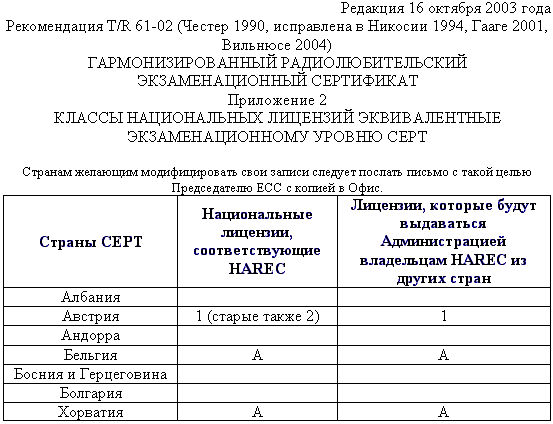
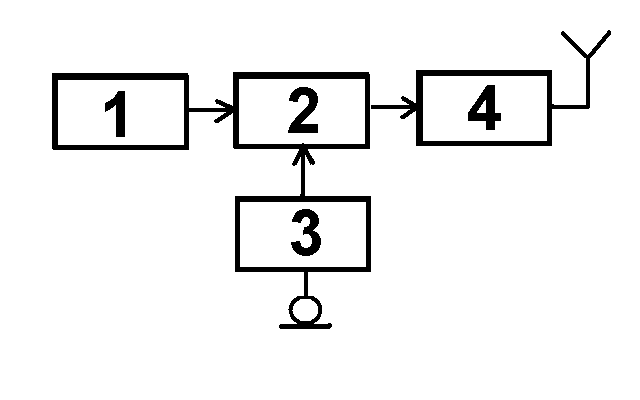
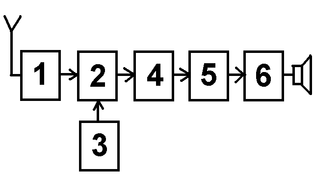

## Вопросы для третьей категории

### Вопрос №1  *(1/218)*

С какими радиостанциями может проводить радиосвязи любительская станция, если она НЕ участвует в проведении аварийно-спасательных работ?

- a) С любительскими радиостанциями и радиостанциями гражданского «Си - Би» диапазона (`27 МГц`)
- b) С любительскими радиостанциями и радиостанциями стандартов `LPD` (`433 МГц`, 10мВт) и `PMR` (`446 МГц`, `0,5 Вт`)
- c) С любительскими радиостанциями, радиостанциями гражданского «Си - Би» диапазона (`27 МГц`), а также с радиостанциями стандартов `LPD` (`433 МГц`, `10 мВт`) и `PMR` (`446 МГц`, `0,5 Вт`)
- d) Только с любительскими радиостанциями

*[Ответ:](# "d")* **$${\color{white}d}$$**

### Вопрос №2  *(2/218)*

В каких случаях любительская радиостанция может передавать кодированные сообщения?

- a) Только при работе вне любительских диапазонов
- b) Не регламентируется
- c) При участии в аварийно-спасательной связи
- d) Ни в каких, при этом передача контрольного номера в соревнованиях по радиоспорту, а также управляющих команд и телеметрии любительских радиостанций наземного и космического базирования не относится к передачам с использованием кодировки сигнала

*[Ответ:](# "d")* **$${\color{white}d}$$**

### Вопрос №3  *(3/218)*

Разрешено ли радиостанции любительской службы создание преднамеренных помех другим радиостанциям?

- a) Разрешено, если станция другой службы работает на более низкой основе
- b) Не разрешено в диапазонах совместного использования с другими службами связи
- c) Не разрешено
- d) Разрешено, если это «радиохулиган», который не реагирует на требования прекратить передачу

*[Ответ:](# "c")* **$${\color{white}c}$$**

### Вопрос №4  *(4/218)*

Разрешено ли радиостанции любительской службы передавать какие-либо сообщения за плату?

- a) Разрешено, если это реклама
- b) Не разрешено
- c) Не разрешено на частотах ниже `30 МГц`
- d) Разрешено, если это телеграммы в труднодоступные районы страны

*[Ответ:](# "b")* **$${\color{white}b}$$**

### Вопрос №5  *(5/218)*

Как называется станция любительской службы, производящая односторонние передачи в целях изучения условий распространения радиоволн?

- a) Цифровая станция
- b) Радиомаяк
- c) Станция радиоуправления
- d) Ретранслятор

*[Ответ:](# "b")* **$${\color{white}b}$$**

### Вопрос №6  *(6/218)*

Может ли станция любительской службы проводить радиосвязи с радиостанциями, не имеющими отношения к любительской службе?

- a) Не может
- b) Может, если эти станции имеют Свидетельства о регистрации РЭС
- c) Может для выяснения, на какой основе (первичной или вторичной) работают эти радиостанции
- d) Может в случае стихийных бедствий, при проведении аварийно-спасательных работ

*[Ответ:](# "d")* **$${\color{white}d}$$**

### Вопрос №7  *(7/218)*

Если радиооператор любительской радиостанции слышит сигнал бедствия на частоте, на которой он не имеете права осуществлять передачу, что ему разрешено сделать для помощи станции, терпящей бедствие?

- a) Ему разрешено помогать станции, терпящей бедствие, на любых частотах любым доступным способом
- b) Ему разрешено помогать, только если сигналы его радиостанции будут на ближайшей частоте в разрешенных границах
- c) Ему разрешено помогать вне разрешённых частот передачи, если только он использует международный код Морзе
- d) Ему не разрешено помогать, потому что сигнал лежит вне границ разрешенных ему частот

*[Ответ:](# "a")* **$${\color{white}a}$$**

### Вопрос №8  *(8/218)*

На сколько условных районов разделён земной шар по схеме деления на районы `IARU` (`ITU`)?

- a) На три
- b) На пять
- c) На два
- d) На четыре

*[Ответ:](# "a")* **$${\color{white}a}$$**

### Вопрос №9  *(9/218)*

Какие территории входят в первый район `IARU` (`ITU`)?

- a) Южная Америка
- b) Австралия и Океания
- c) Северная Америка
- d) Африка, Европа, страны бывшего СССР

*[Ответ:](# "d")* **$${\color{white}d}$$**

### Вопрос №10  *(10/218)*

На основании рекомендаций какой организации в различных странах Европы и ряде неевропейских стран устанавливаются единые требования к квалификации радиолюбителей?

- a) `СРР` (Союз радиолюбителей России)
- b) `СЕРТ` (Европейская конференция администраций почт и электросвязи)
- c) `WRL` (Всемирная радиолюбительская лига)
- d) `ITU` (МСЭ, Международный союз электросвязи)

*[Ответ:](# "b")* **$${\color{white}b}$$**

### Вопрос №11  *(11/218)*

Какой из перечисленных позывных сигналов образован для любительской службы?

- a) `RA3A`
- b) `БЕРЁЗА`
- c) `АТ-321`
- d) `RIT`

*[Ответ:](# "a")* **$${\color{white}a}$$**

### Вопрос №12  *(12/218)*

Какой из перечисленных позывных сигналов образован для любительской службы?

- a) `RA9EM`
- b) `RMT`
- c) `MO13`
- d) `ФОНАРЬ`

*[Ответ:](# "a")* **$${\color{white}a}$$**

### Вопрос №13  *(13/218)*

Какой позывной сигнал не относится к любительской службе?

- a) `RIT`
- b) `R4IT`
- c) `R44ITU`
- d) `R8SRR`

*[Ответ:](# "a")* **$${\color{white}a}$$**

### Вопрос №14  *(14/218)*

Как называется международная организация радиолюбителей?

- a) `СЕРТ` (Европейская конференция администраций почт и электросвязи)
- b) `IARU` (Международный радиолюбительский союз)
- c) `WRL` (Всемирная радиолюбительская лига)
- d) `ITU` (МСЭ, Международный союз электросвязи)

*[Ответ:](# "b")* **$${\color{white}b}$$**

### Вопрос №15  *(15/218)*

Что обозначает сокращение «DX»?

- a) Дальнюю или редкую радиостанцию
- b) Радиостанцию, работающую в соревнованиях
- c) Радиостанцию, работающую с плохим сигналом
- d) Радиостанцию, работающую малой мощностью

*[Ответ:](# "a")* **$${\color{white}a}$$**

### Вопрос №16  *(16/218)*

При каких условиях любительская радиостанция может использоваться на борту морского или воздушного судна

- a) С согласия командира судна и при условии соблюдения всех правил по обеспечению безопасности полетов или мореплавания
- b) С согласия владельца судна
- c) При наличии разрешений Морского или Воздушного Регистров
- d) При любых условиях

*[Ответ:](# "a")* **$${\color{white}a}$$**

### Вопрос №17  *(17/218)*

Разрешается ли допуск на любительскую радиостанцию лица, не имеющего квалификацию или имеющего квалификацию более низкой категории?

- a) Не допускается
- b) Допускаются только лица не старше `19 лет`
- c) Допускается исключительно в целях обучения и при условии обеспечения непрерывного контроля за его работой
- d) Допускается только при участии в соревнованиях

*[Ответ:](# "c")* **$${\color{white}c}$$**

### Вопрос №18  *(18/218)*

Какой российский документ имеет силу полной лицензии СЕРТ?

- a) Свидетельство об образовании позывного сигнала опознавания радиолюбителя третьей квалификационной категории
- b) Свидетельство об образовании позывного сигнала опознавания радиолюбителя первой категории
- c) Свидетельство о регистрации РЭС первой категории
- d) Свидетельство об образовании позывного сигнала опознавания радиолюбителя первой или второй квалификационной категории

*[Ответ:](# "d")* **$${\color{white}d}$$**

### Вопрос №19  *(19/218)*

Какой российский документ имеет силу лицензии СЕРТ новичка (Novice)?

- a) Свидетельство об образовании позывного сигнала опознавания радиолюбителя третьей квалификационной категории
- b) Свидетельство о регистрации РЭС третьей квалификационной категории
- c) Свидетельство об образовании позывного сигнала опознавания радиолюбителя первой или второй квалификационной категории
- d) Свидетельство о регистрации РЭС четвёртой квалификационной категории

*[Ответ:](# "a")* **$${\color{white}a}$$**

### Вопрос №20  *(20/218)*

В течение какого времени радиооператор любительской радиостанции, нерезидент, - обладатель полной или Novice - лицензии СЕРТ может осуществлять передачи с территории России без получения разрешительных документов?

- a) Не имеет права
- b) `90 дней`
- c) Ограничений нет
- d) `1 год`

*[Ответ:](# "b")* **$${\color{white}b}$$**

### Вопрос №21  *(21/218)*

Какой позывной сигнал должен передавать радиолюбитель, осуществляющий передачи при посещении страны, присоединившейся к рекомендациям `СЕРТ T/R 61-01` и `ЕСС(05)06` ?

- a) Передаётся свой позывной сигнал, после которого через дробь следует буква `"Р"`
- b) После своего позывного сигнала через дробь передаётся префикс страны пребывания
- c) Перед своим позывным сигналом через дробь передаётся префикс страны пребывания
- d) Передаётся только свой позывной сигнал

*[Ответ:](# "c")* **$${\color{white}c}$$**

### Вопрос №22  *(22/218)*

Какой позывной сигнал должен использовать российский радиолюбитель с позывным сигналом `RL3DX`, не имеющий бельгийской национальной радиолюбительской лицензии, для осуществления передач с территории Бельгии в течение первых `90` дней пребывания? Смотри подсказку.

- a) `ON33DX`
- b) `ON/RL3DX`
- c) `RL3DX/ON`
- d) `RL3DX`

*[Ответ:](# "b")* **$${\color{white}b}$$**

### Вопрос №23  *(23/218)*

Какой позывной сигнал должен использовать российский радиолюбитель с позывным сигналом `RL3DX`, не имеющий австрийской национальной радиолюбительской лицензии, для осуществления передач с территории Австрии в течение первых `90` дней пребывания? Смотри подсказку.

- a) `RL3DX/OE`
- b) `OE83DX`
- c) `OE/RL3DX`
- d) `RL3DX`

*[Ответ:](# "c")* **$${\color{white}c}$$**

### Вопрос №24  *(24/218)*

В каком документе содержатся сведения о том, в соответствии с какой национальной радиолюбительской лицензией может осуществлять передачи владелец полной или Novice - лицензии СЕРТ в стране пребывания? Как найти этот документ?

- a) В соответствии с решением Роскомнадзора. Находится в интернете на сайте Роскомнадзора по адресу [http://www.rsoc.ru](http://www.rsoc.ru)
- b) В соответствии с приложением № 2 рекомендации `СЕРТ T/R 61-01`. Находится в интернете на сайте Европейского комитета по радиосвязи по адресу [http://www.ero.dk](http://www.ero.dk)
- c) В соответствии с решением Союза радиолюбителей России. Находится в интернете на сайте СРР по адресу [http://www.srr.ru](http://www.srr.ru)
- d) В соответствии с последним Решением ГКРЧ по радиолюбителям. Находится в интернете на сайте ГРЧЦ по адресу [http://www.grfc.ru](http://www.grfc.ru)

*[Ответ:](# "b")* **$${\color{white}b}$$**

### Вопрос №25  *(25/218)*

Может ли обладатель Свидетельства об образовании позывного сигнала опознавания четвёртой квалификационной категории осуществлять передачи из стран пребывания, присоединившихся к рекомендациям `СЕРТ T/R 61-01` и `ЕСС(05)06`?

- a) Может в соответствии с полной лицензией СЕРТ
- b) Может в соответствии с лицензией СЕРТ новичка (Novice)
- c) Нет, не может
- d) Может в соответствии с международной лицензией СЕРТ

*[Ответ:](# "c")* **$${\color{white}c}$$**

### Вопрос №26  *(26/218)*

Даёт ли полная или Novice - лицензия СЕРТ, право беспрепятственно осуществлять ввоз и вывоз любительской аппаратуры в страны - члены СЕРТ?

- a) Даёт, но только в страны - члены СЕРТ
- b) Даёт, но только в страны, присоединившейся к рекомендациям `СЕРТ T/R 61-01` и `ЕСС(05)06`
- c) Не даёт. Рекомендации СЕРТ не заменяют таможенные правила и не имеют отношения к ввозу и вывозу радиолюбительской аппаратуры
- d) Даёт, но только радиолюбителю первой квалификационной категории

*[Ответ:](# "c")* **$${\color{white}c}$$**

### Вопрос №27  *(27/218)*

Какую функцию выполняет гармонизированный радиолюбительский экзаменационный сертификат `HAREC`?

- a) Это справка о сдаче экзамена по программе полной лицензии СЕРТ, на основании которой Администрация связи страны пребывания выдаёт национальную радиолюбительскую лицензию без экзамена
- b) Это лицензия, на основании которой радиолюбитель может осуществлять передачи из стран - членов СЕРТ в течение `90` дней
- c) Это справка о сдаче экзамена по программе лицензии СЕРТ новичка (Novice), на основании которой Администрация связи страны пребывания выдаёт национальную радиолюбительскую лицензию без экзамена
- d) Это свидетельство о членстве радиолюбителя в национальной радиолюбительской организации

*[Ответ:](# "a")* **$${\color{white}a}$$**

### Вопрос №28  *(28/218)*

Какую функцию выполняет радиолюбительский экзаменационный сертификат новичка `ARNEC`?

- a) Это свидетельство о членстве радиолюбителя в национальной радиолюбительской организации
- b) Это лицензия, на основании которой радиолюбитель может осуществлять передачи из стран - членов СЕРТ в течение `90` дней
- c) Это справка о сдаче экзамена по программе полной лицензии СЕРТ, на основании которой Администрация связи страны пребывания выдаёт национальную радиолюбительскую лицензию без экзамена
- d) Это справка о сдаче экзамена по программе лицензии СЕРТ новичка (Novice), на основании которой Администрация связи страны пребывания выдаёт национальную радиолюбительскую лицензию без экзамена

*[Ответ:](# "d")* **$${\color{white}d}$$**

### Вопрос №29  *(29/218)*

Какой позывной сигнал должен использовать для опознавания своей радиостанции владелец лицензии СЕПТ при временном (до `90` дней) посещении России?

- a) Свой позывной и далее после дроби условный номер федерального округа
- b) `R/` и далее свой позывной
- c) `RB/` и далее свой позывной
- d) `RA/` и далее свой позывной

*[Ответ:](# "d")* **$${\color{white}d}$$**

### Вопрос №30  *(30/218)*

Какой позывной сигнал должен использовать для опознавания своей радиостанции владелец лицензии СЕПТ "новичка" (`CEPT NOVICE`) при временном (до `90 дней`) посещении России?

- a) `RU/` и далее свой позывной
- b) Свой позывной и далее после дроби условный номер федерального округа
- c) `RC/` и далее свой позывной
- d) `RA/` и далее свой позывной

*[Ответ:](# "c")* **$${\color{white}c}$$**

### Вопрос №31  *(31/218)*

Какую возможность даёт российскому радиолюбителю наличие лицензии `CEPT В` стране, присоединившейся к рекомендации СЕРТ T/R 61-02` и сообщению `ERC 32` по получению документов?

- a) Получить национальную радиолюбительскую лицензию страны, присоединившейся к рекомендации `CEPT T/R 61-02` и сообщению `ERC 32` и международный экзаменационный сертификат (`HAREC` или `ARNE`) - без экзамена на основании лицензии `CEPT`
- b) Никакой дополнительной возможности для получения документов
- c) Получить только национальную радиолюбительскую лицензию страны, присоединившейся к рекомендации `CEPT T/R 61-02` и сообщению `ERC 32` без экзамена на основании лицензии `CEPT`
- d) Получить только международный экзаменационный сертификат (`HAREC` или `ARNE`) - без экзамена на основании лицензии `CEPT`

*[Ответ:](# "b")* **$${\color{white}b}$$**

### Вопрос №32  *(32/218)*

Какую национальную радиолюбительскую лицензию в Бельгии может без экзаменов получить российский радиолюбитель, имеющий Гармонизированный экзаменационный сертификат `HAREC`? (Смотри подсказку)

- a) Лицензию СЕРТ
- b) Лицензию класса "А"
- c) Лицензию второй категории
- d) Лицензию `HAREC`

*[Ответ:](# "b")* **$${\color{white}b}$$**

### Вопрос №33  *(33/218)*

Где можно сдать международный экзамен на получение гармонизированного радиолюбительского экзаменационного сертификата `HAREC`?

- a) Международных экзаменов на получение гармонизированного экзаменационного сертификата `HAREC` не существует. Каждая страна СЕРТ организует национальные экзамены в соответствии с темами, перечисленными в приложении № 6 рекомендаций `T/R61-02`
- b) В штаб - квартире `ITU В` Вене
- c) Заочно в интернете на сайте Европейского комитета по радиосвязи по адресу [http://www.ero.dk](http://www.ero.dk)
- d) В штаб - квартире СЕРТ в Женеве

*[Ответ:](# "a")* **$${\color{white}a}$$**

### Вопрос №34  *(34/218)*

Может ли гражданин России сдать экзамен на получение гармонизированного радиолюбительского экзаменационного сертификата `HAREC` за пределами России?

- a) Нет, не может
- b) Может, если он является членом национальной радиолюбительской организации
- c) Да, может. Для этого гражданин России должен сдать национальный радиолюбительский экзамен в любой стране СЕРТ, на квалификационную категорию (класс), соответствующую полной лицензии `CEPT`
- d) Может - только в штаб - квартире `ITU`

*[Ответ:](# "c")* **$${\color{white}c}$$**

### Вопрос №47  *(35/218)*

Какой из перечисленных диапазонов выделен любительской службе на первичной основе?

- a) `2 м`
- b) `23 см`
- c) `70 см`
- d) `90 см`

*[Ответ:](# "a")* **$${\color{white}a}$$**

### Вопрос №48  *(36/218)*

Что должен делать радиооператор любительской радиостанции, ведущий передачу в диапазоне частот, выделенном любительской службе на вторичной основе, при требовании прекратить передачу со стороны радиостанции, работающей на первичной основе?

- a) Продолжать передачу
- b) Выяснить позывной радиостанции, работающей на первичной основе
- c) Выяснить местоположение радиостанции, работающей на первичной основе
- d) Прекратить передачу

*[Ответ:](# "d")* **$${\color{white}d}$$**

### Вопрос №49  *(37/218)*

Для каких целей предназначена любительская и любительская спутниковая службы в Российской Федерации?

- a) Для оказания помощи зарубежным странам в улучшении технического состояния сетей радиосвязи и технического мастерства обслуживающего персонала, а также для поощрения визитов зарубежных радиолюбителей
- b) Для самореализации граждан в сфере любительской радиосвязи и радиоспорта, изучения, исследования и экспериментального использования новых технологий и видов радиосвязи, развития технического творчества детей и молодежи, социальной реабилитации граждан с ограниченными возможностями
- c) Для разработки радиосхем, увеличения числа разработчиков радиосхем
- d) Для обеспечения граждан Российской Федерации везде и всегда, где это возможно, бесплатными средствами связи, в том числе мобильными.

*[Ответ:](# "b")* **$${\color{white}b}$$**

### Вопрос №50  *(38/218)*

Какие темы запрещены для радиообмена в эфире?

- a) Только угрозы применения насилия, оскорбления и клевета
- b) Только политика
- c) Политика, религия коммерческая реклама, высказывания экстремистского характера, угрозы применения насилия, оскорбления и клевета
- d) Для радиообмена в эфире нет запрещённых тем

*[Ответ:](# "c")* **$${\color{white}c}$$**

### Вопрос №51  *(39/218)*

Какие сведения запрещены к передаче радиооператорам радиостанций любительской службы?

- a) Сведения, составляющие государственную тайну
- b) Сведения, полученные при прослушивании работы любительских радиостанций
- c) Не регламентируется
- d) Сведения, полученные от корреспондентов

*[Ответ:](# "a")* **$${\color{white}a}$$**

### Вопрос №52  *(40/218)*

Какая организация контролирует выполнение правил и требований любительской службы в России?

- a) Союз радиолюбителей России (СРР)
- b) Государственная комиссия по радиочастотам (ГКРЧ)
- c) Роскомнадзор
- d) Главный радиочастотный центр (ФГУП ГРЧЦ)

*[Ответ:](# "c")* **$${\color{white}c}$$**

### Вопрос №53  *(41/218)*

Сколько категорий радиолюбителей установлено в России?

- a) Пять
- b) Четыре
- c) Шесть
- d) Три

*[Ответ:](# "b")* **$${\color{white}b}$$**

### Вопрос №54  *(42/218)*

Сколько постоянных позывных сигналов может быть образовано любительской радиостанции?

- a) Только один
- b) Два, при этом второй — только для обучения
- c) Нет ограничений
- d) Три

*[Ответ:](# "b")* **$${\color{white}b}$$**

### Вопрос №55  *(43/218)*

Какая категория предоставляет радиолюбителю в России наибольшие возможности работы в эфире?

- a) Четвёртая
- b) «Супер»
- c) Первая
- d) «Экстра»

*[Ответ:](# "c")* **$${\color{white}c}$$**

### Вопрос №56  *(44/218)*

Какой максимальной мощностью разрешено производить передачи любительским радиостанциям четвертой категории?

- a) Один ватт
- b) Десять ватт
- c) Пять ватт
- d) Мощность не ограничена

*[Ответ:](# "c")* **$${\color{white}c}$$**

### Вопрос №57  *(45/218)*

На каких диапазонах разрешено осуществлять передачи радиооператорам любительских радиостанций четвертой категории самостоятельно с собственной радиостанции?

- a) На всех диапазонах, выделенных любительской службе в России
- b) Только на диапазоне `160` метров
- c) На диапазоне `160` метров и `УКВ`-диапазонах
- d) Только на `УКВ` - диапазонах

*[Ответ:](# "d")* **$${\color{white}d}$$**

### Вопрос №58  *(46/218)*

С каких радиостанций разрешено осуществлять передачи начинающим радиолюбителям, не имеющим категории?

- a) С любых радиостанций только под непосредственным контролем управляющего оператора
- b) С радиостанций 1 и 2 категории только под непосредственным контролем управляющего оператора
- c) С радиостанций 1 категории только под непосредственным контролем управляющего оператора
- d) Начинающим радиолюбителям, не имеющим категории, осуществлять передачи запрещено

*[Ответ:](# "a")* **$${\color{white}a}$$**

### Вопрос №59  *(47/218)*

С каких радиостанций разрешено осуществлять передачи в диапазоне коротких волн радиооператорам любительских радиостанций четвёртой категории?

- a) Радиооператорам любительских радиостанций четвёртой категории осуществлять передачи в диапазоне коротких волн запрещено
- b) С радиостанций физических и юридических лиц, имеющих `1 категорию`
- c) С радиостанций физических и юридических лиц, имеющих `1, 2 и 3 категорию` и только под непосредственным контролем управляющего оператора
- d) С радиостанций физических и юридических лиц, имеющих `1, и 2 категорию`

*[Ответ:](# "c")* **$${\color{white}c}$$**

### Вопрос №60  *(48/218)*

Из каких частей состоит позывной сигнал?

- a) Суффикс и астериск
- b) Суффикс и приставка
- c) Префикс и астериск
- d) Префикс и суффикс

*[Ответ:](# "d")* **$${\color{white}d}$$**

### Вопрос №61  *(49/218)*

Как правильно записывается позывной, произнесенный в эфире как `"Роман-Жук-ТриДмитрий-Анна-Василий"`?

- a) `RW3DAV`
- b) `RV3DAW`
- c) `RQ3DAW`
- d) `RG3DAV`

*[Ответ:](# "b")* **$${\color{white}b}$$**

### Вопрос №62  *(50/218)*

Как правильно записывается позывной, произнесенный в эфире как `"Роман-Знак-ТриДмитрий-Галина-Зинаида"`?

- a) `RZ3DHZ`
- b) `RZ3DGX`
- c) `RZ3DGZ`
- d) `RX3DGZ`

*[Ответ:](# "d")* **$${\color{white}d}$$**

### Вопрос №63  *(51/218)*

Как правильно записывается позывной, произнесенный в эфире как `"Ульяна-Анна-ТриЩука-Жук-Иван-Краткий"`?

- a) `UA3QVI`
- b) `UA3QVJ`
- c) `UA3VQJ`
- d) `UA3VQIK`

*[Ответ:](# "b")* **$${\color{white}b}$$**

### Вопрос №64  *(52/218)*

Укажите позывной радиооператора любительской радиостанции из России

- a) `UA9AAA`
- b) `UK8AAA`
- c) `US5AAA`
- d) `UN8AAA`

*[Ответ:](# "a")* **$${\color{white}a}$$**

### Вопрос №65  *(53/218)*

Какой из перечисленных ниже позывных используется для опознавания любительской радиостанции, установленной на автомобиле или речном судне?

- a) `UA3AA/s`
- b) `UA3AA/m`
- c) `UA3AA/mm`
- d) `UA3AA/z`

*[Ответ:](# "b")* **$${\color{white}b}$$**

### Вопрос №66  *(54/218)*

Какой позывной сигнал использовал Э. Т. Кренкель?

- a) `UW3DI`
- b) `R1FL`
- c) `UA1FA`
- d) `RAEM`

*[Ответ:](# "d")* **$${\color{white}d}$$**

### Вопрос №67  *(55/218)*

Кому принадлежал позывной сигнал `RAEM`?

- a) Кудрявцев Ю. Н.
- b) Кренкель Э. Т.
- c) Лаповок Я. С.
- d) Лбов Ф. А.

*[Ответ:](# "b")* **$${\color{white}b}$$**

### Вопрос №68  *(56/218)*

Укажите позывной сигнал любительской радиостанции, принадлежащей ветерану Великой Отечественной войны?

- a) `RR3DH`
- b) `R73SRR`
- c) `U3DI`
- d) `R3DAAD/B`

*[Ответ:](# "c")* **$${\color{white}c}$$**

### Вопрос №69  *(57/218)*

Укажите позывной сигнал любительской радиостанции четвёртой категории

- a) `R73SRR`
- b) `U3DI`
- c) `R3DAAD`
- d) `RR3DH`

*[Ответ:](# "c")* **$${\color{white}c}$$**

### Вопрос №70  *(58/218)*

Какие префиксы позывных сигналов выделены для радиолюбителей России?

- a) `R0 - R9`, `RA0 - RZ9`, `UA0-UI9`
- b) `RA0 - RZ9`
- c) `UA0-UZ9`
- d) `RA0 - RZ9`, `UA0-UZ9`

*[Ответ:](# "a")* **$${\color{white}a}$$**

### Вопрос №71  *(59/218)*

Какой мощностью работает радиостанция любительской службы с позывным сигналом `UA3AA/QRP`?

- a) Более `200 Ватт`
- b) Нельзя определить
- c) `5 Ватт`, или менее
- d) Более `1000 Ватт`

*[Ответ:](# "c")* **$${\color{white}c}$$**

### Вопрос №72  *(60/218)*

Когда радиооператор любительской радиостанции может использовать свою любительскую радиостанцию для передачи `"SOS"` или `"MAYDAY"` на радиочастотах, выделенных другим службам радиосвязи?

- a) Когда передано штормовое предупреждение
- b) Только в определённое время (через `15` или `30` минут после начала часа)
- c) Никогда
- d) В исключительных случаях и только при непосредственной угрозе жизни и здоровью граждан

*[Ответ:](# "d")* **$${\color{white}d}$$**

### Вопрос №73  *(61/218)*

Разрешено ли радиолюбительской станции передавать музыку?

- a) Разрешено только в вечернее время
- b) Не разрешено, кроме передачи музыкальных позывных
- c) Не разрешено
- d) Разрешено на частотах выше `433 МГц`

*[Ответ:](# "c")* **$${\color{white}c}$$**

### Вопрос №74  *(62/218)*

При каких условиях радиооператор любительской радиостанции может самостоятельно осуществлять передачи с принадлежащей ему радиостанции?

- a) При наличии у радиооператора членского билета Союза радиолюбителей России
- b) При наличии у радиооператора Разрешения на эксплуатацию радиостанции
- c) При наличии у радиооператора Сертификата соответствия на радиостанцию
- d) При наличии у радиооператора эксплуатационной и технической квалификации, позывного сигнала, регистрации РЭС, а также выполнении Решения ГКРЧ по любительской службе

*[Ответ:](# "d")* **$${\color{white}d}$$**

### Вопрос №75  *(63/218)*

Какая организация образует позывной сигнал радиостанции любительской службы?

- a) Государственная комиссия по радиочастотам
- b) Радиочастотная служба, состоящая из Главного радиочастотного центра, а также радиочастотных центров Федеральных округов и их филиалов в Республиках, краях и областях
- c) Союз радиолюбителей России
- d) Территориальное управление Роскомнадзора

*[Ответ:](# "b")* **$${\color{white}b}$$**

### Вопрос №76  *(64/218)*

Сколько Свидетельств о регистрации радиоэлектронного средства (РЭС), должен получить радиооператор любительской радиостанции?

- a) По одному на каждое радиоэлектронное средство (трансивер)
- b) Только одно
- c) Одно на позывной и по одному на каждый трансивер
- d) Максимум два: одно на основное место жительства и одно на дачу

*[Ответ:](# "a")* **$${\color{white}a}$$**

### Вопрос №77  *(65/218)*

Может ли радиолюбитель допустить другого радиолюбителя, не имеющего позывного, для работы со своей радиостанции?

- a) Может только под личным контролем
- b) Может только под контролем Роскомнадзора
- c) Может только под контролем Радиочастотной службы
- d) Не может

*[Ответ:](# "a")* **$${\color{white}a}$$**

### Вопрос №78  *(66/218)*

Эксплуатация радиоэлектронных средств без специального разрешения (лицензии), если такое разрешение (лицензия) обязательно (обязательна) влечёт административное наказание физического лица в виде: ?

- a) Предупреждение в письменной форме
- b) Административный арест физического лица на срок до пятнадцати суток
- c) Лишение специального права, предоставленного физическому лицу на три года
- d) Наложение административного штрафа на физическое лицо с конфискацией радиоэлектронных средств или без таковой

*[Ответ:](# "d")* **$${\color{white}d}$$**

### Вопрос №79  *(67/218)*

Каким документом российским радиолюбителям выделяются полосы радиочастот для проведения радиосвязей?

- a) Постановлением Правительства РФ (ППРФ)
- b) Решением Госинспекции электросвязи РФ (ГИЭ)
- c) Решением Государственной комиссии по радиочастотам (ГКРЧ)
- d) Решением Министерства внутренних дел (МВД)

*[Ответ:](# "c")* **$${\color{white}c}$$**

### Вопрос №80  *(68/218)*

Имеет ли право лицо, не имеющее квалификации радиолюбителя (категории), осуществлять самостоятельно передачи на зарегистрированной любительской радиостанции, переданной ему по доверенности?

- a) Да, только в случае, если доверенность заверена нотариально
- b) Да, при наличии разрешения полиции
- c) Да
- d) Нет. Лицо, не имеющее квалификации радиолюбителя, может осуществлять передачи только под контролем управляющего оператора, указанного в Свидетельстве о регистрации РЭС

*[Ответ:](# "d")* **$${\color{white}d}$$**

### Вопрос №81  *(69/218)*

Что определяется Свидетельством об образовании позывного сигнала опознавания?

- a) Только позывной сигнал любительской радиостанции
- b) Квалификационная категория радиооператора любительской радиостанции и позывной сигнал опознавания радиостанций
- c) Свидетельство об образовании позывного сигнала опознавания является разрешением на осуществление радиолюбителем передач с любых радиостанций
- d) Только квалификационная категория радиооператора любительской радиостанции

*[Ответ:](# "b")* **$${\color{white}b}$$**

### Вопрос №82  *(70/218)*

В каком случае радиооператор любительской радиостанции может не вести аппаратный журнал?

- a) При использовании стационарной радиостанции в полосах радиочастот выше `30 МГц`
- b) При проведении радиосвязей цифровыми видами связи
- c) При использовании мобильной радиостанции в полосах радиочастот выше `30 МГц`
- d) При проведении радиосвязей с местными корреспондентами

*[Ответ:](# "c")* **$${\color{white}c}$$**

### Вопрос №83  *(71/218)*

Какой минимальный объём информации фиксируется в аппаратном журнале любительской радиостанции?

- a) Позывной корреспондента и оба рапорта
- b) Позывной корреспондента, его имя и местонахождение, используемая аппаратура и антенны, краткая характеристика погодных условий
- c) Дата и время проведения радиосвязи
- d) Дата и время проведения радиосвязи, диапазон и вид работы, позывной корреспондента

*[Ответ:](# "d")* **$${\color{white}d}$$**

### Вопрос №84  *(72/218)*

Какой минимальный объём информации фиксируется в аппаратном журнале любительского ретранслятора или радиомаяка?

- a) При работе любительских ретрансляторов и радиомаяков аппаратный журнал не ведётся
- b) Выходная мощность и потребляемый ток
- c) Список позывных сигналов допущенных корреспондентов
- d) Время включения и выключения

*[Ответ:](# "d")* **$${\color{white}d}$$**

### Вопрос №85  *(73/218)*

Сколько времени должен храниться аппаратный журнал любительской радиостанции?

- a) Не менее шести месяцев после того, как он начат
- b) Не менее одного года после внесения в него последних сведений
- c) Вечно
- d) Не менее трёх лет после внесения в него последних сведений

*[Ответ:](# "b")* **$${\color{white}b}$$**

### Вопрос №86  *(74/218)*

Обязательно ли переносить сведения в аппаратный журнал любительской радиостанции из отдельного журнала учёта радиосвязей, проведённых в соревнованиях?

- a) Обязательно, если учёт связей в соревнованиях вёлся с использованием компьютера
- b) Нет
- c) Обязательно, если учёт связей в соревнованиях вёлся на бумажном носителе
- d) Да

*[Ответ:](# "b")* **$${\color{white}b}$$**

### Вопрос №87  *(75/218)*

Можно ли вносить в аппаратный журнал любительской радиостанции какую-либо информацию помимо обязательной

- a) Можно вносить дополнительную информацию только об используемой аппаратуре и погодных условиях
- b) Можно вносить дополнительную информацию, только переданную корреспондентом
- c) Нельзя
- d) Можно вносить любую дополнительную информацию

*[Ответ:](# "d")* **$${\color{white}d}$$**

### Вопрос №88  *(76/218)*

Какая полоса частот двухметрового диапазона предназначена для работы частотной модуляцией (`FM`) без использования наземных ретрансляторов и радиолюбительских спутников?

- a) `145`,`206-145`,`594 МГц`
- b) `145 - 146 МГц`
- c) `144.0 - 144.5 МГц`
- d) `144 - 146 МГц`

*[Ответ:](# "a")* **$${\color{white}a}$$**

### Вопрос №89  *(77/218)*

Каков разнос частот приёма и передачи любительского ретранслятора на диапазоне `70 см`?

- a) `6 МГц`
- b) `600 кГц`
- c) `1,6 МГц`
- d) `100 кГц`

*[Ответ:](# "c")* **$${\color{white}c}$$**

### Вопрос №90  *(78/218)*

Каков разнос частот приёма и передачи любительского ретранслятора на диапазоне `2 м`?

- a) `100 кГц`
- b) `1,6 МГц`
- c) `6 МГц`
- d) `600 кГц`

*[Ответ:](# "d")* **$${\color{white}d}$$**

### Вопрос №91  *(79/218)*

Каков разнос частот приёма и передачи любительского ретранслятора на диапазоне `23 см`?

- a) `100 кГц`
- b) `600 кГц`
- c) `6 МГц`
- d) `1,6 МГц`

*[Ответ:](# "c")* **$${\color{white}c}$$**

### Вопрос №92  *(80/218)*

Какое сообщение может регулярно передавать любительский ретранслятор азбукой Морзе?

- a) Новости для радиолюбителей
- b) Значение температуры ретранслятора и напряжение питания
- c) Телеметрию
- d) Позывной сигнал ретранслятора

*[Ответ:](# "d")* **$${\color{white}d}$$**

### Вопрос №93  *(81/218)*

Какие станции пользуются преимуществом при проведении радиосвязей через любительский ретранслятор?

- a) Стационарные
- b) Местные
- c) Иностранные
- d) Носимые и возимые

*[Ответ:](# "d")* **$${\color{white}d}$$**

### Вопрос №94  *(82/218)*

Что может потребоваться передавать вашей радиостанции одновременно с речевым сигналом для проведения `QSO` через любительский ретранслятор?

- a) Позывной сигнал владельца ретранслятора
- b) Субтон
- c) Звук высокого тона, указывающий на окончание передачи
- d) Позывной сигнал ретранслятора

*[Ответ:](# "b")* **$${\color{white}b}$$**

### Вопрос №95  *(83/218)*

Какой экзаменационной программе `CEPT` соответствуют вопросы на четвёртую категорию?

- a) Сообщению `ECC 89` (`ENTRY LEVEL`)
- b) Сообщению `CEPT ERC32` (`ARNEC`)
- c) Рекомендации `CEPT T/R 61-02` (`HAREC`). Дополнительно требуется продемонстрировать умение принимать на слух текст азбукой Морзе со скоростью 60 знаков в минуту
- d) Рекомендации `CEPT T/R 61-02` (`HAREC`)

*[Ответ:](# "a")* **$${\color{white}a}$$**

### Вопрос №96  *(84/218)*

Какой экзаменационной программе `CEPT` соответствуют вопросы на третью категорию?

- a) Рекомендации `CEPT T/R 61-02` (`HAREC`). Дополнительно требуется продемонстрировать умение принимать на слух текст азбукой Морзе со скоростью 60 знаков в минуту
- b) Сообщению `CEPT ERC32` (`ARNEC`)
- c) Рекомендации `CEPT T/R 61-02` (`HAREC`)
- d) Сообщению `ECC 89` (`ENTRY LEVEL`)

*[Ответ:](# "b")* **$${\color{white}b}$$**

### Вопрос №97  *(85/218)*

Какой экзаменационной программе `CEPT` соответствуют вопросы на вторую категорию?

- a) Рекомендации `CEPT T/R 61-02` (`HAREC`). Дополнительно требуется продемонстрировать умение принимать на слух текст азбукой Морзе со скоростью 60 знаков в минуту
- b) Сообщению `ECC 89` (`ENTRY LEVEL`)
- c) Рекомендации `CEPT T/R 61-02` (`HAREC`)
- d) Сообщению `CEPT ERC32` (`ARNEC`)

*[Ответ:](# "c")* **$${\color{white}c}$$**

### Вопрос №98  *(86/218)*

Какой экзаменационной программе `CEPT` соответствуют вопросы на первую категорию?

- a) Рекомендации `CEPT T/R 61-02` (`HAREC`). Дополнительно требуется продемонстрировать умение принимать на слух текст азбукой Морзе со скоростью 60 знаков в минуту
- b) Сообщению `CEPT ERC32` (`ARNEC`)
- c) Сообщению `ECC 89` (`ENTRY LEVEL`)
- d) Рекомендации `CEPT T/R 61-02` (`HAREC`)

*[Ответ:](# "a")* **$${\color{white}a}$$**

### Вопрос №100  *(87/218)*

Как осуществляется общий вызов (`CQ`) при голосовой передаче?

- a) Сначала «Всем», затем несколько раз позывной, затем «приём»
- b) Сначала «Всем», затем несколько раз имя
- c) Несколько раз называется свой самостоятельно придуманный «ник»
- d) Несколько раз называется свой позывной

*[Ответ:](# "a")* **$${\color{white}a}$$**

### Вопрос №101  *(88/218)*

Что необходимо сделать перед передачей общего вызова (`CQ`)?

- a) Убедиться, что операторам других станций не будет создано помех
- b) Несколько раз перевести радиостанцию в режим передачи
- c) Несколько раз передать свой позывной
- d) Дать короткий общий вызов

*[Ответ:](# "a")* **$${\color{white}a}$$**

### Вопрос №102  *(89/218)*

Как следует отвечать на голосовой общий вызов (`CQ`)?

- a) Назвать позывной вызывающей станции, по крайней мере, `пять раз` по буквам, затем слово "здесь", затем Ваш позывной, по крайней мере, `один раз`
- b) Назвать позывной вызывающей станции, по крайней мере, `три раза`, затем слово "здесь", затем Ваш позывной, по крайней мере, `пять раз по буквам`
- c) Назвать позывной вызывающей станции, по крайней мере, `один раз`, затем слово "здесь", затем Ваш позывной `по буквам`
- d) Назвать позывной вызывающей станции, по крайней мере, `10` раз, затем слово "здесь", затем Ваш позывной по крайней мере `дважды`

*[Ответ:](# "c")* **$${\color{white}c}$$**

### Вопрос №103  *(90/218)*

Каковы права радиооператоров любительских радиостанций, желающих использовать одну и ту же свободную частоту?

- a) Радиооператор станции, мощность которой меньше, должен уступить частоту оператору станции, мощность которой больше
- b) Радиооператоры станций второго и третьего районов `ITU` должны уступить частоту радиооператорам станций первого района `ITU`
- c) Радиооператор станции низшей категории должен уступить частоту оператору станции высшей категории
- d) Радиооператоры обеих станций имеют равные права для работы на частоте

*[Ответ:](# "d")* **$${\color{white}d}$$**

### Вопрос №104  *(91/218)*

Как следует выбирать мощность радиостанции при проведении радиосвязи?

- a) Мощность радиостанции не имеет значения
- b) Всегда необходимо устанавливать максимально возможную мощность
- c) Всегда необходимо устанавливать минимально возможную мощность
- d) Необходимо устанавливать минимальную мощность, достаточную для обеспечения уверенного приема вашего сигнала корреспондентом

*[Ответ:](# "d")* **$${\color{white}d}$$**

### Вопрос №105  *(92/218)*

Разрешается ли изменять частоту радиостанции, находящейся в режиме передачи?

- a) Да, только за границами любительских диапазонов
- b) Да, только для компенсации допплеровского сдвига радиочастоты при проведении радиосвязи с использованием любительских ретрансляторов, установленных на борту космических аппаратов
- c) Да
- d) Нет

*[Ответ:](# "b")* **$${\color{white}b}$$**

### Вопрос №106  *(93/218)*

Что следует сделать любительским станциям сразу после обмена позывными и рапортами на вызывной частоте?

- a) Назвать свои позывные сигналы и продолжить радиообмен
- b) Ограничений на радиообмен на вызывной частоте не существует
- c) Немедленно закончить радиообмен
- d) Либо закончить радиообмен, либо перейти на другую частоту для продолжения радиообмена

*[Ответ:](# "d")* **$${\color{white}d}$$**

### Вопрос №107  *(94/218)*

В каком порядке при проведении `QSO` голосовыми видами связи называются позывные?

- a) Свой позывной, затем - позывной корреспондента
- b) Не имеет значения
- c) Позывной корреспондента, затем свой
- d) Всегда только свой позывной

*[Ответ:](# "c")* **$${\color{white}c}$$**

### Вопрос №108  *(95/218)*

В каком порядке даются оценки сигнала корреспондента при передаче рапорта по системе `RST`?

- a) Разбираемость, слышимость (сила сигнала), тон
- b) Слышимость (сила сигнала), разбираемость, тон
- c) Тон, слышимость (сила сигнала), разбираемость
- d) Тон, разбираемость, слышимость (сила сигнала)

*[Ответ:](# "a")* **$${\color{white}a}$$**

### Вопрос №109  *(96/218)*

Что означает "Ваш сигнал - пять девять плюс `20 дб`..."?

- a) Полоса Вашего сигнала на `20` децибел выше линейности
- b) Измеритель относительной силы сигнала вашего корреспондента показывает значение, на `20 дб` превышающее отметку в 9 баллов по шкале «S»
- c) Повторите Вашу передачу на частоте на `20 кГц` Выше
- d) Сила Вашего сигнала увеличилась в `100` раз

*[Ответ:](# "b")* **$${\color{white}b}$$**

### Вопрос №110  *(97/218)*

Какой рапорт (`RS`) при голосовой связи нужно дать радиостанции, которую слышно очень громко и при этом вся передаваемая ей информация разбирается полностью?

- a) `57`
- b) `59`
- c) `599`
- d) `39`

*[Ответ:](# "b")* **$${\color{white}b}$$**

### Вопрос №111  *(98/218)*

Какой рапорт (`RS`) при голосовой связи нужно дать радиостанции, которую слышно очень громко, но из-за плохого качества модуляции отдельные слова принять невозможно?

- a) `599`
- b) `59`
- c) `49`
- d) `73`

*[Ответ:](# "c")* **$${\color{white}c}$$**

### Вопрос №112  *(99/218)*

Каков высший балл оценки разбираемости сигналов корреспондента по системе `RS` или `RST`?

- a) `5` баллов
- b) `1` балл
- c) `9` баллов
- d) `59` баллов

*[Ответ:](# "a")* **$${\color{white}a}$$**

### Вопрос №113  *(100/218)*

Каков высший балл оценки слышимости (силы сигнала) корреспондента по системе `RS` или `RST`?

- a) `5` баллов
- b) `9` баллов
- c) `59` баллов
- d) `1` балл

*[Ответ:](# "b")* **$${\color{white}b}$$**

### Вопрос №114  *(101/218)*

С какой целью используются кодовые слова фонетического алфавита?

- a) Для повышения разборчивости при передаче позывных сигналов и слов сообщений в условиях помех
- b) Для оценки разбираемости сигналов корреспондента
- c) Для передачи общего вызова
- d) Для оценки слышимости (силы сигнала) корреспондента

*[Ответ:](# "a")* **$${\color{white}a}$$**

### Вопрос №115  *(102/218)*

Какие радиолюбительские диапазоны относятся к ультракоротковолновым?

- a) `10 м`, `2 м`, `70 см`
- b) `10 м`, `2 м`
- c) Все диапазоны выше `30 МГц`
- d) `433 МГц` и выше

*[Ответ:](# "c")* **$${\color{white}c}$$**

### Вопрос №116  *(103/218)*

Как радиооператор должен вызывать корреспондента в любительском ретрансляторе, если он знает позывной корреспондента?

- a) Назвать позывной вызываемой станции, затем назвать свой позывной
- b) Сказать `"Брэк, брэк - 73"`, затем назвать позывной вызываемой станции
- c) Сказать три раза `"CQ"`, затем назвать позывной вызываемой станции
- d) Подождать пока станция даст `"CQ"`, затем ответить ей

*[Ответ:](# "a")* **$${\color{white}a}$$**

### Вопрос №117  *(104/218)*

Как правильно включиться в разговор в любительском ретрансляторе?

- a) Назвать Ваш позывной во время паузы между передачами
- b) Немедленно передать: "Брэк - брэк!", чтобы показать, что Вы сильно хотите принять участие в разговоре
- c) Включить усилитель мощности и перекрыть всех, кто работает на передачу
- d) Дождаться окончания передачи и начать вызывать необходимую станцию

*[Ответ:](# "a")* **$${\color{white}a}$$**

### Вопрос №118  *(105/218)*

Почему следует делать короткие паузы между передачами при использовании любительского ретранслятора?

- a) Для проверки КСВ ретранслятора
- b) Чтобы ретранслятор не сильно нагревался
- c) Чтобы успеть сделать запись в аппаратном журнале
- d) Чтобы послушать, не просит ли кто-либо еще предоставить ему возможность воспользоваться ретранслятором

*[Ответ:](# "d")* **$${\color{white}d}$$**

### Вопрос №119  *(106/218)*

Почему передачи через любительский ретранслятор должны быть короткими?

- a) Длинные передачи могут затруднить пользование любительским ретранслятором в аварийной ситуации
- b) Чтобы дать возможность ответить слушающим операторам-нерадиолюбителям
- c) Чтобы повысить вероятность проведения связей на большие расстояния
- d) Чтобы проверить, не отключился ли оператор станции, находящейся на приеме

*[Ответ:](# "a")* **$${\color{white}a}$$**

### Вопрос №120  *(107/218)*

Зачем при работе через любительский ретранслятор, установленный на спутнике, необходимо контролировать излучаемую мощность своей радиостанции?

- a) Чтобы уменьшить допплеровский сдвиг частоты ретранслятора
- b) Чтобы ретранслятор не сильно нагревался
- c) Чтобы Вас всегда было хорошо слышно
- d) Чтобы избежать перегрузки линейного тракта ретранслятора (транспондера)

*[Ответ:](# "d")* **$${\color{white}d}$$**

### Вопрос №121  *(108/218)*

Каким `Q-`кодом обозначается слово "радиосвязь"?

- a) `QSO`
- b) `QSL`
- c) `QSY`
- d) `QRZ`

*[Ответ:](# "a")* **$${\color{white}a}$$**

### Вопрос №122  *(109/218)*

Каким `Q-`кодом обозначается выражение "изменение частоты"?

- a) `QSY`
- b) `QRG`
- c) `QRT`
- d) `QRZ`

*[Ответ:](# "a")* **$${\color{white}a}$$**

### Вопрос №123  *(110/218)*

Каким `Q-`кодом обозначается выражение "прекращение работы в эфире"?

- a) `QRM`
- b) `QRT`
- c) `QRN`
- d) `QRZ`

*[Ответ:](# "b")* **$${\color{white}b}$$**

### Вопрос №124  *(111/218)*

Каким `Q-`кодом обозначается выражение "атмосферные помехи"?

- a) `QRM`
- b) `QRT`
- c) `QRN`
- d) `QRZ`

*[Ответ:](# "c")* **$${\color{white}c}$$**

### Вопрос №125  *(112/218)*

Каким `Q-`кодом обозначается выражение "помехи от других радиостанций"?

- a) `QRT`
- b) `QRN`
- c) `QRZ`
- d) `QRM`

*[Ответ:](# "d")* **$${\color{white}d}$$**

### Вопрос №126  *(113/218)*

Каким `Q-`кодом обозначается выражение "станция малой (менее 5 Ватт) мощности"?

- a) `QRZ`
- b) `QRP`
- c) `QRM`
- d) `QRO`

*[Ответ:](# "b")* **$${\color{white}b}$$**

### Вопрос №127  *(114/218)*

Каким `Q-`кодом обозначается выражение "станция большой мощности"?

- a) `QRM`
- b) `QRO`
- c) `QRZ`
- d) `QRP`

*[Ответ:](# "b")* **$${\color{white}b}$$**

### Вопрос №128  *(115/218)*

С какой периодичностью должен передаваться собственный позывной любительской радиостанции при проведении радиосвязи?

- a) В начале и в конце радиосвязи, а во время радиосвязи - не реже одного раза за десять минут
- b) Один раз за все время радиосвязи, в её конце
- c) Один раз за все время радиосвязи, в её начале
- d) Никогда

*[Ответ:](# "a")* **$${\color{white}a}$$**

### Вопрос №129  *(116/218)*

Что представляет собой карточка - квитанция (`QSL`)?

- a) Квитанция об оплате услуг Радиочастотной службы
- b) Визитная карточка любительской радиостанции
- c) Документ, подтверждающий проведение любительской радиосвязи
- d) Почтовая карточка

*[Ответ:](# "c")* **$${\color{white}c}$$**

### Вопрос №130  *(117/218)*

Для чего предназначен любительский ретранслятор?

- a) Для соревнований по радиоспорту
- b) Для увеличения возможностей по проведению `QSO` переносных и мобильных радиостанций
- c) Для длительных бесед на интересные темы
- d) Для передачи радиолюбительских новостей

*[Ответ:](# "b")* **$${\color{white}b}$$**

### Вопрос №131  *(118/218)*

Как обозначается вид работы «телеграф»?

- a) `RTTY`
- b) `AM`
- c) `CW`
- d) `FM`

*[Ответ:](# "c")* **$${\color{white}c}$$**

### Вопрос №132  *(119/218)*

Как обозначается вид работы «частотная модуляция»?

- a) `CW`
- b) `AM`
- c) `RTTY`
- d) `FM`

*[Ответ:](# "d")* **$${\color{white}d}$$**

### Вопрос №133  *(120/218)*

Как обозначается вид работы - «амплитудная модуляция»?

- a) `CW`
- b) `AM`
- c) `FM`
- d) `RTTY`

*[Ответ:](# "b")* **$${\color{white}b}$$**

### Вопрос №134  *(121/218)*

Какие из перечисленных видов работы предназначены для передачи голоса?

- a) `FM`, `AM`, `SSB`
- b) `CW`
- c) `RTTY`
- d) `PSK`

*[Ответ:](# "a")* **$${\color{white}a}$$**

### Вопрос №135  *(122/218)*

Какой из перечисленных видов работы предназначен для передачи текста?

- a) `RTTY`
- b) `AM`
- c) `FM`
- d) `SSB`

*[Ответ:](# "a")* **$${\color{white}a}$$**

### Вопрос №150  *(123/218)*

В каком случае рекомендуется включать малошумящий предварительный усилитель (`PREAMP`), установленный на входе приёмника радиостанции?

- a) При высоком уровне внешнего шума
- b) При приёме сильных сигналов
- c) При недостаточной громкости сигнала в головных телефонах
- d) При приёме слабых сигналов

*[Ответ:](# "d")* **$${\color{white}d}$$**

### Вопрос №151  *(124/218)*

В каком случае рекомендуется включать аттенюатор (`АТТ`)?

- a) При недостаточной мощности усилителя звуковой частоты
- b) При приёме слабых сигналов
- c) При приёме сильных сигналов
- d) При недостаточной мощности выходного каскада

*[Ответ:](# "c")* **$${\color{white}c}$$**

### Вопрос №152  *(125/218)*

В каких случаях НЕ рекомендуется включать компрессор речевого сигнала (`PROC`, `COMP`)?

- a) Включать компрессор нужно всегда
- b) При работе с динамическим микрофоном
- c) Если в микрофон попадает много постороннего шума
- d) Если у оператора сильный голос

*[Ответ:](# "c")* **$${\color{white}c}$$**

### Вопрос №153  *(126/218)*

В каком режиме работы радиостанции есть высокая вероятность выхода из строя выходного каскада?

- a) При включении режима передачи при отключенном микрофоне
- b) При подключении к радиостанции компьютера с нелицензионной операционной системой Windows
- c) При включении режима передачи без подключенной антенны
- d) При включении высокоомных телефонов вместо низкоомных

*[Ответ:](# "c")* **$${\color{white}c}$$**

### Вопрос №154  *(127/218)*

Что представляет собой субтон (`TONE`, `T`, `CTCSS`)?

- a) Звук высокого тона, указывающий на окончание передачи
- b) Сигнал, используемый для работы азбукой Морзе
- c) Двухчастотный сигнал для проверки линейности выходного каскада передатчика
- d) Низкочастотный звуковой сигнал, передающийся в эфир вместе с речью оператора

*[Ответ:](# "d")* **$${\color{white}d}$$**

### Вопрос №155  *(128/218)*

С какой целью передаётся субтон (`TONE`, `T`, `CTCSS`)?

- a) Для настройки выходного каскада передатчика
- b) Для работы азбукой Морзе
- c) Для автоматического перехода радиостанции в режим передачи
- d) Для автоматического опознавания сигналов одной или нескольких радиостанций

*[Ответ:](# "d")* **$${\color{white}d}$$**

### Вопрос №156  *(129/218)*

Что произойдёт со включенной радиостанцией, если нажать кнопку РТТ (`TRANSMIT`, `SEND`)?

- a) Радиостанция перейдёт в режим приёма
- b) Радиостанция перейдёт в режим передачи
- c) Отключится микрофон
- d) Выключится питание

*[Ответ:](# "b")* **$${\color{white}b}$$**

### Вопрос №157  *(130/218)*

Какова общепринятая цветовая маркировка проводов, идущих от радиостанции (трансивера) к внешнему блоку питания?

- a) Чёрный - плюс, белый - минус
- b) Чёрный - плюс, красный - минус
- c) Красный - плюс, чёрный - минус
- d) Красный - плюс, белый - минус

*[Ответ:](# "c")* **$${\color{white}c}$$**

### Вопрос №158  *(131/218)*

Какую функцию в радиостанции выполняет ручка расстройки (`RIT`)?

- a) Изменяет усиление по промежуточной частоте
- b) Регулирует громкость приёмника
- c) Расстраивает выходной контур выходного каскада
- d) Изменяет частоту приёма при неизменной частоте передачи

*[Ответ:](# "d")* **$${\color{white}d}$$**

### Вопрос №159  *(132/218)*

Что произойдёт со включенной радиостанцией, если включить голосовое управление радиостанцией (`VOX`) и произнести перед микрофоном громкий звук?

- a) Включится шумоподавитель
- b) Радиостанция перейдёт в режим приёма
- c) Радиостанция перейдёт в режим передачи
- d) Выключится питание радиостанции

*[Ответ:](# "c")* **$${\color{white}c}$$**

### Вопрос №160  *(133/218)*

Что отображается на индикаторе радиостанции, градуированном в делениях шкалы `«S»`?

- a) Уровень собственных шумов приёмника
- b) Чувствительность микрофонного входа радиостанции
- c) Громкость сигналов на выходе усилителя звуковой частоты радиостанции
- d) Сила сигнала принимаемых радиостанций, выраженная в баллах

*[Ответ:](# "d")* **$${\color{white}d}$$**

### Вопрос №161  *(134/218)*

Что отображается на индикаторе радиостанции, имеющем обозначение `«PWR»` (`«POWER»`, `«Po»`)?

- a) Уровень мощности на выходе передатчика
- b) Ток потребления радиостанции
- c) Уровень шумов приёмника
- d) Чувствительность микрофонного входа радиостанции

*[Ответ:](# "a")* **$${\color{white}a}$$**

### Вопрос №162  *(135/218)*

При работе в двухметровом диапазоне на индикаторе частоты настройки радиостанции отображаются цифры `«145.475.00»`. Какова частота настройки радиостанции?

- a) `145 Мегагерц` и `475 килогерц`
- b) `14547500 герц`
- c) `145475 герц`
- d) `145475 Мегагерц`

*[Ответ:](# "a")* **$${\color{white}a}$$**

### Вопрос №163  *(136/218)*

Какую функцию в радиостанции выполняет схема автоматической регулировки усиления (`AGC`)?

- a) Поддерживает на постоянном уровне выходную мощность радиостанции
- b) Поддерживает принимаемые сигналы радиостанций на одном уровне громкости
- c) Обеспечивает плавность вращения ручки настройки частоты
- d) Обеспечивает постоянное усилие на рычаг телеграфного манипулятора

*[Ответ:](# "b")* **$${\color{white}b}$$**

### Вопрос №164  *(137/218)*

Что произойдёт с показаниями индикатора уровня выходной мощности (`PWR`) при передаче в режиме `FM` и увеличении усиления микрофонного усилителя?

- a) Показания увеличатся
- b) Показания уменьшатся
- c) Предсказать невозможно
- d) Изменений не произойдёт

*[Ответ:](# "d")* **$${\color{white}d}$$**

### Вопрос №165  *(138/218)*

Что произойдёт с показаниями индикатора уровня выходной мощности (`PWR`) при передаче в режиме `SSB` и сильном уменьшении усиления микрофонного усилителя?

- a) Изменения показаний предсказать невозможно
- b) Показания сильно увеличатся
- c) Показания сильно уменьшатся
- d) Изменения показаний не произойдёт

*[Ответ:](# "c")* **$${\color{white}c}$$**

### Вопрос №166  *(139/218)*

Что произойдёт при установке слишком большого коэффициента усиления микрофонного усилителя радиостанции?

- a) Упадёт выходная мощность
- b) Сигнал радиостанции будет передаваться с искажениями
- c) Сигнал радиостанции передаваться не будет
- d) Ничего не произойдёт

*[Ответ:](# "b")* **$${\color{white}b}$$**

### Вопрос №167  *(140/218)*

Для чего предназначен интерфейс `«САТ»`?

- a) Для подключения к радиостанции дополнительной антенны
- b) Для обмена данными между компьютером и радиостанцией
- c) Для подключения к радиостанции внешних динамиков
- d) Для передачи данных из радиостанции в сеть Интернет

*[Ответ:](# "b")* **$${\color{white}b}$$**

### Вопрос №168  *(141/218)*

Для чего предназначен шумоподавитель (`SQUELCH`, `SQL`)?

- a) Для подавления шума при отсутствии на частоте приёма работающих радиостанций
- b) Для подключения к радиостанции внешних динамиков
- c) Для передачи данных из радиостанции в сеть Интернет
- d) Для обмена данными между компьютером и радиостанцией

*[Ответ:](# "a")* **$${\color{white}a}$$**

### Вопрос №169  *(142/218)*

Что в радиостанции переключает кнопка `«USB - LSB»`?

- a) Верхнюю и нижнюю боковые полосы при работе `SSB`
- b) Верхнюю и нижнюю боковые полосы при работе `FM`
- c) Повышенный и пониженный уровень мощности
- d) Субтон

*[Ответ:](# "a")* **$${\color{white}a}$$**

### Вопрос №170  *(143/218)*

Что представляет собой полудуплекс (`QSK`)?

- a) Режим работы, при котором половину времени занимает передача и половину приём
- b) Режим работы, при котором приём возможен в паузах между нажатиями ключа
- c) Режим работы выходного каскада радиостанции с половинным уровнем мощности
- d) Работа на двух разнесённых частотах

*[Ответ:](# "b")* **$${\color{white}b}$$**

### Вопрос №171  *(144/218)*

Какова наиболее вероятная причина громкого, но при этом полностью неразборчивого приёма сигналов радиостанций в режиме `SSB`?

- a) Мала чувствительность радиостанции
- b) Выключен малошумящий предварительный усилитель (`PREAMP`)
- c) Включена расстройка (`RIT`)
- d) Неправильно выбрана боковая полоса

*[Ответ:](# "d")* **$${\color{white}d}$$**

### Вопрос №172  *(145/218)*

Какой фильтр в тракте промежуточной частоты радиостанции лучше всего подходит для приёма сигналов в режиме `SSB`?

- a) С шириной полосы пропускания `6 кГц`
- b) С шириной полосы пропускания `10 кГц`
- c) С шириной полосы пропускания `500 Гц`
- d) С шириной полосы пропускания `3 кГц`

*[Ответ:](# "d")* **$${\color{white}d}$$**

### Вопрос №173  *(146/218)*

На функциональной схеме изображён `FM` - передатчик. Чем является блок, обозначенный цифрой `4`?

- a) Усилителем мощности
- b) Модулятором
- c) Задающим генератором
- d) Микрофонным усилителем

*[Ответ:](# "a")* **$${\color{white}a}$$**

### Вопрос №174  *(147/218)*

На функциональной схеме изображён `FM` - передатчик. Чем является блок, обозначенный цифрой `3`?

- a) Микрофонным усилителем
- b) Задающим генератором
- c) Модулятором
- d) Усилителем мощности

*[Ответ:](# "a")* **$${\color{white}a}$$**

### Вопрос №175  *(148/218)*

На функциональной схеме изображён `FM` - передатчик. Чем является блок, обозначенный цифрой `1`?

- a) Микрофонным усилителем
- b) Задающим генератором
- c) Усилителем мощности
- d) Модулятором

*[Ответ:](# "b")* **$${\color{white}b}$$**

### Вопрос №176  *(149/218)*

На функциональной схеме изображён `FM` - передатчик. Чем является блок, обозначенный цифрой `2`?

- a) Модулятором
- b) Микрофонным усилителем
- c) Задающим генератором
- d) Усилителем мощности

*[Ответ:](# "a")* **$${\color{white}a}$$**

### Вопрос №177  *(150/218)*

На функциональной схеме изображён супергетеродинный приёмник. Чем является блок, обозначенный цифрой `1`?

- a) Гетеродином
- b) Детектором
- c) Смесителем
- d) Усилителем высокой частоты

*[Ответ:](# "d")* **$${\color{white}d}$$**

### Вопрос №178  *(151/218)*

На функциональной схеме изображён супергетеродинный приёмник. Чем является блок, обозначенный цифрой `2`?

- a) Усилителем высокой частоты
- b) Гетеродином
- c) Детектором
- d) Смесителем

*[Ответ:](# "d")* **$${\color{white}d}$$**

### Вопрос №179  *(152/218)*

На функциональной схеме изображён супергетеродинный приёмник. Чем является блок, обозначенный цифрой `3`?

- a) Усилителем высокой частоты
- b) Смесителем
- c) Гетеродином
- d) Детектором

*[Ответ:](# "c")* **$${\color{white}c}$$**

### Вопрос №180  *(153/218)*

На функциональной схеме изображён супергетеродинный приёмник. Чем является блок, обозначенный цифрой `5`?

- a) Усилителем высокой частоты
- b) Смесителем
- c) Детектором
- d) Гетеродином

*[Ответ:](# "c")* **$${\color{white}c}$$**

### Вопрос №181  *(154/218)*

Что из перечисленного пригодно для работы в качестве линии питания антенны?

- a) Пластмассовая труба
- b) Коаксиальный кабель, двухпроводная линия
- c) Резиновый шланг
- d) Стальной трос

*[Ответ:](# "b")* **$${\color{white}b}$$**

### Вопрос №182  *(155/218)*

Какую линию питания антенны можно вести под землёй и крепить непосредственно к стене дома?

- a) Четырёхпроводную линию
- b) Двухпроводную линию
- c) Коаксиальный кабель
- d) Однопроводную линию

*[Ответ:](# "c")* **$${\color{white}c}$$**

### Вопрос №183  *(156/218)*

Какая линия питания антенны излучает меньше других?

- a) Двухпроводная линия
- b) Однопроводная линия
- c) Четырёхпроводная линия
- d) Коаксиальный кабель

*[Ответ:](# "d")* **$${\color{white}d}$$**

### Вопрос №184  *(157/218)*

Какая линия питания антенны допускает работу с сильно рассогласованной антенной?

- a) Двухпроводная линия
- b) Коаксиальный кабель
- c) Резиновый шланг
- d) Пластмассовая труба

*[Ответ:](# "a")* **$${\color{white}a}$$**

### Вопрос №185  *(158/218)*

Как можно понизить резонансную частоту дипольной антенны?

- a) Использовать линию питания большей длины
- b) Укоротить антенну
- c) Использовать линию питания меньшей длины
- d) Удлинить антенну

*[Ответ:](# "d")* **$${\color{white}d}$$**

### Вопрос №186  *(159/218)*

Каково входное сопротивление высоко подвешенного полуволнового диполя на резонансной частоте?

- a) Около `50 Ом`
- b) Около `75 Ом`
- c) Зависит от резонансной частоты
- d) Около `200 Ом`

*[Ответ:](# "b")* **$${\color{white}b}$$**

### Вопрос №187  *(160/218)*

Каково входное сопротивление четвертьволновой вертикальной штыревой антенны (`«граунд-плейн»`) на резонансной частоте?

- a) Около `50 Ом`
- b) Около `30-36 Ом`
- c) Около `75 Ом`
- d) Зависит от резонансной частоты

*[Ответ:](# "b")* **$${\color{white}b}$$**

### Вопрос №188  *(161/218)*

Какой вид имеет диаграмма направленности в горизонтальной плоскости высоко подвешенного горизонтально расположенного полуволнового диполя?

- a) В виде восьмёрки вдоль полотна антенны
- b) Полуволновый диполь диаграммы направленности не имеет
- c) Круговую
- d) В виде восьмёрки перпендикулярно полотну антенны

*[Ответ:](# "d")* **$${\color{white}d}$$**

### Вопрос №189  *(162/218)*

Какой вид имеет диаграмма направленности в горизонтальной плоскости четвертьволновой вертикальной штыревой антенны («граунд-плейн»)?

- a) Вертикальная штыревая антенна диаграммы направленности не имеет
- b) В виде восьмёрки перпендикулярно полотну антенны
- c) В виде восьмёрки вдоль полотна антенны
- d) Круговую

*[Ответ:](# "d")* **$${\color{white}d}$$**

### Вопрос №190  *(163/218)*

Что является показателем широкополосности антенны?

- a) Ширина полосы частот, в пределах которой `КСВ` не превышает `20`
- b) Ширина полосы частот, в пределах которой антенна полностью перестаёт принимать радиосигналы
- c) Ширина полосы частот, в пределах которой антенна сохраняет свою
работоспособность
- d) Ширина полосы частот, в пределах которой `КСВ` не превышает `0,7`

*[Ответ:](# "c")* **$${\color{white}c}$$**

### Вопрос №191  *(164/218)*

Куда расходуется мощность передатчика, если линия питания антенны имеет потери?

- a) На нагрев линии питания и разъёмов, которыми линия питания присоединяется к антенне и передатчику, а также на излучение линии питания
- b) Возвращается назад в передатчик
- c) Только на излучение линии питания
- d) Только на нагрев линии питания

*[Ответ:](# "a")* **$${\color{white}a}$$**

### Вопрос №192  *(165/218)*

Если в линии питания антенны, имеющей очень малые потери, произойдёт короткое замыкание, каким станет значение `КСВ` в этой линии?

- a) `-1` (минус единица)
- b) `1` (единица)
- c) Бесконечно малым
- d) Бесконечно большим

*[Ответ:](# "d")* **$${\color{white}d}$$**

### Вопрос №193  *(166/218)*

Если линия питания антенны, имеющей очень малые потери, оторвётся от антенны, каким станет значение `КСВ` в этой линии?

- a) Бесконечно большим
- b) `-1` (минус единица)
- c) Бесконечно малым
- d) `1`

*[Ответ:](# "a")* **$${\color{white}a}$$**

### Вопрос №194  *(167/218)*

Справедливо ли утверждение о том, что при увеличении мощности передатчика в `10 раз` дальность связи на `УКВ` возрастает в `10 раз`?

- a) Нет
- b) Да, если антенна поднята на высоту боле десяти длин волн
- c) Да, если используется направленная антенна
- d) Да, если используется однополосная модуляция

*[Ответ:](# "a")* **$${\color{white}a}$$**

### Вопрос №195  *(168/218)*

Какие механизмы дальнего распространения присущи ультракоротким радиоволнам?

- a) Отражение от ионосферного слоя `Z`
- b) Отражение от ионосферного слоя `D`
- c) Рефракция, температурная инверсия, радиоаврора, отражение от слоя Es, отражение от Луны и следов метеоров
- d) Ультракороткие радиоволны распространяется только в пределах прямой видимости

*[Ответ:](# "c")* **$${\color{white}c}$$**

### Вопрос №196  *(169/218)*

Что представляет собой температурная инверсия?

- a) Момент перехода температуры через ноль градусов Цельсия
- b) Такое расположение воздушных масс, при котором холодный воздух оказывается вверху, а тёплый - внизу
- c) Момент перехода температуры через ноль градусов Фаренгейта
- d) Такое расположение воздушных масс, при котором тёплый воздух оказывается вверху, а холодный - внизу

*[Ответ:](# "d")* **$${\color{white}d}$$**

### Вопрос №197  *(170/218)*

Что представляет собой радиоаврора?

- a) Такое расположение воздушных масс, при котором тёплый воздух оказывается вверху, а холодный - внизу
- b) Такое расположение воздушных масс, при котором холодный воздух оказывается вверху, а тёплый - внизу
- c) Отражение радиоволн от приполярных областей ионосферы во время магнитных бурь
- d) Выпадение ледяных игл

*[Ответ:](# "c")* **$${\color{white}c}$$**

### Вопрос №198  *(171/218)*

Сколько в среднем длится солнечный цикл?

- a) `5 лет`
- b) `2 года`
- c) `11 лет`
- d) `17 лет`

*[Ответ:](# "c")* **$${\color{white}c}$$**

### Вопрос №199  *(172/218)*

Какое действие является наиболее эффективным для достижения большей дальности связи?

- a) Использование направленной антенны с коэффициентом усиления `10 дб`и вместо четвертьволновой штыревой антенны с коэффициентом усиления `1 дБи`
- b) Увеличение коэффициента усиления микрофонного усилителя `FM` - радиостанции
- c) Использование компрессора речевого сигнала в `FM` - радиостанции
- d) Увеличение мощности передатчика в два раза

*[Ответ:](# "a")* **$${\color{white}a}$$**

### Вопрос №200  *(173/218)*

В каких условиях наблюдается наиболее сильная температурная инверсия?

- a) Ночью и утром при большом суточном ходе температур, а также при высоком давлении
- b) В туман
- c) При сильном ветре
- d) При температуре, превышающей плюс `30` градусов

*[Ответ:](# "a")* **$${\color{white}a}$$**

### Вопрос №201  *(174/218)*

Каким символом обозначается электрическое напряжение?

- a) `А`
- b) `I`
- c) `U` или `Е`
- d) `W`

*[Ответ:](# "c")* **$${\color{white}c}$$**

### Вопрос №202  *(175/218)*

Каким символом обозначается электрический ток?

- a) `U` или `Е`
- b) `А`
- c) `W`
- d) `I`

*[Ответ:](# "d")* **$${\color{white}d}$$**

### Вопрос №203  *(176/218)*

Как называется электрическая цепь, потребляющая слишком большой ток?

- a) Короткозамкнутая
- b) Мертвая
- c) Закрытая
- d) Разомкнутая

*[Ответ:](# "a")* **$${\color{white}a}$$**

### Вопрос №204  *(177/218)*

Как называется электрическая цепь, не потребляющая тока?

- a) Разомкнутая
- b) Закрытая
- c) Мертвая
- d) Короткозамкнутая

*[Ответ:](# "a")* **$${\color{white}a}$$**

### Вопрос №205  *(178/218)*

Какая физическая величина описывает величину потребления электрической энергии в единицу времени?

- a) Ток
- b) Мощность
- c) Сопротивление
- d) Напряжение

*[Ответ:](# "b")* **$${\color{white}b}$$**

### Вопрос №206  *(179/218)*

Как действует сопротивление в электрической цепи?

- a) Оно хранит энергию в электрическом поле
- b) Оно препятствует движению электронов, превращая электрическую энергию в тепло
- c) Оно обеспечивает цепь электронами вследствие химической реакции
- d) Оно хранит энергию в магнитном поле

*[Ответ:](# "b")* **$${\color{white}b}$$**

### Вопрос №207  *(180/218)*

Как можно непосредственно вычислить величину напряжения в цепи постоянного тока при известных значениях тока и сопротивления?

- a) `U = I * R` (Напряжение равно току, умноженному на сопротивление)
- b) `U = I / R` (Напряжение равно току, деленному на сопротивление)
- c) `U = I / P` (Напряжение равно току, деленному на мощность)
- d) `U = R / I` (Напряжение равно сопротивлению, деленному на ток)

*[Ответ:](# "a")* **$${\color{white}a}$$**

### Вопрос №208  *(181/218)*

Как можно непосредственно вычислить величину тока в цепи постоянного тока при известных значениях напряжения и сопротивления?

- a) `I = U * R` (Ток равен напряжению, умноженному на сопротивление)
- b) `I = U / P` (Ток равен напряжению, деленному на мощность)
- c) `I = U / R` (Ток равен напряжению, деленному на сопротивление)
- d) `I = R / U` (Ток равен сопротивлению, деленному на напряжение)

*[Ответ:](# "c")* **$${\color{white}c}$$**

### Вопрос №209  *(182/218)*

Как называется электрический ток, меняющий своё направление с определённой частотой?

- a) Ток устоявшейся величины
- b) Переменный ток
- c) Изменчивый ток
- d) Постоянный ток

*[Ответ:](# "b")* **$${\color{white}b}$$**

### Вопрос №210  *(183/218)*

Как называется электрический ток, текущий только в одном направлении?

- a) Стабильный ток
- b) Переменный ток
- c) Изменчивый ток
- d) Постоянный ток

*[Ответ:](# "d")* **$${\color{white}d}$$**

### Вопрос №211  *(184/218)*

Какова длина волны диапазона `144 МГц`?

- a) `2 м`
- b) `10 м`
- c) `145 м`
- d) `20 см`

*[Ответ:](# "a")* **$${\color{white}a}$$**

### Вопрос №212  *(185/218)*

Какова длина волны диапазона `433 МГц`?

- a) `433 м`
- b) `23 см`
- c) `70 см`
- d) `7 см`

*[Ответ:](# "c")* **$${\color{white}c}$$**

### Вопрос №213  *(186/218)*

Какова длина волны диапазона `1300 МГц`?

- a) `1300 м`
- b) `2 м`
- c) `23 см`
- d) `10 м`

*[Ответ:](# "c")* **$${\color{white}c}$$**

### Вопрос №214  *(187/218)*

Какова длина волны диапазона `28 МГц`?

- a) `28 м`
- b) `2 м`
- c) `23 см`
- d) `10 м`

*[Ответ:](# "d")* **$${\color{white}d}$$**

### Вопрос №215  *(188/218)*

Что происходит с длиной радиоволны при увеличении частоты?

- a) Длина радиоволны не изменяется
- b) Длина радиоволны уменьшается
- c) Длина радиоволны увеличивается
- d) Радиоволна превращается в электромагнитную волну

*[Ответ:](# "b")* **$${\color{white}b}$$**

### Вопрос №216  *(189/218)*

Какая боковая полоса, как правило, используется при однополосной `(SSB)`- передаче в УКВ - диапазонах?

- a) Центральная
- b) Верхняя
- c) Подавленная
- d) Нижняя

*[Ответ:](# "b")* **$${\color{white}b}$$**

### Вопрос №217  *(190/218)*

При включении радиостанции в режим передачи и при отсутствии звуков перед микрофоном мощность на выходе радиостанции практически не излучается. Каким видом модуляции производится передача?

- a) `FM`
- b) Узкополосная `FM` (`NFM`)
- c) `AM`
- d) `SSB`

*[Ответ:](# "d")* **$${\color{white}d}$$**

### Вопрос №218  *(191/218)*

При включении радиостанции в режим передачи и при отсутствии звуков перед микрофоном на выходе радиостанции излучается полная мощность. Каким видом модуляции производится передача?

- a) `AM`
- b) `USB`
- c) `FM`
- d) `SSB`

*[Ответ:](# "c")* **$${\color{white}c}$$**

### Вопрос №219  *(192/218)*

Что услышит радиооператор радиостанции при приёме в режиме `FM` двух радиостанций одновременно, если сигналы одной из них значительно мощнее другой?

- a) Ничего
- b) Только радиостанцию с более слабыми сигналами
- c) Только радиостанцию с более мощными сигналами
- d) Сигналы обеих радиостанций

*[Ответ:](# "c")* **$${\color{white}c}$$**

### Вопрос №220  *(193/218)*

Что происходит при неполном согласовании антенны с линией питания?

- a) Уменьшается громкость радиостанции
- b) В эфир излучается мощность, меньшая, чем может излучаться при полном согласовании
- c) Уменьшается усиление по микрофонному входу
- d) В эфир излучается мощность, большая, чем может излучаться при полном согласовании

*[Ответ:](# "b")* **$${\color{white}b}$$**

### Вопрос №221  *(194/218)*

Каким волновым сопротивлением должен обладать коаксиальный соединитель, предназначенный для подключения к радиостанции коаксиального кабеля, соединяющего радиостанцию с антенной, имеющей входное сопротивление `50 Ом`?

- a) `75 Ом`
- b) `50 Ом`
- c) С любым волновым сопротивлением
- d) `100 Ом`

*[Ответ:](# "b")* **$${\color{white}b}$$**

### Вопрос №222  *(195/218)*

Два коаксиальных соединителя, один из которых имеет волновое сопротивление `50 Ом`, а другой - `75 Ом`, отличаются только диаметром штыря центрального проводника. Какое волновое сопротивление имеет коаксиальный соединитель с более толстым штырём?

- a) Определить невозможно
- b) `50 Ом`
- c) `75 Ом`
- d) Любое

*[Ответ:](# "b")* **$${\color{white}b}$$**

### Вопрос №223  *(196/218)*

Что означает «сопротивление `50 Ом`» применительно к коаксиальному соединителю?

- a) Усилие при стыковке соединителя к ответной части
- b) Волновое сопротивление соединителя по переменному току
- c) Сопротивление по постоянному току внутри центрального штыря
- d) Сопротивление по постоянному току между корпусом и центральным штырём

*[Ответ:](# "b")* **$${\color{white}b}$$**

### Вопрос №224  *(197/218)*

Какой способ соединения коаксиальных кабелей в линии питания является наименее надёжным?

- a) Обжим
- b) Сварка
- c) Пайка
- d) Скрутка

*[Ответ:](# "d")* **$${\color{white}d}$$**

### Вопрос №225  *(198/218)*

Какова эффективная изотропно-излучаемая мощность (`EIRP`) радиостанции мощностью `100 Ватт` с линией питания без потерь и антенной с коэффициентом усиления 3 дБи (2 раза по мощности)?

- a) `71 Ватт`
- b) `100 Ватт`
- c) `200 Ватт`
- d) `50 Ватт`

*[Ответ:](# "c")* **$${\color{white}c}$$**

### Вопрос №226  *(199/218)*

Что представляет из себя «эквивалент нагрузки» радиостанции?

- a) Кронштейн для крепления радиостанции в автомобиле
- b) Мощный резистор, рассеивающий при подключении его к источнику питания радиостанции такую же мощность, какую потребляет радиостанция
- c) Мощный безындукционный резистор, сопротивление которого равно выходному сопротивлению радиостанции. Как правило, `50` или `75 Ом`
- d) Мощный резистор, включаемый вместо динамика

*[Ответ:](# "c")* **$${\color{white}c}$$**

### Вопрос №387  *(200/218)*

В каких единицах измеряется электрическое напряжение?

- a) Ватт
- b) Ампер
- c) Ом
- d) Вольт

*[Ответ:](# "d")* **$${\color{white}d}$$**

### Вопрос №388  *(201/218)*

В каких единицах измеряется сопротивление?

- a) Ом
- b) Ватт
- c) Вольт
- d) Фарада

*[Ответ:](# "a")* **$${\color{white}a}$$**

### Вопрос №389  *(202/218)*

В каких единицах измеряется ёмкость конденсатора?

- a) Вольт
- b) Ватт
- c) Ом
- d) Фарада

*[Ответ:](# "d")* **$${\color{white}d}$$**

### Вопрос №390  *(203/218)*

При каком значении коэффициента стоячей волны (КСВ) достигается наиболее полное согласование антенны с линией питания?

- a) При КСВ = `3`
- b) При КСВ = `1,0`
- c) При КСВ = `2`
- d) При КСВ = `0,5`

*[Ответ:](# "b")* **$${\color{white}b}$$**

### Вопрос №391  *(204/218)*

Куда включается измеритель коэффициента стоячей волны (КСВ) для измерения степени согласования антенны с радиостанцией?

- a) Между радиостанцией и линией питания, идущей к антенне, либо между линией питания, идущей к антенне, и антенной, либо в разрыв линии питания
- b) Между радиостанцией и эквивалентом нагрузки
- c) Между радиостанцией и источником питания
- d) Между антенной и эквивалентом нагрузки

*[Ответ:](# "a")* **$${\color{white}a}$$**

### Вопрос №409  *(205/218)*

Как лучше всего защитить антенну радиостанции от поражения молнией и воздействия статического электричества?

- a) Установить согласующее устройство в точке питания антенны
- b) Установить предохранитель в линии питания антенны
- c) Заземлить все антенны, когда они не используются
- d) Установить ВЧ дроссель в линии питания антенны

*[Ответ:](# "c")* **$${\color{white}c}$$**

### Вопрос №410  *(206/218)*

Как лучше всего защитить радиостанцию от поражения молнией и воздействия статического электричества?

- a) Отключить радиостанцию от линий питания и антенных кабелей
- b) Тщательной изоляцией всей электропроводки
- c) Отключить заземляющую систему от радиостанции
- d) Никогда не выключать радиостанцию

*[Ответ:](# "a")* **$${\color{white}a}$$**

### Вопрос №411  *(207/218)*

В какую погоду зимой наиболее вероятно воздействие статического электричества на антенну любительской радиостанции?

- a) В туман
- b) При падении атмосферного давления
- c) В оттепель
- d) В метель при низкой влажности

*[Ответ:](# "d")* **$${\color{white}d}$$**

### Вопрос №412  *(208/218)*

Что должно быть заземлено на любительской радиостанции для лучшей защиты от удара током?

- a) Линия питания антенны
- b) Корпуса всех устройств, из которых состоит радиостанция
- c) Источник питания
- d) Вся электропроводка

*[Ответ:](# "b")* **$${\color{white}b}$$**

### Вопрос №413  *(209/218)*

Ток какой величины, протекающий через человеческое тело, может оказаться смертельным?

- a) Ток через человеческое тело безопасен
- b) Более `100 Ампер`
- c) Приблизительно `5 Ампер`
- d) Более `0,1 Ампера`

*[Ответ:](# "d")* **$${\color{white}d}$$**

### Вопрос №414  *(210/218)*

Воздействие на какой орган человеческого тела электрического тока очень маленькой величины может привести к смертельному исходу?

- a) На печень
- b) На мозг
- c) На сердце
- d) На легкие

*[Ответ:](# "c")* **$${\color{white}c}$$**

### Вопрос №415  *(211/218)*

В каком случае требуется заземление радиостанции?

- a) При эксплуатации радиостанции в полевых условиях
- b) При эксплуатации радиостанции в деревянном здании
- c) Всегда, за исключением мобильных радиостанций
- d) При эксплуатации радиостанции в условиях повышенной влажности

*[Ответ:](# "c")* **$${\color{white}c}$$**

### Вопрос №416  *(212/218)*

Каким образом производится заземление радиостанции?

- a) Подключением к контуру заземления здания
- b) Подключением к батарее отопления
- c) Подключением к внешнему заземлению, либо к контуру заземления здания
- d) Подключением к внешнему заземлению

*[Ответ:](# "c")* **$${\color{white}c}$$**

### Вопрос №417  *(213/218)*

Допускается ли заземление радиостанции подключением к батарее отопления?

- a) Зависит от категории помещения
- b) Допускается
- c) Категорически запрещено
- d) Зависит от типа батарей отопления

*[Ответ:](# "c")* **$${\color{white}c}$$**

### Вопрос №418  *(214/218)*

Допускается ли заземление радиостанции подключением к газовым трубам?

- a) Категорически запрещено
- b) Зависит от категории помещения
- c) Запрещается только при использовании «баллонного» газа
- d) Допускается

*[Ответ:](# "a")* **$${\color{white}a}$$**

### Вопрос №419  *(215/218)*

Какие первичные средства пожаротушения должны использоваться в помещении, в котором установлена радиостанция?

- a) Только порошковые огнетушители
- b) Углекислотные и порошковые огнетушители
- c) Углекислотные и пенные огнетушители
- d) Только углекислотные огнетушители

*[Ответ:](# "b")* **$${\color{white}b}$$**

### Вопрос №420  *(216/218)*

Ваш сосед жалуется на помехи телевизионному приёму по всем каналам тогда, когда Вы передаете с Вашей любительской радиостанции на любом диапазоне. Что является наиболее вероятной причиной помех?

- a) Низкая высота антенны ТВ приемника
- b) Перегрузка ТВ - приемника или антенного усилителя
- c) Антенна любительской радиостанции имеет неверную длину
- d) Слишком низкий уровень подавления гармоник радиостанции

*[Ответ:](# "b")* **$${\color{white}b}$$**

### Вопрос №421  *(217/218)*

Ваш сосед жалуется на помехи телевизионному приёму на одном или двух каналах тогда, когда Вы передаете только на диапазоне `2 м`. Что обычно является наиболее вероятной причиной помех?

- a) Плохая фильтрация средних частот в радиостанции
- b) Перегрузка ТВ приемника по входу
- c) Изменение состояния ионосферы вокруг ТВ - антенны соседа
- d) Гармонические излучения Вашей радиостанции

*[Ответ:](# "d")* **$${\color{white}d}$$**

### Вопрос №422  *(218/218)*

Как можно минимизировать помехи другим радиооператорам любительских радиостанций во время длительной проверки радиостанции в режиме передачи?

- a) Использовать резонансную антенну
- b) Использовать эквивалент нагрузки
- c) Выбрать свободную частоту
- d) Использовать нерезонансную антенну

*[Ответ:](# "b")* **$${\color{white}b}$$**

